# Distributed State — Detailed Design

## 1. Overview

This document describes the detailed design of the **distributed state** crate, a library that replicates application state across cluster nodes so that request-serving decisions can be made locally, avoiding multi-hop latencies inherent in pure actor-based architectures. The crate is **actor-framework agnostic** — it defines abstract runtime traits (§6.0) and delegates to a concrete provider (e.g., [ractor](https://github.com/slawlor/ractor), [kameo](https://github.com/tqwewe/kameo), actix) selected via cargo features.

### Core Concept

Each piece of application state is **sharded** across cluster nodes. A node *owns* one shard and holds *read-only views* of every other node's shard. The union of all shards forms the complete state. Because every node can read the full picture locally, cross-node round-trips during request processing are largely eliminated.

### Design Principles

| Principle | Description |
|---|---|
| **Local-first reads** | Queries are served from the local replica; network calls happen only during synchronization. |
| **Single-writer** | Only the shard owner may mutate its shard. All replicas of that shard on other nodes are read-only. |
| **Best-effort freshness** | The system provides an *eventually consistent* view. Callers supply a freshness requirement; the system guarantees the local copy is no older than requested. |
| **Designed-for-inconsistency** | Temporary stale reads are expected. Callers must implement retry/compensation logic for decisions that turn out to be based on stale data. |

---

## 2. State Model

### 2.1 State Composition

The crate provides two trait flavors with different type requirements.
See §2.2 for the diagrams and type details for each flavor.

### 2.2 Author-Provided Traits

The crate provides two trait flavors. The author picks the one that matches
their state's characteristics:

| | `DistributedState` (Simple) | `DeltaDistributedState` (Delta-Aware) |
|---|---|---|
| **Best for** | Small, all-public state | Large state with private fields |
| **Broadcast** | Full state on every mutation | View deltas via `project_delta()` |
| **Private fields** | None — State = what peers see | Yes — `project_view()` filters |
| **Methods to implement** | 3 (`name`, `serialize_state`, `deserialize_state`) | ~10 (view/delta projection, serialization, etc.) |
| **Mutation API** | `shard.mutate(\|state\| { ... })` | `shard.mutate_with_delta(\|state\| { ...; state_delta })` |
| **Sync message** | Always `FullSnapshot` | `DeltaUpdate` or `FullSnapshot` |
| **`diff()` / `apply_delta()`** | Not needed | Needed (on receiver side) |
| **`sync_urgency()`** | Not supported (uses configured strategy) | Supported per-delta |
| **Persistence** | `save(state, None)` | `save(state, Some(state_delta))` |

#### Simple: `DistributedState`

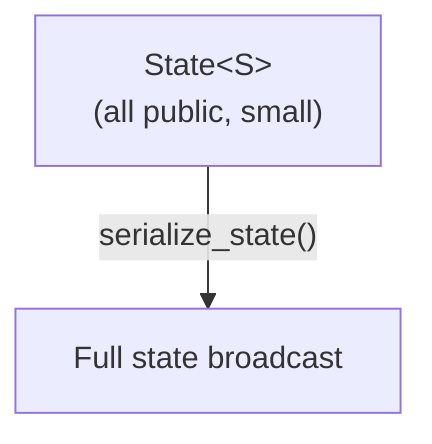
```mermaid
graph TD
    S1["State&lt;S&gt;<br/>(all public, small)"]
    S1 -->|"serialize_state()"| Wire1["Full state broadcast"]
```

| Type | Role |
|---|---|
| `S` — **State** | The complete state. Small, all-public. Broadcast in full to all peers on every mutation. Peers store a clone and replace it on each update. |

For small state objects where the entire state is public and can be broadcast
in full. No View/Delta concept — the State IS what peers see. On every
mutation, the full state is serialized and pushed to all peers. Receivers
simply replace their copy.

```rust
/// Trait for small, all-public distributed state.
///
/// The entire State is broadcast to all peers on every mutation.
/// No View/Delta concept — maximally simple API.
pub trait DistributedState: Send + Sync + 'static {
    /// The state type. Small, fully public. Broadcast in full to peers.
    type State: Clone + Send + Sync + 'static;

    /// Globally unique name identifying this state across the cluster.
    /// Used as the registry key, change-notification identifier,
    /// processing-group name, and in diagnostics / logging.
    fn name() -> &'static str;

    /// Serialize the state to bytes for the wire.
    fn serialize_state(state: &Self::State) -> Vec<u8>;

    /// Deserialize a state from bytes. The `wire_version` parameter indicates
    /// which format the sender used; implementations should handle at least
    /// versions [WIRE_VERSION - 1, WIRE_VERSION].
    fn deserialize_state(bytes: &[u8], wire_version: u32) -> Result<Self::State, DeserializeError>;

    /// The wire format version for State serialization.
    const WIRE_VERSION: u32;

    /// The storage format version for local persistence.
    const STORAGE_VERSION: u32;
}
```

**What the system handles automatically:**
- On mutation: clone the state, serialize, broadcast `FullSnapshot` to all peers
- On receive: deserialize, replace the peer's entry in the view map
- No `project_view()` — State = View
- No `diff()` / `apply_delta()` — full replacement, no deltas
- No `sync_urgency()` — uses the configured `SyncStrategy` from `StateConfig`
- No age-gap detection — every message is a full snapshot, just accept if age > local

#### Delta-Aware: `DeltaDistributedState`

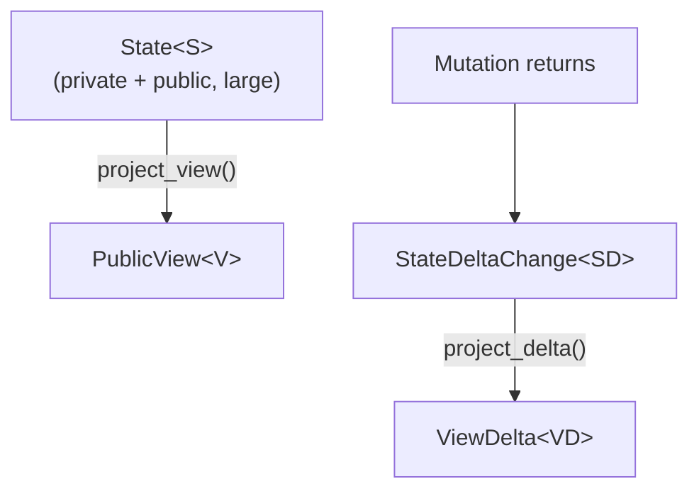
```mermaid
graph TD
    S2["State&lt;S&gt;<br/>(private + public, large)"]
    S2 -->|"project_view()"| View2["PublicView&lt;V&gt;"]
    Mutation2["Mutation returns"] --> SD2["StateDeltaChange&lt;SD&gt;"]
    SD2 -->|"project_delta()"| Delta2["ViewDelta&lt;VD&gt;"]
```

| Type | Role |
|---|---|
| `S` — **State** | Full state struct (private + public fields). Only stored on the owning node. |
| `V` — **PublicView** | Projection of the public portion of `S`. Broadcast to all peer nodes. |
| `VD` — **ViewDelta** | A patch that can be applied to a `PublicView` to advance it to a newer version without transmitting the full view. |
| `SD` — **StateDeltaChange** | A description of what changed at the state level, returned by the mutation closure. Projected to a view-level `ViewDelta` via `project_delta()`. |

For large state objects with private fields. The mutation closure describes
exactly what changed, and the system projects that to a view-level delta.

```rust
/// Trait for large distributed state with private fields and delta support.
///
/// The mutation closure returns a `StateDeltaChange` describing what changed.
/// The system projects it to a view-level `Delta` via `project_delta()`,
/// avoiding expensive view diffing.
pub trait DeltaDistributedState: Send + Sync + 'static {
    /// The full state type (private + public), owned by exactly one node.
    type State: Clone + Send + Sync + 'static;

    /// The public view projected from State, replicated to all nodes.
    type View: Clone + Send + Sync + 'static;

    /// A delta patch that can advance a View from age N to age N+1.
    type Delta: Clone + Send + Sync + 'static;

    /// A description of what changed at the state level.
    /// Returned by the mutation closure passed to `mutate_with_delta()`.
    type StateDeltaChange: Clone + Send + Sync + 'static;

    fn name() -> &'static str;

    /// Project the public view from the full state.
    fn project_view(state: &Self::State) -> Self::View;

    /// Project a state-level change to a view-level delta.
    fn project_delta(state_delta: &Self::StateDeltaChange) -> Self::Delta;

    /// Apply a delta to advance a view.
    fn apply_delta(view: &mut Self::View, delta: &Self::Delta);

    /// Serialize a view to bytes for the wire.
    fn serialize_view(view: &Self::View) -> Vec<u8>;
    fn deserialize_view(bytes: &[u8], wire_version: u32) -> Result<Self::View, DeserializeError>;
    /// Serialize a delta.
    fn serialize_delta(delta: &Self::Delta) -> Vec<u8>;
    fn deserialize_delta(bytes: &[u8], wire_version: u32) -> Result<Self::Delta, DeserializeError>;

    /// Evaluate a delta and return the desired sync urgency.
    fn sync_urgency(_old: &Self::View, _new: &Self::View, _delta: &Self::Delta) -> SyncUrgency {
        SyncUrgency::Default
    }

    const WIRE_VERSION: u32;
    const STORAGE_VERSION: u32;
}

/// Controls how urgently a particular delta is broadcast to peers.
/// Returned by `DistributedState::sync_urgency()` on each mutation.
pub enum SyncUrgency {
    /// Use the default strategy configured in `StateConfig`.
    Default,
    /// Push this delta to all peers immediately, regardless of the configured strategy.
    Immediate,
    /// Batch this delta and push within the given duration.
    /// Overrides the configured interval for this specific delta.
    Delayed(Duration),
    /// Do not broadcast this delta at all. The next delta that is not
    /// suppressed will carry the cumulative change.
    Suppress,
}
```

**Why two separate traits?**

- **Minimal API surface.** Simple states implement 3 methods. Delta-aware
  states implement ~10. Neither carries dead methods.
- **Compile-time safety.** If you pick the wrong trait, the compiler tells you.
  No runtime surprise of calling an unimplemented `diff()`.
- **Clear semantics.** `StateShard<S: DistributedState>` always broadcasts
  full state. `StateShard<S: DeltaDistributedState>` always uses deltas.
  No ambiguity.


### 2.3 Envelope Types

The system wraps raw values with metadata envelopes. Both envelope types
use a [`Generation`](#51-age-based-ordering) struct to track version ordering.

```rust
/// Logical version: (incarnation, age) with lexicographic ordering.
/// See §5.1 for generation rules.
#[derive(Debug, Clone, Copy, PartialEq, Eq, PartialOrd, Ord, Hash)]
pub struct Generation {
    pub incarnation: u64,
    pub age: u64,
}

/// Envelope for the owning node's full state shard.
pub struct StateObject<S> {
    /// Logical version of this state (incarnation + age).
    /// Age is monotonically increasing; incarnation changes on restart
    /// without persistence. Ordering is lexicographic.
    pub generation: Generation,
    /// Storage format version — used for local persistence only.
    /// Set to `S::STORAGE_VERSION` at write time.
    pub storage_version: u32,
    /// The state value.
    pub value: S,
    /// Wall-clock Unix timestamp (ms) — creation time.
    /// Wall-clock (`i64`) because this value is persisted, sent over the wire,
    /// and must be meaningful across nodes. `Instant` is monotonic / local-only
    /// and cannot be serialized or compared across processes.
    pub created_time: i64,
    /// Wall-clock Unix timestamp (ms) — last mutation time (same rationale).
    pub modified_time: i64,
}

/// Envelope for a replicated public view on a non-owning node.
pub struct StateViewObject<V> {
    /// Generation matching the source StateObject at the time of sync.
    pub generation: Generation,
    /// Wire format version — the version used to serialize this view
    /// when it was sent over the network. Set to `S::WIRE_VERSION` by the sender.
    pub wire_version: u32,
    /// The public view value.
    pub value: V,
    /// Wall-clock Unix timestamp (ms) — creation time of the source state.
    /// Replicated from the owning node; must be serializable → `i64`.
    pub created_time: i64,
    /// Wall-clock Unix timestamp (ms) — last mutation time of the source state.
    pub modified_time: i64,
    /// Monotonic instant when this replica was last synced.
    /// Used for freshness checks to avoid NTP / VM-pause drift.
    /// (No wall-clock `synced_time` — elapsed time from `Instant` is
    /// strictly more reliable and sufficient for diagnostics.)
    pub synced_at: Instant,
    /// If set, a change feed notification told us newer data exists at this
    /// generation. The actual data has not been pulled yet. Cleared after
    /// a successful pull.
    pub pending_remote_generation: Option<Generation>,
    /// The source node that produced this view.
    pub source_node: NodeId,
}
```

---

## 3. Node-Local Data Layout

Each node maintains the following per registered state type:

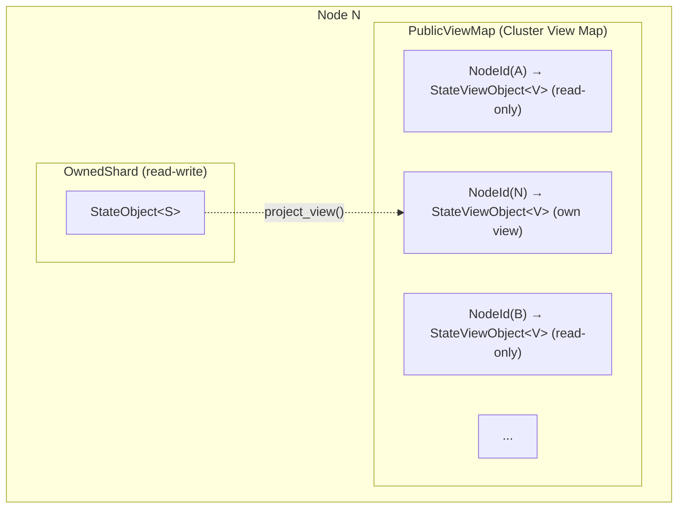
```mermaid
graph TD
    subgraph NodeN["Node N"]
        subgraph OwnedShard["OwnedShard (read-write)"]
            SO["StateObject&lt;S&gt;"]
        end
        subgraph PVM["PublicViewMap (Cluster View Map)"]
            A["NodeId(A) → StateViewObject&lt;V&gt; (read-only)"]
            B["NodeId(B) → StateViewObject&lt;V&gt; (read-only)"]
            N["NodeId(N) → StateViewObject&lt;V&gt; (own view)"]
            Etc["..."]
        end
    end

    SO -.->|"project_view()"| N
```

The **PublicViewMap** (also referred to as the *Cluster View Map*) is a `HashMap<NodeId, StateViewObject<V>>` that gives every node a complete, queryable picture of the cluster-wide state.

### 3.1 Concurrency Model for the PublicViewMap

The PublicViewMap is **read** by the query path (potentially from any async
task) and **written** by multiple sources:

| Writer | Trigger |
|---|---|
| `mutate()` | Local shard mutation → update own entry |
| SyncEngine | Inbound push/delta → update peer entry |
| ClusterMembership | Node join → add entry; node leave → remove entry |
| `query()` refresh | Pull result → update stale entry |

All writes are serialized through the `StateShard` actor mailbox, so there is
no write-write contention. The challenge is **read-write concurrency**: queries
should not block behind ongoing mutations or sync updates.

#### Design: Two-Level `ArcSwap` for Lock-Free Reads

The view map uses a **two-level [`ArcSwap`](https://docs.rs/arc-swap)**
architecture that provides O(1) single-node updates without cloning the
entire map:

```
Outer ArcSwap (rare swap — node join/leave only)
│
└─▶ HashMap<NodeId, Arc<ArcSwap<StateViewObject<V>>>>
                          │
                          └─▶ Inner ArcSwap (frequent swap — every mutation/sync)
                              └─▶ StateViewObject<V>
```

- **Outer level:** `ArcSwap<HashMap<NodeId, Arc<ArcSwap<StateViewObject<V>>>>>`
  — swapped only when nodes join or leave (rare). The clone copies `Arc`
  pointers, not view data.
- **Inner level:** Each node has its own `ArcSwap<StateViewObject<V>>` —
  swapped on every mutation or inbound sync for that node. Cost is O(1):
  a single atomic store, no map clone.

```rust
use arc_swap::ArcSwap;

/// Two-level concurrent view map. Outer map swapped on topology changes;
/// inner per-node ArcSwap swapped on every state update (O(1)).
pub(crate) struct ViewMap<V> {
    inner: ArcSwap<HashMap<NodeId, Arc<ArcSwap<StateViewObject<V>>>>>,
}

struct ShardCore<S, V> {
    /// The owned state shard — only modified inside the actor mailbox.
    state: StateObject<S>,
    /// Per-node lock-free view map.
    views: ViewMap<V>,
    node_id: NodeId,
    clock: Arc<dyn Clock>,
}
```

**Read path (lock-free, 2 atomic loads):**

```rust
// Any thread — two atomic loads, no locking.
// 1. Load outer map (get the HashMap snapshot)
// 2. Load inner ArcSwap for the target node
let view = self.views.get(&peer_id);   // Option<StateViewObject<V>>
// view is a clone; the map remains valid even if the actor
// swaps in new values while we're reading.
```

**Write path — single node update (O(1), actor-serialized):**

```rust
// Inside the actor's message handler — only one writer, no contention.
// Only the inner ArcSwap is swapped — the outer map is untouched.
self.views.update(&peer_id, new_view_object);
// Cost: 1 atomic store. No HashMap clone.
```

**Write path — topology change (node join/leave, rare):**

```rust
// Clone the outer HashMap (cheap — just Arc pointer bumps), then swap.
self.views.insert_node(new_node_id, initial_view);
self.views.remove_node(departed_node_id);
// Cost: O(n) Arc::clone, but this happens only on cluster membership changes.
```

**Cost comparison vs single-level ArcSwap:**

| Operation | Single-level `ArcSwap<HashMap>` | Two-level `ViewMap` |
|---|---|---|
| Read single node | O(1) atomic + HashMap lookup | O(1) 2 atomics + HashMap lookup |
| Update single node | O(n) deep clone of HashMap | **O(1) atomic store** |
| Node join/leave | O(n) deep clone | O(n) Arc clone (cheap pointers) |
| Memory overhead | 1 allocation per swap | 1 ArcSwap per node (negligible) |

For a typical 100-node cluster with frequent mutations, this eliminates
~100× overhead per update.

#### Query Path: Fast Path vs Slow Path

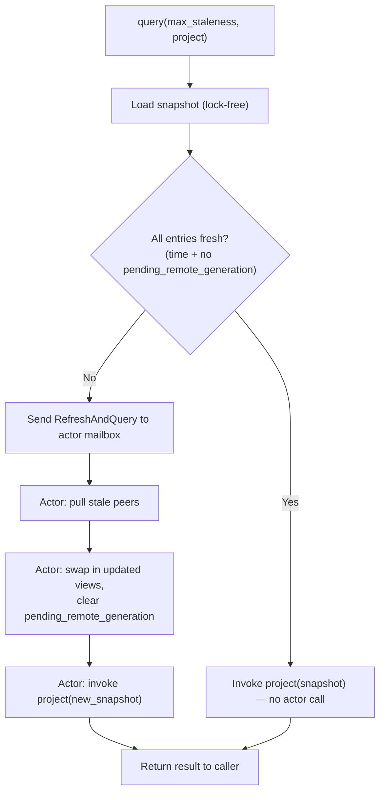
```mermaid
flowchart TD
    Query["query(max_staleness, project)"] --> Load["Load snapshot (lock-free)"]
    Load --> Check{"All entries fresh?<br/>(time + no pending_remote_generation)"}
    Check -->|Yes| Fast["Invoke project(snapshot) — no actor call"]
    Check -->|No| Slow["Send RefreshAndQuery to actor mailbox"]
    Slow --> Pull["Actor: pull stale peers"]
    Pull --> Swap["Actor: swap in updated views,<br/>clear pending_remote_generation"]
    Swap --> Project["Actor: invoke project(new_snapshot)"]
    Project --> Return["Return result to caller"]
    Fast --> Return
```

- **Fast path (lock-free, no actor involvement):** Load the snapshot, check
  all entries against `max_staleness` AND `pending_remote_generation`. If
  everything is fresh and no change feed markers are pending, invoke the
  projection directly and return. This path involves zero message-passing
  and zero locking — just two atomic pointer loads.

- **Slow path (actor-mediated):** If any entry is stale, send a
  `RefreshAndQuery` message to the `StateShard` actor. The actor pulls the
  stale views, swaps in the updated entries (inner `ArcSwap` stores), and
  invokes the projection inside its single-threaded handler. This ensures
  the pull-update-read sequence is atomic with respect to other writes.

---

## 4. Synchronization Strategies

The system supports four synchronization modes. A state author selects one (or a combination) during registration.

### 4.1 Active Push

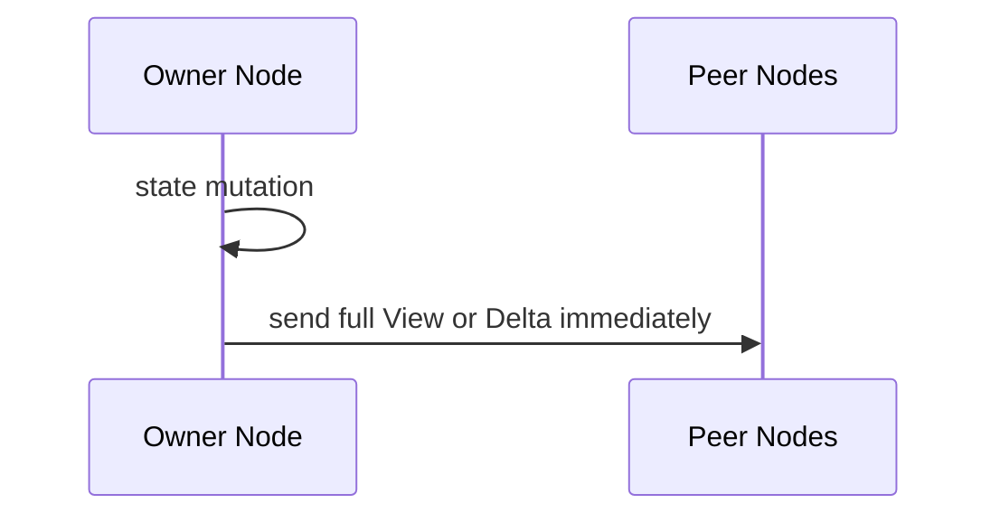
```mermaid
sequenceDiagram
    participant Owner as Owner Node
    participant Peers as Peer Nodes

    Owner->>Owner: state mutation
    Owner->>Peers: send full View or Delta immediately
```

* On every mutation, the owner computes the delta and pushes it to all peers.
* Lowest latency; highest bandwidth.

### 4.2 Active Feed + Lazy Pull

The core idea: instead of pushing full state/delta data on every mutation, nodes
**broadcast lightweight change notifications** that say *"state X changed"*
without including the change payload. Peers **lazily pull** the actual data only
when they need it (on query). Because notifications carry no state-specific
payload, they can be **batched across all state types** into a single network
message, dramatically reducing network traffic compared to per-state push.

#### 4.2.1 How It Works

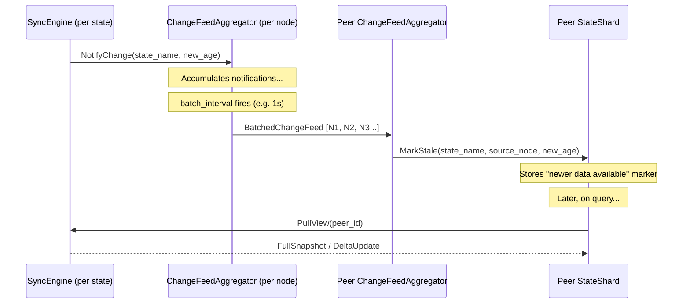
```mermaid
sequenceDiagram
    participant SE as SyncEngine (per state)
    participant CFA as ChangeFeedAggregator (per node)
    participant PeerCFA as Peer ChangeFeedAggregator
    participant PeerSS as Peer StateShard

    SE->>CFA: NotifyChange(state_name, new_age)
    Note over CFA: Accumulates notifications...
    Note over CFA: batch_interval fires (e.g. 1s)
    CFA->>PeerCFA: BatchedChangeFeed [N1, N2, N3...]
    PeerCFA->>PeerSS: MarkStale(state_name, source_node, new_age)
    Note over PeerSS: Stores "newer data available" marker

    Note over PeerSS: Later, on query...
    PeerSS->>SE: PullView(peer_id)
    SE-->>PeerSS: FullSnapshot / DeltaUpdate
```

#### 4.2.2 Cross-State Batching

Change notifications are **state-type-independent** — they contain only
`(state_name, source_node, new_age)`. This lets a single per-node actor
batch notifications from *all* state types into one network message:

```rust
/// A single change notification (state-type-independent).
pub struct ChangeNotification {
    pub state_name: String,
    pub source_node: NodeId,
    pub incarnation: u64,
    pub new_age: u64,
}

/// Batched wire message — one per batch interval.
/// No target node is specified because this message is broadcast to all nodes.
pub struct BatchedChangeFeed {
    pub source_node: NodeId,
    pub notifications: Vec<ChangeNotification>,
}
```

**Why batching matters:**

| Scenario | Per-state broadcast | Batched change feed |
|---|---|---|
| 10 state types, 100 mutations/sec each | 1,000 messages/sec per peer | 1 message/sec per peer (at 1s interval) |
| 50 nodes in cluster | 50,000 messages/sec total | 50 messages/sec total |
| Payload per message | Full state/delta (KB–MB) | ~40 bytes per notification |

Even with a 100ms batch interval, this represents a **100x–1000x reduction**
in broadcast traffic for frequently-mutated states.

#### 4.2.3 ChangeFeedAggregator Actor

Each node runs **one** `ChangeFeedAggregator` actor (not per-state — that
would defeat batching). See [§6.5](#65-changefeedaggregator-actor) for full
actor design.

Key responsibilities:
1. **Collect** — receives `NotifyChange` messages from all local SyncEngine actors
2. **Deduplicate** — if the same `(state_name, source_node)` pair is reported
   multiple times within a batch interval, only the latest `new_age` is kept
3. **Flush** — on timer tick, sends `BatchedChangeFeed` to all peer aggregators
   via `group.broadcast()` on the `distributed_state::change_feed` processing group
4. **Route inbound** — when receiving a `BatchedChangeFeed` from a peer, dispatches
   each notification to the appropriate local SyncEngine/StateShard

```rust
// Deduplication buffer — keyed by (state_name, source_node)
type PendingNotifications = HashMap<(String, NodeId), u64>; // → latest age
```

#### 4.2.4 Receiver Side: Stale Markers

When a peer receives a change notification, it does **not** pull data
immediately. Instead, it records a "newer data available" marker in the
`PublicViewMap` entry:

```rust
pub struct StateViewObject<V> {
    pub view: V,
    pub age: u64,
    pub synced_at: Instant,

    /// If set, a change notification told us newer data exists at this age.
    /// The actual data has not been pulled yet.
    pub pending_remote_age: Option<u64>,
}
```

The `pending_remote_age` field is checked during the **query fast path**
(see §3.1). When a query runs its freshness check:

```rust
let needs_pull = snapshot.iter().any(|(_, entry)| {
    // Entry is stale by time (monotonic clock — immune to NTP drift)...
    let stale_by_time = entry.synced_at.elapsed() > max_staleness;
    // ...OR we know newer data exists but haven't pulled it yet.
    let has_pending = entry.pending_remote_age
        .map(|ra| ra > entry.age)
        .unwrap_or(false);
    stale_by_time || has_pending
});
```

If `has_pending` is true, the query falls to the **slow path** which pulls
the latest data from the owning node, updates the view, and clears the marker.

#### 4.2.5 Interaction with Other Strategies

Active Feed + Lazy Pull can be **combined** with other strategies:

| Combination | Behavior |
|---|---|
| Feed + `sync_urgency() → Immediate` | Critical deltas bypass the feed and push directly; routine deltas go through the feed |
| Feed + Periodic Push | Feed notifications arrive faster than push interval; peer uses whichever delivers data first |
| Feed + Pull with Freshness | Feed tells the peer *when* to pull; freshness threshold tells it *whether* to pull |

The `SyncUrgency::Default` fallback (§4.6) routes through the feed when the
configured strategy is `ActiveFeedLazyPull`.

### 4.3 Periodic Push

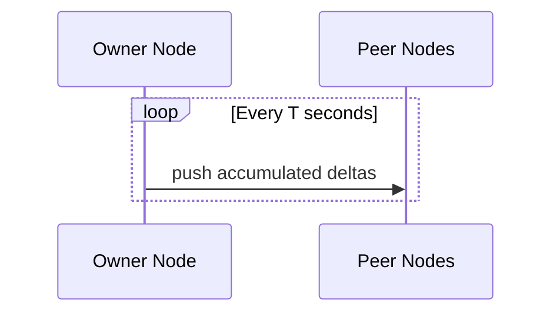
```mermaid
sequenceDiagram
    participant Owner as Owner Node
    participant Peers as Peer Nodes

    loop Every T seconds
        Owner->>Peers: push accumulated deltas
    end
```

* A background timer fires every `T` seconds (configurable).
* All mutations since the last push are collapsed into a single delta (or full snapshot) and broadcast.
* Trades freshness for reduced network overhead.

### 4.4 Pull with Freshness

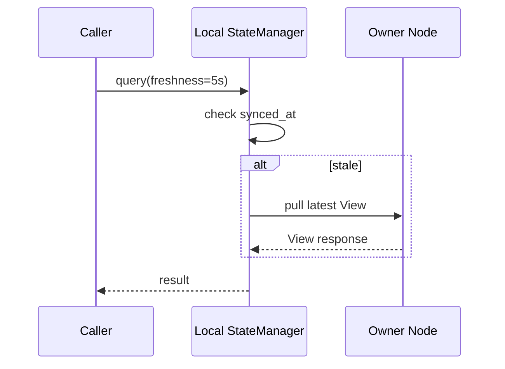
```mermaid
sequenceDiagram
    participant Caller
    participant SM as Local StateManager
    participant Owner as Owner Node

    Caller->>SM: query(freshness=5s)
    SM->>SM: check synced_at
    alt stale
        SM->>Owner: pull latest View
        Owner-->>SM: View response
    end
    SM-->>Caller: result
```

* The caller specifies a maximum staleness (e.g., "no older than 5 seconds").
* The state manager checks `synced_at`; if the local copy is fresh enough, it returns immediately.
* Otherwise, it pulls the latest view from the owner before returning.

### 4.5 Composing Strategies

Sync strategies are **orthogonal layers**, not mutually exclusive choices.
A state author selects a **primary push mode** and optionally layers on
additional behaviors:

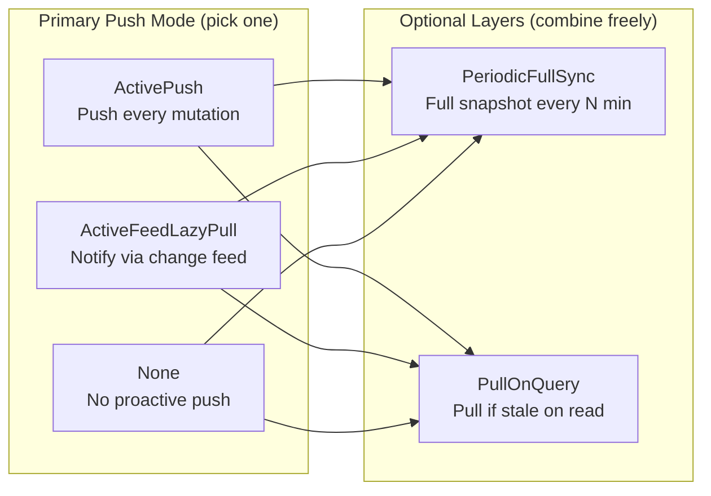
```mermaid
flowchart LR
    subgraph "Primary Push Mode (pick one)"
        A["ActivePush<br/>Push every mutation"]
        B["ActiveFeedLazyPull<br/>Notify via change feed"]
        C["None<br/>No proactive push"]
    end

    subgraph "Optional Layers (combine freely)"
        D["PeriodicFullSync<br/>Full snapshot every N min"]
        E["PullOnQuery<br/>Pull if stale on read"]
    end

    A --> D
    A --> E
    B --> D
    B --> E
    C --> D
    C --> E
```

**Example compositions:**

| Use Case | Primary | Layers | Effect |
|---|---|---|---|
| Real-time small state | `ActivePush` | — | Push every mutation immediately |
| Large state, read-heavy | `ActiveFeedLazyPull` | `PullOnQuery` | Notify changes; pull on demand |
| Large state, bounded staleness | `ActiveFeedLazyPull` | `PeriodicFullSync(15 min)` | Notify changes; full sync every 15 min as safety net |
| Rarely queried telemetry | None | `PeriodicFullSync(5 min)` + `PullOnQuery` | No push; periodic background sync + pull if queried between intervals |
| Critical + bounded | `ActivePush` | `PeriodicFullSync(10 min)` | Push every mutation; periodic full sync recovers any missed deltas |

### 4.6 Dynamic Sync Urgency

Rather than committing to a single strategy at registration time, the state author
can override the sync behavior **per delta** by implementing `sync_urgency()` on
the `DistributedState` trait. After every mutation the SyncEngine calls
`sync_urgency(old_view, new_view, delta)` and dispatches accordingly:

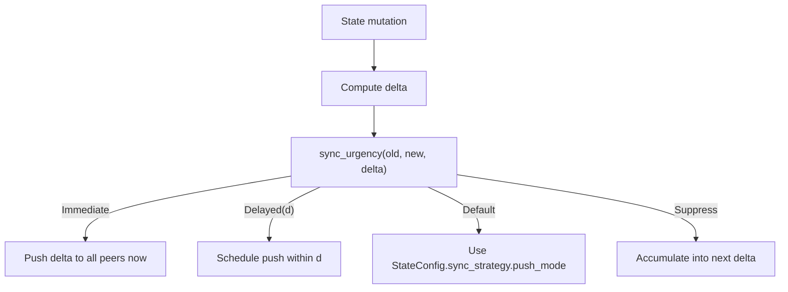
```mermaid
flowchart TD
    Mutation["State mutation"] --> Diff["Compute delta"]
    Diff --> Urgency["sync_urgency(old, new, delta)"]
    Urgency -->|"Immediate"| Push["Push delta to all peers now"]
    Urgency -->|"Delayed(d)"| Timer["Schedule push within d"]
    Urgency -->|"Default"| Config["Use StateConfig.sync_strategy.push_mode"]
    Urgency -->|"Suppress"| Accumulate["Accumulate into next delta"]
```

The `push_mode` in `SyncStrategy` acts as the **fallback** when `sync_urgency()`
returns `SyncUrgency::Default` (which is the default trait implementation). This
means existing state types that don't override `sync_urgency()` behave according
to their configured `push_mode`, while performance-sensitive types can make
fine-grained decisions per mutation. The `periodic_full_sync` and `pull_on_query`
layers operate independently of `sync_urgency()` — they are always active if
configured.

> **⚠ Warning on `Suppress`:** If `sync_urgency()` returns `Suppress` for
> every delta *and* `periodic_full_sync` is `None` *and* `push_mode` is `None`,
> peers will **never** receive updates. `Suppress` is only safe when at least
> one of `periodic_full_sync` or `pull_on_query` is enabled. The crate logs a
> warning at registration time if a state type overrides `sync_urgency()` but
> has no fallback sync path configured.

---

## 5. Versioning and Ordering

### 5.1 Age-Based Ordering

Every mutation increments the state's `age`. Both `StateObject` and
`StateViewObject` carry a **`Generation`** struct that bundles `(incarnation, age)`
into a single comparable unit:

```rust
/// Logical version of a state, used for ordering and staleness detection.
/// Ordered lexicographically: `(incarnation, age)`.
///
/// (inc=2, age=0) > (inc=1, age=999)   // new incarnation wins
/// (inc=1, age=5) > (inc=1, age=4)     // same incarnation, newer age
#[derive(Debug, Clone, Copy, PartialEq, Eq, PartialOrd, Ord, Hash)]
pub struct Generation {
    pub incarnation: u64,
    pub age: u64,
}
```

The `incarnation` is a monotonically increasing identifier that changes
whenever the owner loses its state (restart without persistence, migration
failure, etc.). It is generated from `current_unix_time_ms()` which is
naturally `u64`, time-ordered, and unique across restarts.

**Incarnation generation rules at startup:**

| Scenario | Incarnation value | Rationale |
|---|---|---|
| Persistence enabled, load succeeds | Same as the persisted `incarnation` | State is continuous — no epoch break |
| Persistence enabled, load/migration fails | `current_unix_time_ms()` | State was lost — peers must accept fresh state |
| Persistence disabled | `current_unix_time_ms()` on every start | No state survives restarts |
| Crash → fast restart (before `NodeLeft` detected) | `current_unix_time_ms()` (if state lost) | Ensures peers accept `age=0` even if old entry still exists |

> **Why wall-clock milliseconds?** The value only needs to be greater than any
> previous incarnation from the same node. Wall-clock milliseconds are
> monotonically increasing across process restarts (barring large NTP
> corrections), fit naturally in `u64`, and require no external dependency.

#### Delta Ordering

Deltas carry a single `generation: Generation` field representing the state
**after** applying the delta. The delta always advances `age` by exactly 1
(batched deltas are not supported in the initial version).

Rules for applying incoming deltas/snapshots on a peer node:

| Condition | Action |
|---|---|
| Incoming `generation.incarnation > local.incarnation` | **New incarnation** — accept snapshot unconditionally (owner restarted). For deltas: gap detected, request full snapshot. |
| Incoming `generation.incarnation < local.incarnation` | **Discard** — from a prior lifetime. |
| Same incarnation, `generation.age == local.age + 1` | **Apply delta** normally. |
| Same incarnation, `generation.age <= local.age` | **Discard** — stale or duplicate. |
| Same incarnation, `generation.age > local.age + 1` | **Gap detected** — request a full snapshot from the owner. |
| Full snapshot with `generation > local` | **Accept** — replace the local entry. |

This prevents the scenario where an owner restarts with `age=0` and peers
reject all updates because they hold a higher age from the previous lifetime.
The `Generation` struct's `Ord` implementation makes these comparisons concise
and eliminates scattered `(incarnation, age)` tuple comparisons throughout
the codebase.

### 5.2 Rolling Upgrades and Serde Versioning

There are three serializable types — State (`S`), View (`V`), and Delta (`VD`) —
but they do **not** all cross the same boundaries:

| Type | Crosses the wire? | Persisted locally? | Version scope |
|---|---|---|---|
| **State (`S`)** | ❌ Never — stays on the owning node | ✅ If persistence is enabled | `storage_version` |
| **View (`V`)** | ✅ Full snapshots, initial sync | ❌ Only the owner persists the full state | `wire_version` |
| **Delta (`VD`)** | ✅ Incremental updates | ❌ | `wire_version` |

This gives us **two independent version domains**:

- **`wire_version: u32`** — Governs View and Delta serialization. This is the
  version that matters during rolling upgrades because it determines whether
  peers can understand each other's sync messages. View and Delta share a single
  version number because Delta is derived from View diffs — a structural change
  to View almost always requires a corresponding change to Delta.

- **`storage_version: u32`** — Governs full State serialization for local
  persistence. This version is purely local: it only matters when a node
  restarts and loads its shard from disk. It can evolve independently of the
  wire format (e.g., you might restructure private fields without affecting the
  public view).

The state author declares both versions as associated constants on the trait:

```rust
pub trait DistributedState: Send + Sync + 'static {
    // ... (type aliases omitted for brevity)

    /// Current wire format version for View and Delta serialization.
    /// Increment this when the View or Delta struct changes shape.
    const WIRE_VERSION: u32;

    /// Current storage format version for full State persistence.
    /// Increment this when the State struct changes shape.
    /// Only relevant if persistence is enabled.
    const STORAGE_VERSION: u32;

    // ...
}
```

#### Version Mismatch Handling

During a rolling upgrade, some nodes run version N while others run version N+1.
When a node receives a delta or snapshot with a `wire_version` it does not
understand, the `deserialize_view` or `deserialize_delta` call will fail. The
system must handle this gracefully — **never panic, never corrupt local state**.

The `DistributedState` trait gives the state author control over how version
mismatches are resolved via the return value of the deserialization methods. The
SyncEngine wraps this with a structured fallback chain:

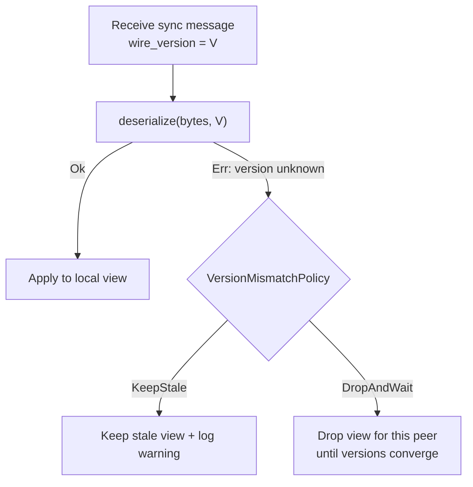
```mermaid
flowchart TD
    Receive["Receive sync message<br/>wire_version = V"] --> Try["deserialize(bytes, V)"]
    Try -->|Ok| Apply["Apply to local view"]
    Try -->|Err: version unknown| Decision{"VersionMismatchPolicy"}

    Decision -->|KeepStale| StaleKeep["Keep stale view + log warning"]
    Decision -->|DropAndWait| Drop["Drop view for this peer<br/>until versions converge"]
```

The state author configures the policy during registration:

```rust
/// How to handle incoming sync messages with an unrecognized wire_version.
pub enum VersionMismatchPolicy {
    /// Keep the last successfully deserialized view and log a warning.
    /// The view becomes increasingly stale until the local node is upgraded.
    /// Best when staleness is tolerable and you want zero extra network traffic.
    KeepStale,

    /// Remove the peer's view entirely and treat it as absent until the
    /// version mismatch is resolved. Queries will not see this peer.
    /// Best when acting on an outdated view is worse than having no view.
    DropAndWait,
}
```

#### Guidelines for State Authors

When evolving a state's serialization format across versions:

1. **Additive changes (new fields with defaults)** — Increment `WIRE_VERSION`.
   Implement `deserialize_view` / `deserialize_delta` to handle both the old and
   new versions by filling in defaults for missing fields. This avoids triggering
   the mismatch policy entirely.

   ```rust
   fn deserialize_view(bytes: &[u8], wire_version: u32) -> Result<NodeResourceView, DeserializeError> {
       match wire_version {
           1 => {
               let v1: NodeResourceViewV1 = bincode::deserialize(bytes)?;
               Ok(NodeResourceView {
                   cpu_usage_pct: v1.cpu_usage_pct,
                   memory_used_bytes: v1.memory_used_bytes,
                   memory_total_bytes: v1.memory_total_bytes,
                   disk_used_bytes: v1.disk_used_bytes,
                   disk_total_bytes: v1.disk_total_bytes,
                   // New field in V2 — default to 0 when deserializing from V1
                   gpu_usage_pct: 0.0,
               })
           }
           2 => {
               bincode::deserialize(bytes).map_err(|e| DeserializeError::new(e.to_string()))
           }
           v => Err(DeserializeError::unknown_version(v)),
       }
   }
   ```

2. **Breaking changes — two-phase upgrade pattern.** When a breaking change is
   unavoidable (removed or renamed fields, changed semantics), use a two-phase
   deployment to ensure zero data loss and no sync disruption.

   The key insight is that `WIRE_VERSION` controls the **outbound** format
   (what `serialize_view`/`serialize_delta` produce), while `deserialize_view`
   and `deserialize_delta` independently control which **inbound** formats are
   accepted. These are decoupled — a node can read formats it doesn't yet write.

   | Phase | `WIRE_VERSION` | Sends | Reads | Purpose |
   |---|---|---|---|---|
   | **1** | 1 (unchanged) | V1 | V1 + V2 | All nodes learn to read V2 |
   | **2** | 2 (bumped) | V2 | V1 + V2 | All nodes switch to writing V2 |
   | **3** (optional) | 2 | V2 | V2 only | Drop V1 deserialization code |

   **Phase 1 — "understand both, send old":**
   Deploy code that keeps `WIRE_VERSION` at the old value but adds
   deserialization support for the new format. After this rollout completes,
   every node in the cluster can read both V1 and V2, but all nodes still
   send V1.

   ```rust
   // Phase 1: read V1 + V2, write V1
   const WIRE_VERSION: u32 = 1;  // still sending V1

   fn serialize_view(view: &NodeResourceView) -> Vec<u8> {
       // Serialize as V1 format
       bincode::serialize(&NodeResourceViewV1::from(view)).unwrap()
   }

   fn deserialize_view(bytes: &[u8], wire_version: u32) -> Result<NodeResourceView, DeserializeError> {
       match wire_version {
           1 => { /* existing V1 deserialization */ }
           2 => { /* NEW: V2 deserialization — ready for phase 2 */ }
           v => Err(DeserializeError::unknown_version(v)),
       }
   }
   ```

   **Phase 2 — "send new":**
   Once all nodes are running phase 1 code (verifiable via `PeerSyncStatus` —
   all peers report the same build), deploy a second change that bumps
   `WIRE_VERSION` and switches serialization to the new format. Since every
   node already understands V2, there is no data loss.

   ```rust
   // Phase 2: read V1 + V2, write V2
   const WIRE_VERSION: u32 = 2;  // now sending V2

   fn serialize_view(view: &NodeResourceView) -> Vec<u8> {
       // Serialize as V2 format
       bincode::serialize(view).unwrap()
   }

   fn deserialize_view(bytes: &[u8], wire_version: u32) -> Result<NodeResourceView, DeserializeError> {
       match wire_version {
           1 => { /* keep V1 support until phase 2 rollout is complete */ }
           2 => { /* V2 deserialization */ }
           v => Err(DeserializeError::unknown_version(v)),
       }
   }
   ```

   **Phase 3 (optional) — "drop old":**
   After all nodes are running phase 2 code, a third deployment can remove V1
   deserialization support to reduce code complexity.

   ```mermaid
   sequenceDiagram
       participant Cluster

       Note over Cluster: All nodes at WIRE_VERSION=1
       Cluster->>Cluster: Phase 1 deploy: add V2 deserialization, keep sending V1
       Note over Cluster: All nodes read V1+V2, send V1

       Cluster->>Cluster: Phase 2 deploy: switch to WIRE_VERSION=2
       Note over Cluster: All nodes read V1+V2, send V2

       Cluster->>Cluster: Phase 3 deploy (optional): remove V1 deserialization
       Note over Cluster: All nodes read V2 only, send V2
   ```

   This pattern works because `WIRE_VERSION` is a compile-time constant that
   the `SyncEngine<S>` reads from the generic type parameter — no runtime
   lookup needed. The version flows as:
   `S::WIRE_VERSION` → stamped on `SyncMessage` by sender → read by receiver →
   passed to `deserialize_view(bytes, wire_version)`.

3. **Multiple versions in flight** — The `wire_version` in `SyncMessage` tells
   the receiver exactly which format was used. The receiver should support
   deserializing at least versions `[current - 1, current]` so that the upgrade
   window is safe. Once the upgrade is complete and all nodes report the same
   version (observable via `PeerSyncStatus`), support for old versions can be
   removed in a subsequent release.

4. **Testing** — State authors should write round-trip tests that serialize at
   version N and deserialize at version N-1 (and vice versa) to catch
   compatibility issues before deployment.

---

## 6. Actor Architecture

The crate is designed to work with **any** distributed actor framework that
provides the five capabilities listed below. The concrete framework is selected
at compile time via a cargo feature flag (see §6.0.2). All internal code
programs against the abstract `ActorRuntime` trait — never against a specific
framework's API directly.

### 6.0 Actor Runtime Abstraction

The distributed state crate requires exactly five capabilities from the
underlying actor framework. These are captured as Rust traits so that
providers can be swapped without changing any business logic.

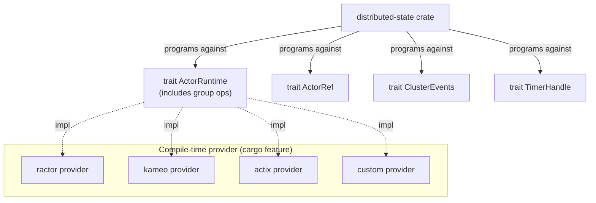
```mermaid
graph TD
    DS["distributed-state crate"]
    DS -->|"programs against"| RT["trait ActorRuntime<br/>(includes group ops)"]
    DS -->|"programs against"| AR["trait ActorRef"]
    DS -->|"programs against"| CE["trait ClusterEvents"]
    DS -->|"programs against"| TH["trait TimerHandle"]

    subgraph "Compile-time provider (cargo feature)"
        Ractor["ractor provider"]
        Kameo["kameo provider"]
        Actix["actix provider"]
        Custom["custom provider"]
    end

    RT -.->|"impl"| Ractor
    RT -.->|"impl"| Kameo
    RT -.->|"impl"| Actix
    RT -.->|"impl"| Custom
```

#### 6.0.1 Required Capabilities

| # | Capability | Why the crate needs it | Trait |
|---|---|---|---|
| 1 | **Single-threaded actor execution** | StateShard and SyncEngine process messages one at a time — no locks needed for state mutation or view-map swaps. | `ActorRuntime` |
| 2 | **Remote actor messaging** | SyncEngine sends snapshots/deltas to peer SyncEngines on other nodes. Fire-and-forget (`send`) is the primary pattern; request-reply is framework-specific and handled at the adapter layer. | `ActorRef<M>` |
| 3 | **Actor registration / discovery** | The StateRegistry must look up StateShard actors by name. Peer SyncEngines must discover each other across nodes. | `ActorRuntime::get_group_members` |
| 4 | **Cluster node join/leave events** | ClusterMembership listener must be notified when nodes join or leave so it can propagate events to all StateShards. | `ClusterEvents` |
| 5 | **Message broadcasting** | SyncEngine broadcasts snapshots/deltas to all peers of the same state type. ChangeFeedAggregator broadcasts batched notifications to all peer aggregators. | `ActorRuntime::broadcast_group` |

#### 6.0.2 Abstract Trait Definitions

```rust
use std::future::Future;
use std::time::Duration;

/// A handle to a running actor that can receive messages of type `M`.
/// This is the primary way actors communicate — by sending messages
/// through an `ActorRef`.
///
/// Implementations must guarantee:
/// - Messages are delivered in FIFO order to the actor's handler.
/// - The actor processes one message at a time (single-threaded).
pub trait ActorRef<M: Send + 'static>: Clone + Send + Sync + 'static {
    /// Fire-and-forget: enqueue a message in the actor's mailbox.
    /// Returns immediately; does not wait for the message to be processed.
    fn send(&self, msg: M) -> Result<(), ActorSendError>;

    /// Request-reply: send a message and wait for a response.
    /// Only fire-and-forget delivery is part of this trait.
    /// Request-reply patterns are framework-specific and should be
    /// handled at the adapter layer.
    fn send(&self, msg: M) -> Result<(), ActorSendError>;
}

/// Errors from fire-and-forget sends.
#[derive(Debug)]
pub enum ActorSendError {
    /// The actor has stopped or its mailbox is full.
    ActorUnavailable,
}

/// Opaque handle returned by `ClusterEvents::subscribe`, used to
/// cancel a subscription via `ClusterEvents::unsubscribe`.
#[derive(Debug, Clone, Copy, PartialEq, Eq, Hash)]
pub struct SubscriptionId(pub(crate) u64);

#[derive(Debug)]
pub enum GroupError {
    GroupNotFound,
    NetworkError(String),
}

/// Subscription to cluster-level node membership events.
/// The distributed state crate subscribes once at startup and
/// routes events to all registered StateShards via the StateRegistry.
pub trait ClusterEvents: Send + Sync + 'static {
    /// Subscribe to cluster membership changes. Returns a handle
    /// for later unsubscription.
    fn subscribe(
        &self,
        on_event: Box<dyn Fn(ClusterEvent) + Send + Sync>,
    ) -> Result<SubscriptionId, ClusterError>;

    /// Remove a previously registered subscription. Idempotent.
    fn unsubscribe(&self, id: SubscriptionId) -> Result<(), ClusterError>;
}

pub enum ClusterEvent {
    NodeJoined(NodeId),
    NodeLeft(NodeId),
}

#[derive(Debug)]
pub enum ClusterError {
    AlreadySubscribed,
    ConnectionFailed(String),
}

/// Timer handle returned by the runtime's scheduling methods.
/// Dropping the handle cancels the timer.
pub trait TimerHandle: Send + 'static {
    /// Cancel the timer. After this call, the timer message will
    /// not be delivered. Idempotent — cancelling an already-fired
    /// or already-cancelled timer is a no-op.
    fn cancel(self);
}

/// The top-level runtime abstraction. Provides actor lifecycle,
/// timer scheduling, and processing group management. One instance
/// per node.
///
/// Processing group methods are part of this trait (rather than a
/// separate trait) so that all group operations use the same
/// `Self::Ref<M>` type family without requiring cross-trait GAT
/// equality constraints.
pub trait ActorRuntime: Send + Sync + 'static {
    type Ref<M: Send + 'static>: ActorRef<M>;
    type Events: ClusterEvents;
    type Timer: TimerHandle;

    /// Spawn a new actor with the given handler. Returns a reference
    /// that can be used to send messages to the actor.
    ///
    /// The handler closure is invoked for each message, one at a time
    /// (single-threaded guarantee).
    fn spawn<M, H, S>(
        &self,
        name: &str,
        initial_state: S,
        handler: H,
    ) -> Self::Ref<M>
    where
        M: Send + 'static,
        S: Send + 'static,
        H: FnMut(&mut S, M) -> BoxFuture<'_, ()> + Send + 'static;

    /// Schedule a recurring timer that sends `msg` to `target` every
    /// `interval`. The first tick fires after `interval` has elapsed.
    fn send_interval<M: Clone + Send + 'static>(
        &self,
        target: &Self::Ref<M>,
        interval: Duration,
        msg: M,
    ) -> Self::Timer;

    /// Schedule a one-shot timer that sends `msg` to `target` after
    /// `delay`.
    fn send_after<M: Send + 'static>(
        &self,
        target: &Self::Ref<M>,
        delay: Duration,
        msg: M,
    ) -> Self::Timer;

    /// Add an actor to a named processing group.
    fn join_group<M: Send + 'static>(
        &self,
        group_name: &str,
        actor: &Self::Ref<M>,
    ) -> Result<(), GroupError>;

    /// Remove an actor from a named processing group.
    fn leave_group<M: Send + 'static>(
        &self,
        group_name: &str,
        actor: &Self::Ref<M>,
    ) -> Result<(), GroupError>;

    /// Broadcast a message to all members of a named group.
    fn broadcast_group<M: Clone + Send + 'static>(
        &self,
        group_name: &str,
        msg: M,
    ) -> Result<(), GroupError>;

    /// Get current members of the group (for point-to-point sends).
    fn get_group_members<M: Send + 'static>(
        &self,
        group_name: &str,
    ) -> Result<Vec<Self::Ref<M>>, GroupError>;

    /// Access the cluster events facility.
    fn cluster_events(&self) -> &Self::Events;
}
```

#### 6.0.3 Crate Architecture

Rather than using cargo features to select the actor framework at compile time
within a single crate, the design uses a **multi-crate** approach. This keeps
the core crate dependency-free from any actor framework and makes it easy for
third parties to add new adapters without modifying the core.

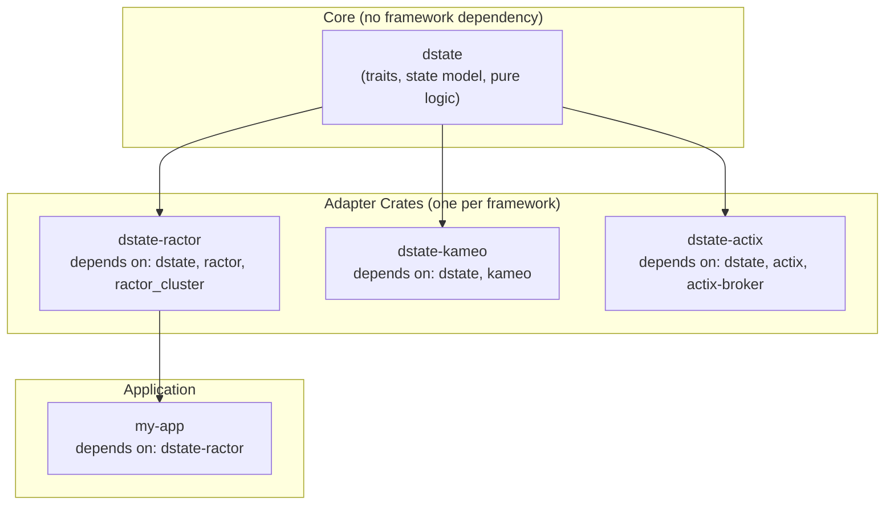
```mermaid
graph TD
    subgraph "Core (no framework dependency)"
        Core["dstate<br/>(traits, state model, pure logic)"]
    end

    subgraph "Adapter Crates (one per framework)"
        Ractor["dstate-ractor<br/>depends on: dstate, ractor, ractor_cluster"]
        Kameo["dstate-kameo<br/>depends on: dstate, kameo"]
        Actix["dstate-actix<br/>depends on: dstate, actix, actix-broker"]
    end

    subgraph "Application"
        App["my-app<br/>depends on: dstate-ractor"]
    end

    Core --> Ractor
    Core --> Kameo
    Core --> Actix
    Ractor --> App
```

**Crate series:**

| Crate | Role | Dependencies |
|---|---|---|
| `dstate` | Core library. Defines all public traits (`DistributedState`, `DeltaDistributedState`, `ActorRuntime`, `ActorRef`, `ClusterEvents`, `TimerHandle`, `StatePersistence`, `Clock`), data types (`StateObject`, `StateViewObject`, `SyncMessage`, `ChangeNotification`, etc.), pure logic (`ShardCore`), error types, and configuration structs. **No actor framework dependency.** Processing group operations are part of `ActorRuntime`. | `arc-swap`, `tokio` (time only) |
| `dstate-ractor` | Ractor adapter. Implements `ActorRuntime` for ractor, wires `StateShard`/`SyncEngine`/`ChangeFeedAggregator` as ractor actors, and provides a ready-to-use `StateRegistry<RactorRuntime>`. | `dstate`, `ractor`, `ractor_cluster` |
| `dstate-kameo` | Kameo adapter. Same role as `dstate-ractor` but for the kameo framework. | `dstate`, `kameo` |
| `dstate-actix` | Actix adapter. Same role, targeting actix + a custom cluster messaging layer. | `dstate`, `actix`, `actix-broker` |

**Application authors depend only on the adapter crate** for their chosen
framework. The adapter re-exports everything from `dstate` so there is no
need to depend on both:

```toml
# Application Cargo.toml — only one dependency needed
[dependencies]
dstate-ractor = "0.1"
```

```rust
// Application code — imports come through the adapter crate
use dstate_ractor::{StateRegistry, StateConfig, SyncStrategy};
use dstate_ractor::{DistributedState, DeltaDistributedState};
```

**Third-party adapters** can be created independently by depending on `dstate`
and implementing the runtime traits:

```toml
# dstate-my-framework/Cargo.toml
[dependencies]
dstate       = "0.1"
my-framework = "1.0"
```

#### Core Crate (`dstate`) Module Layout

```
dstate/
├── src/
│   ├── lib.rs              // Public API re-exports
│   ├── traits/
│   │   ├── mod.rs
│   │   ├── state.rs        // DistributedState, DeltaDistributedState traits
│   │   ├── runtime.rs      // ActorRuntime (incl. group ops), ActorRef,
│   │   │                   //   ClusterEvents, TimerHandle, SubscriptionId
│   │   ├── persistence.rs  // StatePersistence trait (saves StateObject<S>)
│   │   └── clock.rs        // Clock trait, SystemClock, TestClock
│   ├── types/
│   │   ├── mod.rs
│   │   ├── envelope.rs     // StateObject, StateViewObject
│   │   ├── sync_message.rs // SyncMessage, ChangeNotification, BatchedChangeFeed
│   │   ├── config.rs       // StateConfig, SyncStrategy, PushMode, ChangeFeedConfig
│   │   ├── errors.rs       // RegistryError, QueryError, MutationError,
│   │   │                   //   DeserializeError
│   │   └── node.rs         // NodeId, VersionMismatchPolicy
│   ├── core/
│   │   ├── mod.rs
│   │   ├── shard_core.rs   // ShardCore — pure state machine logic
│   │   │                   //   (mutation, age comparison, view-map ops,
│   │   │                   //    staleness detection, incarnation ordering)
│   │   ├── sync_logic.rs   // Urgency dispatch, delta accumulation,
│   │   │                   //   broadcast/pull decision logic
│   │   ├── change_feed.rs  // ChangeFeed aggregation logic
│   │   │                   //   (dedup, batching, pending map)
│   │   └── versioning.rs   // Wire version comparison, mismatch policy
│   ├── messages/
│   │   ├── mod.rs
│   │   ├── shard_msg.rs    // StateShardMsg, SimpleShardMsg, DeltaShardMsg
│   │   ├── sync_msg.rs     // SyncEngineMsg
│   │   └── feed_msg.rs     // ChangeFeedMsg
│   ├── registry.rs         // StateRegistry<R: ActorRuntime>, AnyStateShard trait
│   └── test_support/
│       ├── mod.rs
│       ├── test_clock.rs   // TestClock implementation
│       ├── test_persist.rs // InMemoryPersistence, FailingPersistence
│       └── test_cluster.rs // TestCluster harness (uses a TestRuntime)
```

**Key design principle:** The `core/` module contains **all pure logic** with
no dependency on any actor runtime. The adapter crate's job is to wire these
pure structs into framework-specific actor shells. This keeps the core
unit-testable without any framework overhead.

#### Public API Surface — Least Exposure Principle

The `dstate` core crate follows the **least exposure** principle: only types
and traits that downstream consumers (application code or adapter crates)
need are publicly exported. Internal implementation details are kept
`pub(crate)` or private.

**lib.rs re-exports — the only public surface:**

```rust
// ── Traits (what users implement) ───────────────────────────────
pub use traits::state::{DistributedState, DeltaDistributedState, SyncUrgency};
pub use traits::runtime::{
    ActorRuntime, ActorRef, ClusterEvents, TimerHandle, ClusterEvent, SubscriptionId,
};
pub use traits::persistence::{StatePersistence, PersistError};
pub use traits::clock::{Clock, SystemClock};

// ── Types (what users construct / receive) ──────────────────────
pub use types::envelope::{StateObject, StateViewObject};
pub use types::config::{StateConfig, SyncStrategy, PushMode, ChangeFeedConfig};
pub use types::node::{NodeId, VersionMismatchPolicy};
pub use types::errors::{
    RegistryError, QueryError, MutationError, DeserializeError,
};
pub use traits::runtime::{
    ActorSendError, GroupError, ClusterError,
};
pub use types::sync_message::{SyncMessage, ChangeNotification, BatchedChangeFeed};

// ── Test support (feature-gated or cfg(test)) ───────────────────
pub mod test_support;  // TestClock, InMemoryPersistence, FailingPersistence, TestRuntime
```

**Visibility rules by module:**

| Module | Visibility | Rationale |
|---|---|---|
| `traits/` | Items re-exported via `lib.rs` | Traits are the contract — users implement or consume them |
| `types/` | Items re-exported via `lib.rs` | Users construct configs, match on errors, send messages |
| `core/` | `pub(crate)` | Pure logic — only adapter crates and `registry.rs` use it internally. Not exposed to application code. |
| `messages/` | `pub(crate)` | Message enums are internal plumbing between actors. Adapter crates import them to wire actors but application code never touches them. |
| `registry.rs` | `StateRegistry` re-exported via `lib.rs` | The registry is the user-facing entry point for registration |
| `test_support/` | `pub` (entire module) | Must be accessible to adapter crates for conformance testing and to application tests for `TestCluster` |

**What is NOT public:**

- `core::shard_core::ShardCore` — internal state machine, only used by
  adapter actor shells
- `core::sync_logic`, `core::change_feed`, `core::versioning` — internal
  decision logic
- `messages::shard_msg`, `messages::sync_msg`, `messages::feed_msg` —
  internal message envelopes between actors
- Individual `traits/` and `types/` submodule paths (e.g.,
  `dstate::traits::state::DistributedState` works but the preferred import
  is `dstate::DistributedState`)

**Adapter crates** (e.g., `dstate-ractor`) re-export the entire public API
from `dstate` so that application code only needs a single dependency:

```rust
// In dstate-ractor/src/lib.rs:
pub use dstate::*;
pub use runtime::RactorRuntime;
pub use actors::{StateShardActor, SyncEngineActor, ChangeFeedActor};
```

| Module | Contains | Depends on actor runtime? |
|---|---|---|
| `traits/` | All public trait definitions | ❌ (defines `ActorRuntime` but doesn't implement it) |
| `types/` | Data structs, enums, error types | ❌ |
| `core/` | `ShardCore`, sync logic, change feed logic | ❌ (pure functions and state machines) |
| `messages/` | Message enum definitions | ❌ (just data types) |
| `registry.rs` | `StateRegistry<R>` | ✅ Generic over `R: ActorRuntime` (uses `R::Ref`, `R::spawn`) |
| `test_support/` | Test doubles and harness | ❌ (uses a `TestRuntime` that implements `ActorRuntime` in-process) |

#### Adapter Crate (`dstate-ractor`) Module Layout

```
dstate-ractor/
├── src/
│   ├── lib.rs              // Re-exports dstate::* + ractor-specific types
│   ├── runtime.rs          // RactorRuntime: impl ActorRuntime
│   ├── actors/
│   │   ├── mod.rs
│   │   ├── shard_actor.rs  // impl Actor for StateShardActor<S>
│   │   │                   //   (wraps ShardCore, delegates to pure logic)
│   │   ├── sync_actor.rs   // impl Actor for SyncEngineActor<S>
│   │   │                   //   (wraps sync_logic, uses pg::broadcast)
│   │   └── feed_actor.rs   // impl Actor for ChangeFeedActor
│   │                       //   (wraps change_feed logic, uses pg::broadcast)
│   └── cluster.rs          // RactorClusterEvents: impl ClusterEvents
│                           //   (subscribes to ractor_cluster membership)
```

#### 6.0.4 Ractor Provider (Reference Implementation)

The `dstate-ractor` adapter crate maps the abstract traits to ractor's
concrete APIs:

| Abstract Trait | Ractor Implementation |
|---|---|
| `ActorRef<M>::send()` | `ractor::ActorRef::cast()` |
| `ActorRuntime::join_group()` | `ractor::pg::join(group, actor_ref)` |
| `ActorRuntime::leave_group()` | `ractor::pg::leave(group, actor_ref)` |
| `ActorRuntime::broadcast_group()` | `ractor::pg::broadcast(group, msg)` |
| `ActorRuntime::get_group_members()` | `ractor::pg::get_members(group)` |
| `ClusterEvents::subscribe()` | Subscribe to `ractor_cluster` membership events |
| `ClusterEvents::unsubscribe()` | Remove membership event callback |
| `ActorRuntime::spawn()` | `ractor::Actor::spawn()` wrapping handler in `impl Actor` |
| `ActorRuntime::send_interval()` | `ractor::Actor::send_interval()` |
| `ActorRuntime::send_after()` | `ractor::Actor::send_after()` |
| `TimerHandle::cancel()` | Drop the `ractor::timer::SendAfterHandle` |

```rust
// In dstate-ractor/src/runtime.rs
use dstate::{ActorRuntime, ActorRef, ClusterEvents, TimerHandle};

pub struct RactorRuntime {
    // Holds cluster connection state for ractor_cluster
}

impl ActorRuntime for RactorRuntime {
    type Ref<M: Send + 'static> = ractor::ActorRef<M>;
    type Events = RactorClusterEvents;
    type Timer = RactorTimerHandle;

    fn spawn<M, H, S>(
        &self,
        name: &str,
        initial_state: S,
        handler: H,
    ) -> Self::Ref<M>
    where
        M: Send + 'static,
        S: Send + 'static,
        H: FnMut(&mut S, M) -> BoxFuture<'_, ()> + Send + 'static,
    {
        // Wraps the handler in a struct that implements ractor::Actor,
        // then calls ractor::Actor::spawn(). The ractor Actor's
        // handle() method delegates to the closure.
        todo!("wrap handler in impl Actor and spawn")
    }

    fn send_interval<M: Clone + Send + 'static>(
        &self,
        target: &Self::Ref<M>,
        interval: Duration,
        msg: M,
    ) -> Self::Timer {
        let handle = target.send_interval(interval, move || msg.clone());
        RactorTimerHandle(Some(handle))
    }

    // ... remaining methods map directly to ractor APIs
}
```

#### 6.0.5 Kameo Provider

[Kameo](https://github.com/tqwewe/kameo) (v0.19+) is a lightweight, fault-tolerant actor framework
built on Tokio. It provides distributed actor communication via
[libp2p](https://libp2p.io) and uses Kademlia DHT for actor registration
and lookup — no centralized registry needed.

**Key differences from ractor:**

| Concern | Ractor | Kameo |
|---|---|---|
| **Messaging API** | `cast()` / `call()` | `tell()` / `ask()` |
| **Actor definition** | `impl Actor for T` with `handle()` method | `#[derive(Actor)]` + `impl Message<M> for T` (one handler per message type) |
| **Processing groups** | Built-in `pg` module (`pg::join`, `pg::broadcast`) | No built-in groups; use `PubSub<M>` actor from `kameo_actors` crate or manual actor registry |
| **Cluster membership** | `ractor_cluster` with TCP transport + heartbeats | `ActorSwarm` with libp2p (Kademlia DHT, gossipsub, QUIC/TCP) |
| **Remote actor refs** | Transparent via `ractor_cluster` | `RemoteActorRef<A>` with explicit `register()` / `lookup()` |
| **Timer scheduling** | `send_interval()` / `send_after()` on `ActorRef` | `tokio::time::interval` + `tell()` in a spawned task |

##### Adapter Crate (`dstate-kameo`) Module Layout

```
dstate-kameo/
├── src/
│   ├── lib.rs              // Re-exports dstate::* + kameo-specific types
│   ├── runtime.rs          // KameoRuntime: impl ActorRuntime
│   ├── actors/
│   │   ├── mod.rs
│   │   ├── shard_actor.rs  // impl Message<StateShardMsg<S>> for StateShardActor<S>
│   │   │                   //   (wraps ShardCore, delegates to pure logic)
│   │   ├── sync_actor.rs   // impl Message<SyncEngineMsg<S>> for SyncEngineActor<S>
│   │   │                   //   (broadcasting via PubSub actor)
│   │   └── feed_actor.rs   // impl Message<ChangeFeedMsg> for ChangeFeedActor
│   │                       //   (wraps change_feed logic)
│   ├── group.rs            // Group operations implemented inside
│   │                       //   KameoRuntime using PubSub<M> actors
│   └── cluster.rs          // KameoClusterEvents: impl ClusterEvents
│                           //   (subscribes to ActorSwarm peer events)
```

##### Trait Mapping

| Abstract Trait | Kameo Implementation |
|---|---|
| `ActorRef<M>::send()` | `kameo::ActorRef::tell()` |
| `ActorRuntime::join_group()` | `pubsub_ref.tell(Subscribe::new(actor_ref.recipient()))` |
| `ActorRuntime::leave_group()` | `pubsub_ref.tell(Unsubscribe::new(actor_ref.recipient()))` |
| `ActorRuntime::broadcast_group()` | `pubsub_ref.tell(Publish::new(msg))` |
| `ActorRuntime::get_group_members()` | Query internal `Vec<ActorRef>` on the `PubSub` actor |
| `ClusterEvents::subscribe()` | Subscribe to `ActorSwarm` peer discovery/disconnect events |
| `ClusterEvents::unsubscribe()` | Remove peer event callback |
| `ActorRuntime::spawn()` | `A::spawn(initial_state)` with `#[derive(Actor)]` wrapper |
| `ActorRuntime::send_interval()` | Spawn a `tokio::task` that calls `tell()` on an interval |
| `ActorRuntime::send_after()` | `tokio::spawn(async { tokio::time::sleep(d).await; ref_.tell(msg) })` |
| `TimerHandle::cancel()` | `tokio::task::JoinHandle::abort()` |

##### Processing Group Strategy

Kameo does not have a built-in processing group equivalent to ractor's `pg`
module. The `dstate-kameo` adapter bridges this gap using **one `PubSub<M>`
actor per group name**, managed internally by `KameoRuntime`:

```rust
use kameo::actor::Spawn;
use kameo_actors::pubsub::{PubSub, Subscribe, Unsubscribe, Publish};

pub struct KameoRuntime {
    /// group_name → PubSub actor ref
    groups: HashMap<String, kameo::ActorRef<PubSub<Vec<u8>>>>,
    // ...
}

// Group operations are part of ActorRuntime — no separate ProcessingGroup trait.
// KameoRuntime implements join_group/leave_group/broadcast_group/get_group_members
// by delegating to the PubSub actors stored in self.groups.
```

For **distributed** broadcasting (cross-node), the `PubSub` actor is
configured with libp2p's gossipsub protocol so that `Publish` messages
propagate to subscribers on remote nodes. Each node's `ChangeFeedActor`
and `SyncEngineActor` subscribe to their respective `PubSub` actor.

##### Cluster Events via ActorSwarm

Kameo uses `ActorSwarm` for cluster formation. The adapter subscribes to
swarm events for node join/leave notifications:

```rust
use kameo::remote::ActorSwarm;

pub struct KameoClusterEvents {
    swarm: ActorSwarm,
}

impl ClusterEvents for KameoClusterEvents {
    fn subscribe(
        &self,
        on_event: Box<dyn Fn(ClusterEvent) + Send + Sync>,
    ) -> Result<(), ClusterError> {
        // ActorSwarm emits peer connected/disconnected events.
        // The adapter translates these to ClusterEvent::NodeJoined / NodeLeft.
        self.swarm.on_peer_connected(move |peer_id| {
            on_event(ClusterEvent::NodeJoined(NodeId::from(peer_id)));
        });
        self.swarm.on_peer_disconnected(move |peer_id| {
            on_event(ClusterEvent::NodeLeft(NodeId::from(peer_id)));
        });
        Ok(())
    }
}
```

##### Timer Implementation

Since kameo does not provide `send_interval` / `send_after` as built-in actor
methods, the adapter implements timers as lightweight Tokio tasks:

```rust
pub struct KameoTimerHandle {
    handle: tokio::task::JoinHandle<()>,
}

impl TimerHandle for KameoTimerHandle {
    fn cancel(self) {
        self.handle.abort();
    }
}

impl KameoRuntime {
    fn send_interval<M: Clone + Send + 'static>(
        &self,
        target: &kameo::ActorRef<A>,
        interval: Duration,
        msg: M,
    ) -> KameoTimerHandle
    where
        A: kameo::Actor + kameo::message::Message<M>,
    {
        let target = target.clone();
        let handle = tokio::spawn(async move {
            let mut ticker = tokio::time::interval(interval);
            loop {
                ticker.tick().await;
                if target.tell(msg.clone()).is_err() {
                    break; // Actor stopped — exit timer loop
                }
            }
        });
        KameoTimerHandle { handle }
    }
}
```

Because timer messages are delivered via `tell()` into the actor's mailbox,
they are serialized with all other messages — preserving the single-threaded
guarantee required by the core design (§6.6).

##### Dependencies

```toml
# dstate-kameo/Cargo.toml
[dependencies]
dstate       = { path = "../dstate" }
kameo        = "0.19"
kameo_actors = "0.19"   # for PubSub actor
tokio        = { version = "1", features = ["time", "rt"] }
```

### 6.0.6 Architecture Overview

The following actors compose the system. All actors are spawned through the
`ActorRuntime` trait and communicate via `ActorRef::send()` (fire-and-forget).
Broadcasting uses `ActorRuntime::broadcast_group()`.

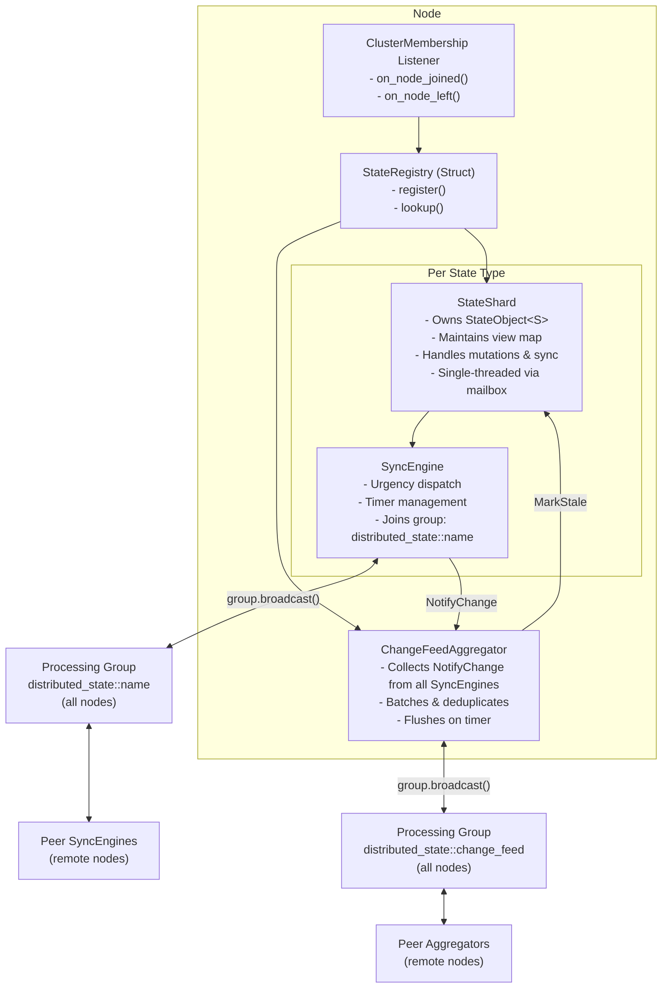
```mermaid
graph TD
    subgraph Node
        SR["StateRegistry (Struct)<br/>- register()<br/>- lookup()"]
        CML["ClusterMembership Listener<br/>- on_node_joined()<br/>- on_node_left()"]
        CFA["ChangeFeedAggregator<br/>- Collects NotifyChange from all SyncEngines<br/>- Batches &amp; deduplicates<br/>- Flushes on timer"]

        subgraph "Per State Type"
            SS["StateShard<br/>- Owns StateObject&lt;S&gt;<br/>- Maintains view map<br/>- Handles mutations &amp; sync<br/>- Single-threaded via mailbox"]
            SE["SyncEngine<br/>- Urgency dispatch<br/>- Timer management<br/>- Joins group: distributed_state::name"]
        end

        SR --> SS
        SR --> CFA
        CML --> SR
        SS --> SE
        SE -->|"NotifyChange"| CFA
        CFA -->|"MarkStale"| SS
    end

    SE <-->|"group.broadcast()"| PG["Processing Group<br/>distributed_state::name<br/>(all nodes)"]
    PG <--> RemoteSE["Peer SyncEngines<br/>(remote nodes)"]
    CFA <-->|"group.broadcast()"| CFPG["Processing Group<br/>distributed_state::change_feed<br/>(all nodes)"]
    CFPG <--> RemoteCFA["Peer Aggregators<br/>(remote nodes)"]
```

### 6.1 StateRegistry

* Singleton per node. A plain `struct`, **not an actor** — it has no mailbox
  or message loop. Registration and lookup are direct method calls.
* Provides `register()` and `lookup()` APIs.
* On `register()`, validates that the `DistributedState` trait implementation is complete and stores the actor reference.
* Generic over `R: ActorRuntime` — the concrete runtime is a type parameter,
  not a hard-coded dependency.

#### Heterogeneous State Storage — Design Decision

Because `StateShard<S>` is generic over `S: DistributedState`, each registered state type produces a different concrete actor type. The registry must store them in a single `HashMap<String, …>`, which requires **type erasure**. Two approaches were evaluated:

| | Trait-object erasure (`dyn AnyStateShard`) | `Any`-based erasure (`Box<dyn Any>`) |
|---|---|---|
| **Common operations without downcasting** | ✅ The trait defines shared methods (`on_node_joined`, `on_node_left`, `state_name`) callable on any entry. | ❌ The registry cannot invoke any method without knowing the concrete type first. |
| **Cluster event broadcasting** | ✅ The registry iterates all entries and calls trait methods directly — no type knowledge needed. | ❌ Requires a separate side-channel or secondary collection to broadcast to all shards. |
| **Compile-time safety** | ✅ Trait boundary is checked by the compiler; only types implementing the trait can be stored. | ⚠️ Accepts any `'static` type; misuse is caught only at runtime via failed downcasts. |
| **Boilerplate** | ⚠️ Requires defining and maintaining an extra trait + blanket impl. | ✅ Minimal — just `Box::new()` and `downcast_ref()`. |
| **Type-specific operations (query/mutate)** | ⚠️ Still requires downcasting for typed access. | ⚠️ Same — caller must know the concrete type. |

**Decision: Trait-object erasure (`dyn AnyStateShard`).**

The decisive factor is that the registry must broadcast cluster membership events to *all* registered shards regardless of their state type. With `dyn AnyStateShard`, the registry simply iterates the map and calls `on_node_joined()` / `on_node_left()` on each entry. With `Box<dyn Any>`, this is impossible without maintaining a parallel dispatch mechanism, which defeats the purpose of a unified registry.

The extra boilerplate is minimal — one trait with a handful of methods — and is a one-time cost that pays for itself in type safety and simpler cluster event handling.

#### Implementation

```rust
/// Type-erased interface for any StateShard, enabling the registry to
/// perform common operations without knowing the concrete state type.
pub trait AnyStateShard: Send + Sync + 'static {
    /// The globally unique name of this state.
    fn state_name(&self) -> &str;

    /// Notify this shard that a new node has joined the cluster.
    /// Uses fire-and-forget send — no need for async.
    fn on_node_joined(&self, node_id: NodeId);

    /// Notify this shard that a node has left the cluster.
    fn on_node_left(&self, node_id: NodeId);

    /// Mark a peer's entry as stale (called by ChangeFeedAggregator).
    fn on_mark_stale(&self, source: NodeId, new_age: u64);

    /// Return self as `&dyn Any` for downcasting to the concrete type.
    fn as_any(&self) -> &dyn std::any::Any;
}

/// Blanket implementation for all concrete StateShard actors.
/// `R::Ref<StateShardMsg<S>>` is the runtime-provided actor reference type.
impl<R: ActorRuntime, S: DistributedState> AnyStateShard for R::Ref<StateShardMsg<S>> {
    fn state_name(&self) -> &str { S::name() }

    fn on_node_joined(&self, node_id: NodeId) {
        let _ = self.send(StateShardMsg::NodeJoined(node_id));
    }

    fn on_node_left(&self, node_id: NodeId) {
        let _ = self.send(StateShardMsg::NodeLeft(node_id));
    }

    fn on_mark_stale(&self, source: NodeId, new_age: u64) {
        let _ = self.send(StateShardMsg::MarkStale { source, new_age });
    }

    fn as_any(&self) -> &dyn std::any::Any { self }
}
```

The registry stores `HashMap<String, (TypeId, Box<dyn AnyStateShard>)>`:

```rust
use std::any::TypeId;

pub struct StateRegistry<R: ActorRuntime> {
    runtime: R,
    shards: HashMap<String, (TypeId, Box<dyn AnyStateShard>)>,
}

impl<R: ActorRuntime> StateRegistry<R> {
    /// Register a new state type. Spawns the StateShard and SyncEngine actors.
    ///
    /// Returns `RegistryError::DuplicateName` if a different state type has
    /// already been registered under the same `S::name()`.
    pub fn register<S: DistributedState>(&mut self, config: StateConfig<S>) -> Result<(), RegistryError> {
        let name = S::name().to_string();
        let new_type_id = TypeId::of::<S>();

        if let Some((existing_type_id, _)) = self.shards.get(&name) {
            if *existing_type_id == new_type_id {
                // Same type re-registered — idempotent, no-op.
                return Ok(());
            }
            return Err(RegistryError::DuplicateName {
                name,
                existing_type: existing_type_id.clone(),
                new_type: new_type_id,
            });
        }

        let actor_ref = self.spawn_state_shard::<S>(config);
        self.shards.insert(name, (new_type_id, Box::new(actor_ref)));
        Ok(())
    }

    /// Look up a state shard by name, downcasting to the expected concrete type.
    /// Returns an error if the state is not registered or the type does not match.
    pub fn lookup<S: DistributedState>(&self) -> Result<&R::Ref<StateShardMsg<S>>, RegistryError> {
        let (_, entry) = self.shards
            .get(S::name())
            .ok_or_else(|| RegistryError::StateNotRegistered {
                name: S::name().to_string(),
            })?;

        entry
            .as_any()
            .downcast_ref::<R::Ref<StateShardMsg<S>>>()
            .ok_or_else(|| RegistryError::TypeMismatch {
                name: S::name().to_string(),
            })
    }

    /// Broadcast a cluster event to all registered shards (no downcasting needed).
    pub fn broadcast_node_joined(&self, node_id: NodeId) {
        for (_, shard) in self.shards.values() {
            shard.on_node_joined(node_id);
        }
    }

    pub fn broadcast_node_left(&self, node_id: NodeId) {
        for (_, shard) in self.shards.values() {
            shard.on_node_left(node_id);
        }
    }
}
```

Callers use `lookup::<MyState>()` for typed query/mutate access, while the registry internally uses the trait interface for cluster-wide broadcasts.

### 6.2 StateShard

* One instance per registered state type per node.
* **Owns** the `StateObject<S>` (the local shard).
* **Maintains** the view map via `ArcSwap` (§3.1) for lock-free reads.
* All writes go through the actor's mailbox — single-threaded, no locks.

#### Messages

> **Implementation note:** In the actual Rust implementation, there will be
> **two separate message enums** — `SimpleShardMsg<S: DistributedState>` and
> `DeltaShardMsg<S: DeltaDistributedState>` — because the delta-aware variants
> reference associated types (`S::StateDeltaChange`, `S::View`) that only exist
> on `DeltaDistributedState`. They are shown combined here for readability.
> The same applies to `SyncEngineMsg`.

```rust
enum StateShardMsg<S: DistributedState> {
    /// Caller wants to mutate the local state (simple).
    Mutate { closure: Box<dyn FnOnce(&mut S::State) + Send>, reply: ReplyChannel<Result<(), MutationError>> },

    /// Caller wants to mutate with a state delta (delta-aware only).
    /// (Only in DeltaShardMsg<S: DeltaDistributedState> in implementation.)
    MutateWithDelta { closure: Box<dyn FnOnce(&mut S::State) -> S::StateDeltaChange + Send>, reply: ReplyChannel<Result<(), MutationError>> },

    /// A peer's full snapshot arrived (from SyncEngine).
    InboundSnapshot { source: NodeId, generation: Generation, wire_version: u32, bytes: Vec<u8> },

    /// A peer's view delta arrived (from SyncEngine, delta-aware only).
    /// `generation` is the state AFTER applying the delta. The delta
    /// advances age by exactly 1 (generation.age == local.age + 1).
    InboundDelta { source: NodeId, generation: Generation, wire_version: u32, bytes: Vec<u8> },

    /// A new node joined the cluster.
    NodeJoined(NodeId),

    /// A node left the cluster.
    NodeLeft(NodeId),

    /// ChangeFeedAggregator reports that a peer has newer data.
    MarkStale { source: NodeId, generation: Generation },

    /// Query slow path: refresh stale entries and invoke projection.
    RefreshAndQuery { max_staleness: Duration, reply: ReplyChannel<Result<Box<dyn Any>, QueryError>> },
}
```

> **`ReplyChannel<T>`** is a type alias for the runtime-specific reply
> mechanism. For ractor this is `RpcReplyPort<T>`; for kameo it is
> `kameo::Reply<T>`; for actix it would be a `oneshot::Sender<T>`. The
> abstraction is: the caller provides a channel, the handler sends the
> response through it.

#### Key Workflows

**`Mutate` (simple state):**

```
1. Apply closure to state
2. Advance age and timestamps
3. Clone state into view map (per-node ArcSwap store)
4. Persist: save(state, None)  — rollback on failure
5. Send OutboundSnapshot to SyncEngine
6. Reply Ok to caller
```

**`MutateWithDelta` (delta-aware):**

```
1. Apply closure to state, capture StateDeltaChange
2. Advance age and timestamps
3. project_delta(state_delta) → ViewDelta
4. project_view(state) → View, insert into view map (per-node ArcSwap store)
5. Determine sync_urgency
6. Persist: save(state, Some(state_delta)) — rollback on failure
7. Send OutboundDelta to SyncEngine
8. Reply Ok to caller
```

**`InboundSnapshot`:**

```
1. Deserialize state/view from bytes using wire_version
2. If incoming generation ≤ local generation → discard (stale)
3. Insert/replace entry in view map (per-node ArcSwap store)
```

**`InboundDelta` (delta-aware only):**

```
1. Deserialize delta from bytes using wire_version
2. If generation.incarnation ≠ local incarnation → gap or discard
3. If generation.age ≠ local.age + 1 → gap (ahead) or discard (behind)
4. apply_delta(local_view, delta) → new view
5. Update entry in view map with new generation (per-node ArcSwap store)
```

**`NodeJoined`:**

```
1. Add empty placeholder entry for the new node
2. Send own snapshot to SyncEngine for delivery to the new node
3. Request snapshot from the new node via SyncEngine
```

**`NodeLeft`:**

```
1. Remove the departed node's entry from view map (ArcSwap store)
2. Cancel any in-flight pulls for that node
```

**`MarkStale` (from ChangeFeedAggregator):**

```
1. Look up the source node's entry in the view map
2. Compare incoming generation vs local generation:
   - If incoming generation > local generation → mark stale
   - Otherwise → no-op (already have equal or newer data)
3. Set entry.pending_remote_generation = Some(incoming_generation)
4. Update via per-node ArcSwap store
```

**`RefreshAndQuery` (slow path):**

```
1. Check if a refresh is already in-flight for the same stale peers
   (request coalescing — avoids thundering herd from concurrent queries)
2. If refresh in-flight → wait for the existing refresh to complete
3. Otherwise, identify stale entries:
   - synced_at.elapsed() > max_staleness, OR
   - pending_remote_generation > entry.generation (change feed told us newer data exists)
4. Pull fresh views from stale peers concurrently via SyncEngine
5. Update view map with refreshed entries, clear pending_remote_generation (per-node ArcSwap store)
6. Invoke projection on the updated snapshot
7. Reply with projection result
```

> **Request coalescing:** The `StateShard` actor maintains a
> `HashMap<NodeId, Shared<Future<PullResult>>>` of in-flight pulls. When a
> `RefreshAndQuery` arrives and a pull is already pending for a stale peer,
> the new request awaits the existing future instead of issuing a duplicate
> pull. This prevents N concurrent queries from triggering N redundant pulls
> to the same peer.

### 6.3 SyncEngine

* One instance per registered state type per node.
* Handles outbound broadcasting and inbound wire message routing.
* Manages timers for periodic and batched strategies.

#### Broadcasting via Processing Groups

Rather than manually maintaining a peer list and iterating it on every
broadcast, each `SyncEngine` actor joins a **processing group** named after
the state type. All `SyncEngine` actors for the same state type across all
nodes in the cluster share the same group.

```rust
// On actor startup (framework-agnostic):
let group_name = format!("distributed_state::{}", S::name());
runtime.groups().join(&group_name)?;
```

**Benefits over manual peer tracking:**

| Concern | Manual `Vec<PeerRef>` | Processing Group |
|---|---|---|
| Adding/removing peers | Must handle `NodeJoined`/`NodeLeft` manually; maintain peer list | Automatic — the runtime tracks group membership across the cluster |
| Broadcast | `for peer in &self.peers { peer.send(...) }` | `group.broadcast(&group_name, msg)` — single call |
| Node crash cleanup | Must detect and remove stale peer refs | The runtime removes crashed actors from the group automatically |
| New state type registration | Must announce to all existing peers | Actor joins the group; existing members discover it via the group |

The SyncEngine no longer needs `NodeJoined` / `NodeLeft` messages — the
processing group handles membership transparently. The SyncEngine focuses purely
on serialization, urgency dispatch, and timer management.

**Broadcast code becomes:**

```rust
impl<S: DeltaDistributedState> SyncEngine<S> {
    fn broadcast_delta_now(&self, msg: &OutboundDelta<S>) {
        let delta_bytes = S::serialize_delta(&msg.delta, S::WIRE_VERSION);
            from_age: msg.from_age,
            to_age: msg.to_age,
            wire_version: S::WIRE_VERSION,
            delta_bytes,
        };

        // Single call — the runtime delivers to all group members across nodes.
        let group_name = format!("distributed_state::{}", S::name());
        self.runtime.groups().broadcast(&group_name, SyncEngineMsg::InboundWireMessage(sync_msg));
    }
}
```

#### Messages

```rust
enum SyncEngineMsg<S> {
    /// StateShard produced a full snapshot to broadcast (simple state).
    OutboundSnapshot { age: u64, wire_version: u32, state: S::State },

    /// StateShard produced a delta to broadcast (delta-aware state).
    OutboundDelta { from_age: u64, to_age: u64, wire_version: u32,
                    delta: S::Delta, new_view: S::View, urgency: SyncUrgency },

    /// Wire message received from a peer SyncEngine.
    InboundWireMessage(SyncMessage),

    /// Periodic timer fired — time to push pending state/deltas.
    TimerTick,

    /// StateShard is requesting a pull from a specific peer.
    PullView { peer_id: NodeId, reply: ReplyChannel<PullResult> },

    /// A peer requested our current snapshot.
    SnapshotRequest { peer_id: NodeId },
}
```

#### Key Workflows

**`OutboundSnapshot` (simple state):**

```
1. Dispatch based on push_mode:
   - ActivePush → serialize via S::serialize_state(), group.broadcast() FullSnapshot
   - ActiveFeedLazyPull → send NotifyChange to ChangeFeedAggregator
   - None → no-op (periodic_full_sync or pull_on_query will handle it)
```

**`OutboundDelta` (delta-aware):**

```
1. Check urgency:
   - Immediate → serialize and broadcast now (regardless of push_mode)
   - Delayed(d) → schedule a timer for d, store pending
   - Suppress → accumulate into pending_view/pending_age
   - Default → dispatch based on push_mode:
       · ActivePush → serialize delta, group.broadcast() DeltaUpdate
       · ActiveFeedLazyPull → send NotifyChange to ChangeFeedAggregator
       · None → no-op
```

**`InboundWireMessage`:**

```
1. Ignore messages where source_node == self.node_id (own broadcast)
2. Match on SyncMessage variant:
   - FullSnapshot → forward InboundSnapshot to StateShard
   - DeltaUpdate → forward InboundDelta to StateShard
   - RequestSnapshot → send our current view/state to the requesting peer
```

> **Note:** `ChangeFeed` notifications no longer flow through `SyncEngineMsg`.
> They are handled by the `ChangeFeedAggregator` actor (see §6.5), which
> batches notifications across all state types and routes inbound notifications
> directly to the StateShard.

**`TimerTick` (fired by periodic_full_sync interval):**

```
1. If periodic_full_sync is configured and interval has elapsed:
   - Request current state/view from StateShard
   - Serialize and group.broadcast() a FullSnapshot to all peers
   - This acts as a safety net: even if individual deltas or change feed
     notifications were lost, peers get a full refresh
2. Reset timer for next interval
```

**`PullView` (query-initiated refresh):**

> **Note:** Point-to-point — targets a specific peer looked up via
> `group.get_members()`, not a broadcast.

```
1. Look up the target peer's SyncEngine actor reference from the group members list
2. Send RequestSnapshot to that specific peer
3. Wait for response (with timeout)
4. Reply with PullResult::Success { bytes, age, wire_version }
   or PullResult::Unreachable on timeout
```

**`SnapshotRequest`:**

```
1. Load current view/state from the StateShard's view map
2. Serialize and send FullSnapshot to the requesting peer
```

### 6.4 ClusterMembership Listener

* Subscribes to the runtime's cluster events via `ClusterEvents::subscribe()`.
* On **NodeJoined**: notifies all `StateShard` actors (via `StateRegistry`) to
  add the new node to their view map and trigger a snapshot exchange.
  The `SyncEngine` does **not** need to be notified — the processing
  group automatically includes the new node's `SyncEngine` once it joins the
  group.
* On **NodeLeft**: notifies all `StateShard` actors to remove the departed
  node from their view map. Again, the `SyncEngine`'s group membership is
  cleaned up automatically by the runtime.

### 6.5 ChangeFeedAggregator

* **One per node** (not per state type) — this is what enables cross-state batching.
* Collects change notifications from all local `SyncEngine` actors.
* Deduplicates and batches them, then broadcasts a single `BatchedChangeFeed`
  message to all peer aggregators on a configurable interval.
* Routes inbound batched notifications to the appropriate local `StateShard`.

#### Processing Group

The `ChangeFeedAggregator` joins a **dedicated** processing group:

```rust
// On startup:
runtime.groups().join("distributed_state::change_feed")?;
```

This group is separate from the per-state-type SyncEngine groups. All
`ChangeFeedAggregator` actors across the cluster share this single group.

#### Messages

```rust
enum ChangeFeedMsg {
    /// A local SyncEngine reports that a state was mutated.
    NotifyChange {
        state_name: String,
        source_node: NodeId,
        new_age: u64,
    },

    /// Timer fired — flush pending notifications to peers.
    FlushTick,

    /// Batched notification received from a peer aggregator.
    InboundBatch(BatchedChangeFeed),
}
```

#### State

```rust
struct ChangeFeedAggregator<R: ActorRuntime> {
    node_id: NodeId,
    batch_interval: Duration,
    runtime: R,

    /// Pending notifications since last flush.
    /// Key: (state_name, source_node) → latest (incarnation, age).
    /// Deduplicates: if the same state mutates 50 times between flushes,
    /// only one notification (with the highest incarnation/age) is sent.
    pending: HashMap<(String, NodeId), (u64, u64)>,

    /// Reference to the StateRegistry for routing inbound notifications.
    registry: Arc<StateRegistry<R>>,
}
```

#### Key Workflows

**`NotifyChange` (from a local SyncEngine):**

```
1. Upsert into pending map: key=(state_name, source_node),
   value=(incarnation, age) — keep whichever has higher (incarnation, age)
   - If key exists with (incarnation, age) ≥ incoming → no-op
   - Otherwise → insert/update the entry
```

**`FlushTick` (timer fires every batch_interval):**

```
1. If pending map is empty → no-op
2. Build BatchedChangeFeed:
   - source_node = self.node_id
   - notifications = pending.drain() → Vec<ChangeNotification>
     (each notification carries state_name, source_node, incarnation, new_age)
3. runtime.groups().broadcast("distributed_state::change_feed", ChangeFeedMsg::InboundBatch(batch))
4. Log: "flushed {} change notifications to peers", count
```

**`InboundBatch` (from a peer aggregator):**

```
1. Ignore if batch.source_node == self.node_id (own broadcast)
2. For each notification in batch.notifications:
   a. Look up the StateShard for notification.state_name via StateRegistry
   b. Send MarkStale { source_node, incarnation, new_age } to that StateShard
   c. If state_name not registered locally → skip (this node doesn't track it)
```

#### Sequence Diagram: Full Change Feed Flow

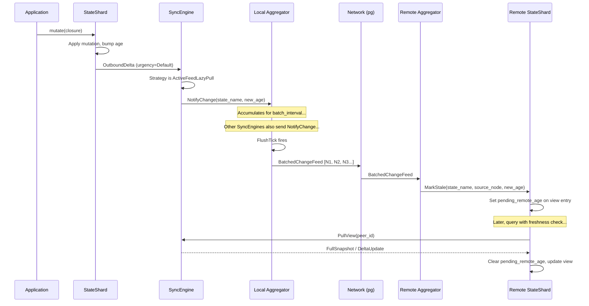
```mermaid
sequenceDiagram
    participant App as Application
    participant SS as StateShard
    participant SE as SyncEngine
    participant CFA as Local Aggregator
    participant Net as Network (pg)
    participant RCFA as Remote Aggregator
    participant RSS as Remote StateShard

    App->>SS: mutate(closure)
    SS->>SS: Apply mutation, bump age
    SS->>SE: OutboundDelta (urgency=Default)
    SE->>SE: Strategy is ActiveFeedLazyPull
    SE->>CFA: NotifyChange(state_name, new_age)

    Note over CFA: Accumulates for batch_interval...
    Note over CFA: Other SyncEngines also send NotifyChange...

    CFA->>CFA: FlushTick fires
    CFA->>Net: BatchedChangeFeed [N1, N2, N3...]
    Net->>RCFA: BatchedChangeFeed

    RCFA->>RSS: MarkStale(state_name, source_node, new_age)
    RSS->>RSS: Set pending_remote_age on view entry

    Note over RSS: Later, query with freshness check...
    RSS->>SE: PullView(peer_id)
    SE-->>RSS: FullSnapshot / DeltaUpdate
    RSS->>RSS: Clear pending_remote_age, update view
```

#### Design Decisions

| Decision | Rationale |
|---|---|
| One aggregator per node (not per state) | Enables cross-state batching — the key bandwidth optimization |
| Deduplication by (state_name, source_node) | If a state mutates 100 times per second, peers only need to know *that* it changed, not how many times |
| Uses its own pg group | Separate from per-state SyncEngine groups to avoid type-system entanglement |
| Only carries age, no payload | Keeps notifications tiny (~40 bytes each); actual data pulled lazily |
| Aggregator routes inbound to StateShard | StateRegistry lookup happens once per notification; StateShard handles the stale marker via its existing actor mailbox |

### 6.6 Timer-Driven Work

Several system behaviors are driven by recurring or one-shot timers rather than
external events. All timers are implemented via the `ActorRuntime`'s
`send_interval` (recurring) or `send_after` (one-shot) methods, which deliver
timer messages through the owning actor's mailbox. This guarantees timer
handlers are serialized with all other messages — no extra synchronization is
needed.

#### Timer Inventory

| Timer | Owner | Interval | Message | Purpose |
|---|---|---|---|---|
| Change feed flush | `ChangeFeedAggregator` | `batch_interval` (default 1 s) | `FlushTick` | Drain pending change notifications and broadcast a `BatchedChangeFeed` to all peers |
| Periodic full sync | `SyncEngine` | `periodic_full_sync` (e.g. 5–30 min) | `TimerTick` | Safety-net: broadcast a full snapshot so peers recover from any lost deltas or notifications |
| Delayed delta send | `SyncEngine` | `SyncUrgency::Delayed(d)` — one-shot | (internal scheduled send) | Deferred delta broadcast; coalesces rapid mutations within the delay window |
| Pull timeout | `StateShard` | `pull_timeout` (default 5 s) — one-shot | (future timeout) | Cancel an in-flight `PullView` if the peer does not respond in time |

#### Lifecycle

```
Actor startup:
  ├─ ChangeFeedAggregator: runtime.send_interval(&self_ref, batch_interval, FlushTick)
  ├─ SyncEngine (if periodic_full_sync configured): runtime.send_interval(&self_ref, interval, TimerTick)
  └─ Timers automatically cancelled when the TimerHandle is dropped (actor stop)

Runtime (on mutation):
  └─ SyncEngine: if sync_urgency == Delayed(d) → runtime.send_after(&self_ref, d, flush pending delta)
```

* **Recurring timers** (`send_interval`) are started during actor initialization
  and run for the actor's lifetime. Dropping the `TimerHandle` on actor stop
  cancels the timer — no explicit teardown is required.
* **One-shot timers** (`send_after`) are used for delayed deltas and pull
  timeouts. If a newer mutation arrives before the delayed timer fires, the
  pending delta is replaced (latest-wins); the stale timer message is ignored
  because the pending age has advanced.
* **Pull timeout** is implemented as a `tokio::time::timeout` wrapping the
  `request()` (RPC) to the peer's SyncEngine, not as a separate actor message.

#### Interaction with Actor Mailbox

Because timer messages enter the same mailbox as all other messages, they are
processed in FIFO order relative to mutations, inbound snapshots, and queries.
This avoids race conditions — for example, a `TimerTick` that fires while a
mutation is in progress will be processed *after* the mutation completes,
ensuring the periodic broadcast always picks up the latest state.

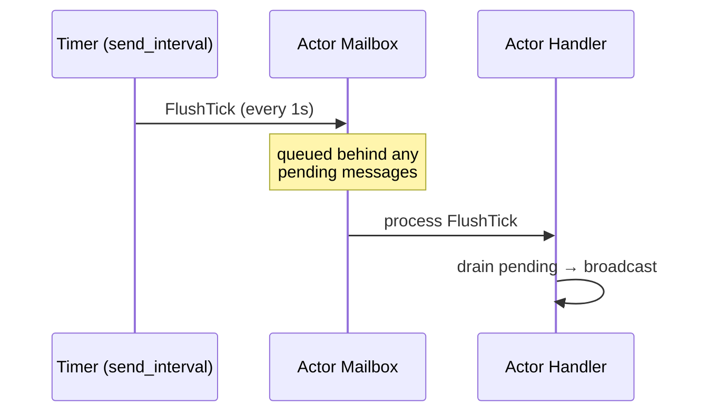
```mermaid
sequenceDiagram
    participant T as Timer (send_interval)
    participant MB as Actor Mailbox
    participant A as Actor Handler

    T->>MB: FlushTick (every 1s)
    Note over MB: queued behind any<br/>pending messages
    MB->>A: process FlushTick
    A->>A: drain pending → broadcast
```

#### Configuration Summary

| Config field | Location | Default | Controls |
|---|---|---|---|
| `batch_interval` | `ChangeFeedConfig` | 1 second | How often change notifications are flushed |
| `periodic_full_sync` | `SyncStrategy` | `None` | Interval for safety-net full broadcasts (`None` = disabled) |
| `pull_timeout` | `StateConfig<S>` | 5 seconds | Max wait for a peer to respond to a pull request |

> **Tuning guidance:** The `batch_interval` trades latency for bandwidth —
> shorter intervals deliver change notifications faster but generate more
> wire messages. The `periodic_full_sync` interval should be long enough
> to avoid unnecessary traffic (minutes, not seconds) but short enough that
> stale peers converge within an acceptable window.

---

## 7. Query API

### 7.1 Querying the Cluster View Map

The query API provides two levels of access:

1. **`query()` — projection callback** (primary API): takes a closure that
   runs against the view map snapshot. Handles freshness checks and pull
   automatically. The closure must be `Send + 'static` because it may run
   inside the actor if the slow path is needed.

2. **`snapshot()` + manual check** (advanced API): returns a read-only
   `Arc<HashMap<...>>` snapshot for callers that want to inspect the map
   directly. No freshness enforcement — the caller is responsible.

```rust
impl<S: DistributedState> StateShard<S> {
    /// Get a read-only snapshot of the current view map.
    /// Lock-free (atomic pointer load). No freshness guarantee.
    pub fn snapshot(&self) -> Arc<HashMap<NodeId, StateViewObject<S::View>>> {
        self.view_map.load_full()
    }

    /// Query the cluster view map with a freshness requirement.
    ///
    /// **Fast path (lock-free):** If all entries are within `max_staleness`,
    /// the projection runs directly on the ArcSwap snapshot — no actor call,
    /// no locking, just an atomic pointer load.
    ///
    /// **Slow path (actor-mediated):** If any entry is stale, a message is
    /// sent to the actor to pull fresh views, swap in the updated map, and
    /// then invoke the projection.
    pub async fn query<R, F>(
        &self,
        max_staleness: Duration,
        project: F,
    ) -> Result<R, QueryError>
    where
        F: FnOnce(&HashMap<NodeId, StateViewObject<S::View>>) -> R + Send + 'static,
        R: Send + 'static,
    {

        // Fast path: load the snapshot (atomic pointer load, lock-free).
        let snapshot = self.view_map.load();

        // Check if any peer entry is stale (by monotonic time or change feed marker).
        let has_stale = snapshot.iter()
            .any(|(node_id, view_obj)| {
                if *node_id == self.node_id { return false; }
                let stale_by_time = view_obj.synced_at.elapsed() > max_staleness;
                let has_pending = view_obj.pending_remote_age
                    .map(|ra| ra > view_obj.age)
                    .unwrap_or(false);
                stale_by_time || has_pending
            });

        if !has_stale {
            // Fast path: all entries are fresh. Invoke projection directly
            // on the snapshot. No actor call, no locking.
            return Ok(project(&*snapshot));
        }

        // Slow path: send RefreshAndQuery to the actor mailbox.
        // The actor will pull stale peers, swap in the updated map,
        // and invoke the projection inside its single-threaded handler.
        self.actor_ref.request(StateShardMsg::RefreshAndQuery {
            max_staleness,
            project: Box::new(project),
        }, self.config.pull_timeout).await
    }

    /// Called inside the actor's message handler (single-threaded).
    /// Pulls stale entries, swaps in the updated map, invokes projection.
    fn handle_refresh_and_query<R, F>(
        &self,
        max_staleness: Duration,
        project: F,
    ) -> Result<R, QueryError>
    where
        F: FnOnce(&HashMap<NodeId, StateViewObject<S::View>>) -> R,
    {
        let now = current_unix_time_ms();
        let staleness_ms = max_staleness.as_millis() as i64;

        // Clone the current map for modification.
        let mut new_map = (**self.view_map.load()).clone();

        // Identify and refresh stale entries (by monotonic time or change feed marker).
        let stale_peers: Vec<NodeId> = new_map.iter()
            .filter(|(node_id, _)| **node_id != self.node_id)
            .filter(|(_, view_obj)| {
                let stale_by_time = view_obj.synced_at.elapsed() > max_staleness;
                let has_pending = view_obj.pending_remote_age
                    .map(|ra| ra > view_obj.age)
                    .unwrap_or(false);
                stale_by_time || has_pending
            })
            .map(|(node_id, _)| *node_id)
            .collect();

        // Pull all stale peers concurrently to minimize total latency.
        // Each pull is independent — no ordering dependency between peers.
        let pull_futures: Vec<_> = stale_peers.iter().map(|peer_id| {
            self.sync_engine.request(SyncEngineMsg::PullView {
                peer_id: *peer_id,
                state_name: S::name().to_string(),
            }, self.config.pull_timeout)
        }).collect();

        let pull_results = futures::future::join_all(pull_futures).await;

        for (peer_id, pull_result) in stale_peers.iter().zip(pull_results) {
            match pull_result {
                Ok(PullResult::Success { view, age, incarnation, wire_version }) => {
                    let deserialized = S::deserialize_view(&view, wire_version);

                    // TODO: handle deserialization failure
                    //       (version mismatch → apply VersionMismatchPolicy)

                    let refreshed_time = current_unix_time_ms();
                    new_map.insert(*peer_id, StateViewObject {
                        age,
                        incarnation,
                        wire_version,
                        value: deserialized.unwrap(),
                        created_time: new_map
                            .get(peer_id)
                            .map(|v| v.created_time)
                            .unwrap_or(refreshed_time),
                        modified_time: refreshed_time,
                        synced_at: Instant::now(),
                        pending_remote_age: None, // Clear — we now have fresh data.
                    });
                }
                _ => {
                    // TODO: handle pull failure
                    //       (peer unreachable → QueryError::StalePeer)
                    todo!("handle pull failure");
                }
            }
        }

        // Atomically swap in the updated map.
        self.view_map.store(Arc::new(new_map));

        // Invoke the projection on the fresh snapshot.
        let snapshot = self.view_map.load();
        Ok(project(&*snapshot))
    }
}
```

### 7.2 Mutating the Local Shard

#### Simple Mutation (`DistributedState`)

For simple states, there is no View/Delta concept. The full state is
broadcast as a `FullSnapshot` on every mutation. This is the simplest path.

```rust
impl<S: DistributedState> StateShard<S> {
    /// Apply a mutation to the owned state shard.
    ///
    /// The closure mutates a cloned state. Only after persistence succeeds
    /// does the mutation become visible in the view map and broadcast to peers.
    pub async fn mutate<F>(&mut self, mutate: F) -> Result<(), MutationError>
    where
        F: FnOnce(&mut S::State) + Send,
    {
        // 1. Clone the state and apply the mutation to the clone.
        //    The original is untouched until we know persistence succeeded.
        let mut new_value = self.state.value.clone();
        mutate(&mut new_value);

        // 2. Advance metadata on a tentative basis.
        let now = current_unix_time_ms();
        let new_age = self.state.age + 1;

        // 3. Persist BEFORE publishing (full state, no delta).
        if let Some(ref persistence) = self.persistence {
            let tentative_state = StateObject {
                value: new_value.clone(),
                age: new_age,
                incarnation: self.state.incarnation,
                storage_version: S::STORAGE_VERSION,
                created_time: self.state.created_time,
                modified_time: now,
            };
            persistence.save(&tentative_state, None).await
                .map_err(MutationError::PersistenceFailed)?;
        }

        // 4. Commit: persistence succeeded, update in-memory state.
        self.state.value = new_value;
        self.state.age = new_age;
        self.state.modified_time = now;

        // 5. Publish to the local view map (now safe — mutation is persisted).
        let mut new_map = (**self.view_map.load()).clone();
        new_map.insert(self.node_id, StateViewObject {
            age: self.state.age,
            incarnation: self.state.incarnation,
            wire_version: S::WIRE_VERSION,
            value: self.state.value.clone(),
            created_time: self.state.created_time,
            modified_time: now,
            synced_at: Instant::now(),
            pending_remote_age: None,
        });
        self.view_map.store(Arc::new(new_map));

        // 6. Broadcast full state to all peers.
        self.sync_engine.send(SyncEngineMsg::OutboundSnapshot {
            age: self.state.age,
            incarnation: self.state.incarnation,
            wire_version: S::WIRE_VERSION,
            state: self.state.value.clone(),
        })?;

        Ok(())
    }
}
```

**On the receiver side** (inside the SyncEngine for simple state):

```rust
// Receive FullSnapshot from a peer — just replace.
fn handle_inbound_snapshot(&self, msg: InboundSnapshot) {
    let state = S::deserialize_state(&msg.state_bytes, msg.wire_version)?;

    // Only accept if incoming (incarnation, age) is newer.
    let mut new_map = (**self.view_map.load()).clone();
    if let Some(existing) = new_map.get(&msg.source_node) {
        if msg.incarnation < existing.incarnation {
            return; // from a prior lifetime — discard
        }
        if msg.incarnation == existing.incarnation && msg.age <= existing.age {
            return; // stale or duplicate within same incarnation — discard
        }
        // msg.incarnation > existing.incarnation → new lifetime, accept unconditionally
    }

    new_map.insert(msg.source_node, StateViewObject {
        age: msg.age,
        incarnation: msg.incarnation,
        wire_version: msg.wire_version,
        value: state,
        created_time: msg.created_time,
        modified_time: msg.modified_time,
        synced_at: Instant::now(),
        pending_remote_age: None, // Direct snapshot — no pending marker.
    });
    self.view_map.store(Arc::new(new_map));
}
```

#### Delta-Aware Mutation (`DeltaDistributedState`)

For large states, the mutation closure returns a `StateDeltaChange` describing what
changed. The system projects it directly to a view-level delta via
`project_delta()`, avoiding the need to snapshot the old view or diff two
potentially large views.

```rust
impl<S: DeltaDistributedState> StateShard<S> {
    /// Apply a mutation that returns a state-level delta.
    ///
    /// The closure mutates a cloned state AND returns a `StateDeltaChange`.
    /// Persistence happens before the view map is updated, ensuring
    /// fast-path readers never see uncommitted mutations.
    pub async fn mutate_with_delta<F>(&mut self, mutate: F) -> Result<(), MutationError>
    where
        F: FnOnce(&mut S::State) -> S::StateDeltaChange + Send,
    {
        // 1. Capture the old view from the current view map (for sync_urgency).
        let old_view = self.view_map.load()
            .get(&self.node_id)
            .map(|entry| entry.value.clone());

        // 2. Clone the state and apply the mutation to the clone.
        let mut new_value = self.state.value.clone();
        let state_delta = mutate(&mut new_value);

        // 3. Advance metadata tentatively.
        let now = current_unix_time_ms();
        let new_age = self.state.age + 1;

        // 4. Project the state-level delta to a view-level delta.
        let delta = S::project_delta(&state_delta);

        // 5. Project the new view.
        let new_view = S::project_view(&new_value);

        // 6. Determine sync urgency (old_view vs new_view).
        let urgency = match &old_view {
            Some(ov) => S::sync_urgency(ov, &new_view, &delta),
            None => SyncUrgency::Immediate,
        };

        // 7. Persist BEFORE publishing — pass both full state and state_delta.
        if let Some(ref persistence) = self.persistence {
            let tentative_state = StateObject {
                value: new_value.clone(),
                age: new_age,
                incarnation: self.state.incarnation,
                storage_version: S::STORAGE_VERSION,
                created_time: self.state.created_time,
                modified_time: now,
            };
            persistence.save(&tentative_state, Some(&state_delta)).await
                .map_err(MutationError::PersistenceFailed)?;
        }

        // 8. Commit: persistence succeeded, update in-memory state.
        self.state.value = new_value;
        self.state.age = new_age;
        self.state.modified_time = now;

        // 9. Publish to the local view map (now safe — mutation is persisted).
        let mut new_map = (**self.view_map.load()).clone();
        new_map.insert(self.node_id, StateViewObject {
            age: self.state.age,
            incarnation: self.state.incarnation,
            wire_version: S::WIRE_VERSION,
            value: new_view.clone(),
            created_time: self.state.created_time,
            modified_time: now,
            synced_at: Instant::now(),
            pending_remote_age: None,
        });
        self.view_map.store(Arc::new(new_map));

        // 10. Forward the delta to the SyncEngine for broadcasting.
        self.sync_engine.send(SyncEngineMsg::OutboundDelta {
            from_age: self.state.age - 1,
            to_age: self.state.age,
            wire_version: S::WIRE_VERSION,
            delta,
            new_view,
            urgency,
        })?;

        Ok(())
    }
}
```

#### Comparison

| Step | `mutate()` (Simple) | `mutate_with_delta()` (Delta-Aware) |
|---|---|---|
| Snapshot old view | ❌ Not needed | ❌ Not needed |
| Apply mutation | `FnOnce(&mut State)` | `FnOnce(&mut State) -> StateDeltaChange` |
| Compute delta | ❌ No delta — full state broadcast | `project_delta(state_delta)` |
| View map entry | State cloned directly | `project_view(state)` |
| Persistence | `save(state, None)` | `save(state, Some(state_delta))` |
| Broadcast | `OutboundSnapshot` (full state) | `OutboundDelta` (view-level delta) |

Inside the `SyncEngine`, the outbound path differs by trait:

**Simple state** — always broadcasts full state:

```rust
impl<S: DistributedState> SyncEngine<S> {
    /// Handle an outbound snapshot from the StateShard.
    /// Simple state always sends full snapshots — no delta logic.
    fn handle_outbound_snapshot(&self, msg: OutboundSnapshot<S>) {
        let state_bytes = S::serialize_state(&msg.state);

        let sync_msg = SyncMessage::FullSnapshot {
            state_name: S::name().to_string(),
            source_node: self.node_id,
            incarnation: msg.incarnation,
            age: msg.age,
            wire_version: S::WIRE_VERSION,
            state_bytes,
        };

        for peer in &self.peers {
            peer.send(sync_msg.clone());
        }
    }
}
```

**Delta-aware state** — uses urgency dispatch and delta broadcasting:

```rust
impl<S: DeltaDistributedState> SyncEngine<S> {
    /// Handle an outbound delta from the StateShard.
    fn handle_outbound_delta(&mut self, msg: OutboundDelta<S>) {
        match msg.urgency {
            SyncUrgency::Immediate => {
                self.broadcast_delta_now(&msg);
            }
            SyncUrgency::Delayed(d) => {
                self.schedule_delta(msg, d);
            }
            SyncUrgency::Suppress => {
                // Accumulate — the next non-suppressed delta will carry
                // the cumulative change via a full view snapshot.
                self.pending_view = Some(msg.new_view);
                self.pending_age = msg.to_age;
            }
            SyncUrgency::Default => {
                // Delegate to the configured strategy
                self.strategy.handle_delta(msg);
            }
        }
    }

    /// Serialize and broadcast a delta to all peers immediately.
    fn broadcast_delta_now(&self, msg: &OutboundDelta<S>) {
        let delta_bytes = S::serialize_delta(&msg.delta, S::WIRE_VERSION);

        let sync_msg = SyncMessage::DeltaUpdate {
            state_name: S::name().to_string(),
            source_node: self.node_id,
            incarnation: msg.incarnation,
            from_age: msg.from_age,
            to_age: msg.to_age,
            // WIRE_VERSION is a compile-time constant from the trait.
            // The receiver reads this to select the right deserializer.
            wire_version: S::WIRE_VERSION,
            delta_bytes,
        };

        for peer in &self.peers {
            peer.send(sync_msg.clone());
        }
    }

    /// Send a full snapshot (used for gap recovery, node join, or when
    /// flushing accumulated suppressed deltas).
    fn send_snapshot(&self, peer: &PeerRef, view: &S::View, age: u64, incarnation: u64) {
        let view_bytes = S::serialize_view(view);

        let sync_msg = SyncMessage::FullSnapshot {
            state_name: S::name().to_string(),
            source_node: self.node_id,
            incarnation,
            age,
            wire_version: S::WIRE_VERSION,
            view_bytes,
        };

        peer.send(sync_msg);
    }
}
```

---

## 8. Persistence (Optional)

State can be optionally persisted to local storage for crash recovery.

* Each node persists **only its own shard** (`StateObject<S>`), not the replicated views.
* On restart, the node loads its shard from storage and re-announces it to the cluster.
* Replicated views are rebuilt from peer announcements during rejoin.

### 8.1 Persistence Trait

The `StatePersistence` trait is implemented by the **application owner** — the
crate provides the contract, but the storage backend (file, database, cloud
blob, etc.) is entirely the application's choice.

The trait receives both the **full state** and an **optional state delta** on
every save. The implementation chooses how to persist:

| Strategy | When to use | How it works |
|---|---|---|
| **Full write** | Small state, simple backend | Ignore `state_delta`, write the full `StateObject` every time |
| **Delta append** | Large state, log-based backend | Append `state_delta` to a write-ahead log; periodically compact with full state |
| **Targeted update** | Large state, database backend | Apply `state_delta` to update only changed rows/fields |

```rust
#[async_trait]
pub trait StatePersistence: Send + Sync + 'static {
    type State;

    /// The state-level delta type. Set to `()` for simple states that
    /// always do full writes. For delta-aware states, this matches
    /// `DeltaDistributedState::StateDeltaChange`.
    type StateDeltaChange;

    /// Persist the state to durable storage.
    ///
    /// Called by the StateShard actor after each mutation.
    /// - `state`: The full state object (always provided).
    /// - `state_delta`: The state-level change that was just applied.
    ///   `Some(delta)` for delta-aware mutations (`mutate_with_delta()`),
    ///   `None` for simple mutations (`mutate()`) or initial save.
    ///
    /// The implementation can choose to write the full state, append just
    /// the delta to a log, or apply the delta to a database.
    async fn save(
        &self,
        state: &StateObject<Self::State>,
        state_delta: Option<&Self::StateDeltaChange>,
    ) -> Result<(), PersistError>;

    /// Load the state from durable storage.
    /// Returns None if no prior state exists (first-time startup).
    /// If using delta-append, the implementation must reconstruct the full
    /// state by replaying the log.
    async fn load(&self) -> Result<Option<StateObject<Self::State>>, PersistError>;
}

/// Errors from persistence operations.
pub enum PersistError {
    /// The storage backend is unavailable (disk full, network error, etc.).
    StorageUnavailable(String),
    /// The stored data could not be deserialized (corrupt or incompatible
    /// storage_version).
    DeserializationFailed { storage_version: u32, details: String },
    /// Generic I/O error.
    Io(std::io::Error),
}
```

**Simple state example** — always writes full state, ignores delta:

```rust
#[async_trait]
impl StatePersistence for FileBackend {
    type State = NodeResourceState;
    type StateDeltaChange = ();  // not used

    async fn save(
        &self,
        state: &StateObject<Self::State>,
        _state_delta: Option<&()>,
    ) -> Result<(), PersistError> {
        let bytes = bincode::serialize(state).map_err(/* ... */)?;
        tokio::fs::write(&self.path, bytes).await.map_err(PersistError::Io)
    }

    async fn load(&self) -> Result<Option<StateObject<Self::State>>, PersistError> {
        // ... read file, deserialize ...
    }
}
```

**Delta-aware example** — appends deltas, periodically compacts:

```rust
#[async_trait]
impl StatePersistence for WalBackend {
    type State = RoutingTableState;
    type StateDeltaChange = RoutingChange;  // matches DeltaDistributedState::StateDeltaChange

    async fn save(
        &self,
        state: &StateObject<Self::State>,
        state_delta: Option<&RoutingChange>,
    ) -> Result<(), PersistError> {
        match state_delta {
            Some(delta) => {
                // Append just the delta — fast, O(delta_size).
                self.wal.append(delta)?;
                self.delta_count += 1;

                // Periodically compact: write full state + truncate log.
                if self.delta_count >= self.compact_threshold {
                    self.wal.write_checkpoint(state)?;
                    self.delta_count = 0;
                }
                Ok(())
            }
            None => {
                // No delta (initial save or simple mutation fallback).
                self.wal.write_checkpoint(state)?;
                Ok(())
            }
        }
    }

    async fn load(&self) -> Result<Option<StateObject<Self::State>>, PersistError> {
        // Read last checkpoint + replay subsequent deltas.
        let checkpoint = self.wal.read_checkpoint()?;
        let deltas = self.wal.read_deltas_since_checkpoint()?;
        // Apply deltas to reconstruct current state...
    }
}
```

### 8.2 Ownership: This Crate Controls Write Timing

**Writes are controlled by this crate, not the application.** The `StateShard`
actor calls `save()` automatically after every successful mutation — the
application author does not call `save()` directly. This ensures the persisted
state is always consistent with the in-memory state and the age/metadata are
correctly stamped.

The application owner controls:

| Concern | Owner |
|---|---|
| **When** to write | This crate (after every mutation) |
| **Where** to write (storage backend) | Application (implements `StatePersistence`) |
| **Whether** to enable persistence at all | Application (passes `Some(persistence)` or `None` at registration) |
| **How** to serialize to storage | Application (inside `save()` / `load()`) |

### 8.3 Startup: Loading State from Store

When the `StateShard` actor starts, it follows this sequence:

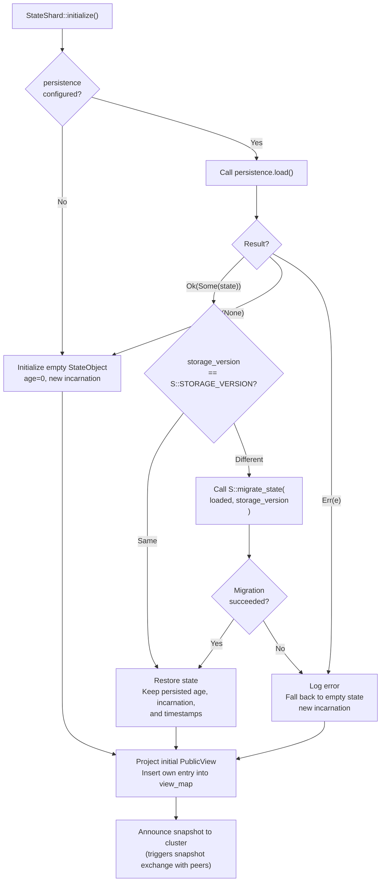
```mermaid
flowchart TD
    Start["StateShard::initialize()"] --> HasPersist{"persistence\nconfigured?"}
    HasPersist -->|No| Fresh["Initialize empty StateObject\nage=0, new incarnation"]
    HasPersist -->|Yes| Load["Call persistence.load()"]
    Load --> LoadResult{"Result?"}
    LoadResult -->|"Ok(Some(state))"| CheckVer{"storage_version\n== S::STORAGE_VERSION?"}
    LoadResult -->|"Ok(None)"| Fresh
    LoadResult -->|"Err(e)"| LoadFail["Log error\nFall back to empty state\nnew incarnation"]
    CheckVer -->|Same| Restore["Restore state\nKeep persisted age, incarnation,\nand timestamps"]
    CheckVer -->|Different| Migrate["Call S::migrate_state(\nloaded, storage_version\n)"]
    Migrate --> MigrateResult{"Migration\nsucceeded?"}
    MigrateResult -->|Yes| Restore
    MigrateResult -->|No| LoadFail
    Restore --> ProjectView["Project initial PublicView\nInsert own entry into view_map"]
    Fresh --> ProjectView
    LoadFail --> ProjectView
    ProjectView --> Announce["Announce snapshot to cluster\n(triggers snapshot exchange with peers)"]
```

**Key startup code:**

```rust
impl<S: DistributedState> StateShard<S> {
    /// Called during actor initialization (before the actor starts
    /// processing messages). Framework-specific lifecycle hooks
    /// (e.g., ractor's `pre_start()`) delegate to this method.
    fn initialize(&mut self) -> Result<(), StartupError> {
        let new_incarnation = || current_unix_time_ms() as u64;

        let state = match &self.persistence {
            None => StateObject { incarnation: new_incarnation(), ..Default::default() },
            Some(persistence) => {
                match persistence.load().await {
                    Ok(Some(loaded)) => {
                        if loaded.storage_version == S::STORAGE_VERSION {
                            // Same version — use as-is. Incarnation preserved.
                            tracing::info!(
                                state = S::name(),
                                age = loaded.age,
                                "Restored state from persistence"
                            );
                            loaded
                        } else {
                            // Different version — attempt migration.
                            match S::migrate_state(loaded.value, loaded.storage_version) {
                                Ok(migrated_value) => {
                                    tracing::info!(
                                        state = S::name(),
                                        from_version = loaded.storage_version,
                                        to_version = S::STORAGE_VERSION,
                                        "Migrated persisted state"
                                    );
                                    StateObject {
                                        value: migrated_value,
                                        age: loaded.age,
                                        incarnation: loaded.incarnation,
                                        storage_version: S::STORAGE_VERSION,
                                        created_time: loaded.created_time,
                                        modified_time: loaded.modified_time,
                                    }
                                }
                                Err(e) => {
                                    tracing::error!(
                                        state = S::name(),
                                        storage_version = loaded.storage_version,
                                        error = %e,
                                        "State migration failed; starting fresh"
                                    );
                                    StateObject { incarnation: new_incarnation(), ..Default::default() }
                                }
                            }
                        }
                    }
                    Ok(None) => {
                        // First-time startup — no prior state.
                        tracing::info!(state = S::name(), "No persisted state found; starting fresh");
                        StateObject { incarnation: new_incarnation(), ..Default::default() }
                    }
                    Err(e) => {
                        // Persistence backend failure — start fresh.
                        // This is a deliberate design choice: we prefer a running node
                        // with empty state over a node that refuses to start.
                        tracing::error!(
                            state = S::name(),
                            error = %e,
                            "Failed to load persisted state; starting fresh"
                        );
                        StateObject { incarnation: new_incarnation(), ..Default::default() }
                    }
                }
            }
        };

        self.state = state;

        // Project initial view and seed the view_map with own entry.
        let view = S::project_view(&self.state.value);
        let mut initial_map = HashMap::new();
        initial_map.insert(self.node_id, StateViewObject {
            age: self.state.age,
            incarnation: self.state.incarnation,
            wire_version: S::WIRE_VERSION,
            value: view,
            created_time: self.state.created_time,
            modified_time: self.state.modified_time,
            synced_at: Instant::now(),
            pending_remote_age: None,
        });
        self.view_map.store(Arc::new(initial_map));

        Ok(())
    }
}
```

The `migrate_state` method is an optional extension on the `DistributedState`
trait with a default implementation that returns an error (no migration
supported):

```rust
pub trait DistributedState: Send + Sync + 'static {
    // ... existing methods ...

    /// Migrate state from an older storage_version to the current version.
    /// Default implementation rejects migration (returns Err).
    fn migrate_state(
        old_state: Self::State,
        from_version: u32,
    ) -> Result<Self::State, PersistError> {
        Err(PersistError::DeserializationFailed {
            storage_version: from_version,
            details: format!(
                "No migration path from storage_version {} to {}",
                from_version, Self::STORAGE_VERSION,
            ),
        })
    }
}
```

### 8.4 Write Path: Save After Mutation

The `StateShard` actor calls `save()` synchronously after every mutation,
**after** updating the in-memory state and PublicViewMap but **before**
forwarding the delta to the `SyncEngine`. This ordering ensures:

1. If save fails, the mutation is rolled back (age reverted, old view restored)
   and the delta is never broadcast — peers never see a state that wasn't
   persisted.
2. If the node crashes after save but before broadcast, peers will receive the
   update on rejoin via the snapshot exchange.

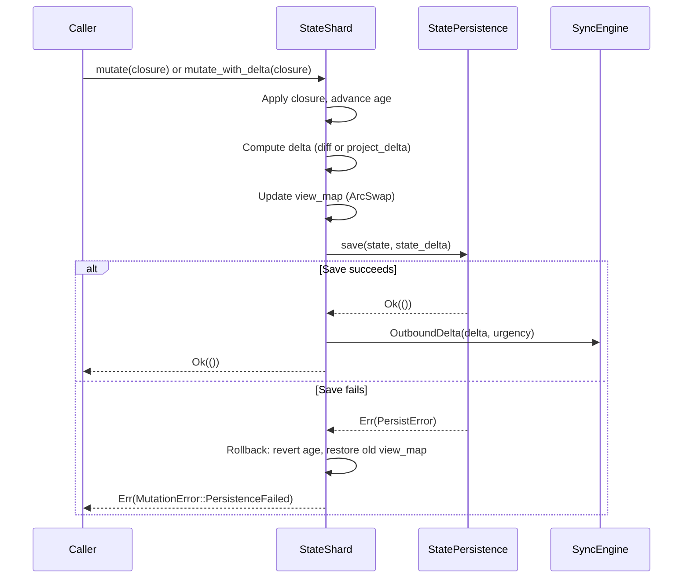
```mermaid
sequenceDiagram
    participant Caller
    participant Shard as StateShard
    participant Store as StatePersistence
    participant Sync as SyncEngine

    Caller->>Shard: mutate(closure) or mutate_with_delta(closure)
    Shard->>Shard: Apply closure, advance age
    Shard->>Shard: Compute delta (diff or project_delta)
    Shard->>Shard: Update view_map (ArcSwap)
    Shard->>Store: save(state, state_delta)
    alt Save succeeds
        Store-->>Shard: Ok(())
        Shard->>Sync: OutboundDelta(delta, urgency)
        Shard-->>Caller: Ok(())
    else Save fails
        Store-->>Shard: Err(PersistError)
        Shard->>Shard: Rollback: revert age, restore old view_map
        Shard-->>Caller: Err(MutationError::PersistenceFailed)
    end
```

The rollback logic is in `commit_mutation()` (§7.2). The persistence call
passes `state_delta`:

- `mutate()` → `save(state, None)` — no delta available, backend does full write
- `mutate_with_delta()` → `save(state, Some(state_delta))` — backend can choose
  full write or delta append

### 8.5 Failure Modes and Recovery

| Failure | Behavior | Recovery |
|---|---|---|
| **`load()` returns `Err`** | Log error, start with empty state (age=0). Node re-announces to cluster and rebuilds peer views from snapshot exchange. | Operator investigates storage backend. Node functions normally but loses local history. |
| **`load()` returns data at unknown `storage_version`** | Attempt `migrate_state()`. If migration fails, fall back to empty state. | Application author implements `migrate_state()` to handle version transitions. |
| **`save()` returns `Err`** | Mutation is rolled back: age reverted, view_map restored. `MutationError::PersistenceFailed` returned to caller. Delta is **not** broadcast. | Caller retries or reports the error. If storage is permanently broken, the application can re-register the state without persistence. |
| **Node crashes after `save()` but before broadcast** | On restart, node loads persisted state at the saved age. Peers still have the old view. | Snapshot exchange on rejoin brings peers up to date. No data loss. |
| **Node crashes before `save()`** | On restart, node loads the last successfully persisted state. The in-flight mutation is lost. | Acceptable — the mutation was never acknowledged to the caller (the `mutate()` call did not return `Ok`). |
| **Storage corruption** | `load()` returns `Err(DeserializationFailed)`. Node starts fresh. | Operator restores from backup or accepts fresh start. Peer views are rebuilt from cluster. |

### 8.6 Design Decision: Why Not Batch Writes?

Saving after every mutation is the simplest correct strategy but may be
expensive for high-frequency state updates. Future optimization options:

1. **Write-ahead log (WAL):** Append deltas to a log, compact periodically.
   Reduces per-mutation I/O to a sequential append.
2. **Debounced save:** Coalesce rapid mutations and save at most once per
   configurable interval. Trades durability (up to one interval of mutations
   may be lost on crash) for throughput.
3. **Async save:** Move persistence to a background task. The mutation returns
   immediately; save happens asynchronously. Risk: crash before save loses
   data.

These are **not implemented in v1** — they can be added behind the existing
`StatePersistence` trait without changing the API. The synchronous per-mutation
save is the correct default for a library that values correctness over
throughput, and the overhead is dominated by the application's storage backend
choice.

---

## 9. Cluster Lifecycle Events

### 9.1 Node Joins

1. `ClusterMembership` listener receives `NodeJoined(node_id)`.
2. For each registered state type:
   a. The new node's `StateShard` sends its current `PublicView` snapshot to all existing nodes.
   b. Existing nodes send their `PublicView` snapshots to the new node.
3. The new node's `PublicViewMap` is fully populated.

### 9.2 Node Leaves

1. `ClusterMembership` listener receives `NodeLeft(node_id)`.
2. For each registered state type:
   a. Remove the entry for `node_id` from the `PublicViewMap`.
   b. Any in-flight sync messages from the departed node are discarded.

### 9.3 Crash Restart (No Clean Leave)

When a node crashes (e.g., OOM-kill, hardware fault), it may restart before
the runtime detects the connection loss and fires `NodeLeft`. The sequence:

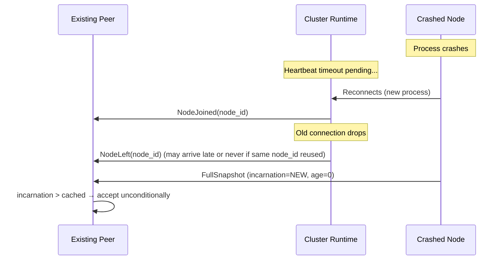
```mermaid
sequenceDiagram
    participant Peer as Existing Peer
    participant R as Cluster Runtime
    participant Node as Crashed Node

    Note over Node: Process crashes
    Note over R: Heartbeat timeout pending...
    Node->>R: Reconnects (new process)
    R->>Peer: NodeJoined(node_id)
    Note over R: Old connection drops
    R->>Peer: NodeLeft(node_id)   (may arrive late or never if same node_id reused)
    Node->>Peer: FullSnapshot (incarnation=NEW, age=0)
    Peer->>Peer: incarnation > cached → accept unconditionally
```

**Key mechanics:**

1. **New incarnation signals a fresh epoch.** The restarted node generates a
   new `incarnation` via `current_unix_time_ms()` (if state was lost) or restores the
   persisted incarnation (if state was recovered). Peers compare
   `(incarnation, age)` — a higher incarnation wins unconditionally, so
   `age=0` is accepted even if the peer cached `age=500` from the prior
   lifetime.

2. **Late or missing `NodeLeft`.** If `NodeLeft` arrives *after* the new
   `NodeJoined`, the `StateShard` removes the entry — but the rejoin snapshot
   exchange immediately repopulates it. If `NodeLeft` never arrives (same
   `node_id` reused by the runtime), the old entry is overwritten by the new
   incarnation's snapshot. Either way the cluster converges.

3. **Persistence-enabled restart.** If the node loads state from storage
   successfully, it keeps the same incarnation and same age. Peers see
   same-incarnation updates and apply normal age ordering. No special
   handling needed — the node simply resumes where it left off.

| Scenario | Incarnation | Age | Peers accept? |
|---|---|---|---|
| Crash, no persistence | New (wall-clock ms) | 0 | ✅ New incarnation > old |
| Crash, persistence OK | Same | Persisted age | ✅ Same incarnation, age ≥ cached or catches up on next mutation |
| Crash, persistence fails (migration error) | New (wall-clock ms) | 0 | ✅ New incarnation > old |

### 9.4 Network Partitions

During a network partition, views from unreachable nodes become increasingly stale. The freshness mechanism naturally surfaces this:
* Queries with tight freshness will fail with a `QueryError::StalePeer` for unreachable nodes.
* Callers can choose to proceed with stale data or fail the operation.

---

## 10. Registration Flow

Application startup follows this sequence:

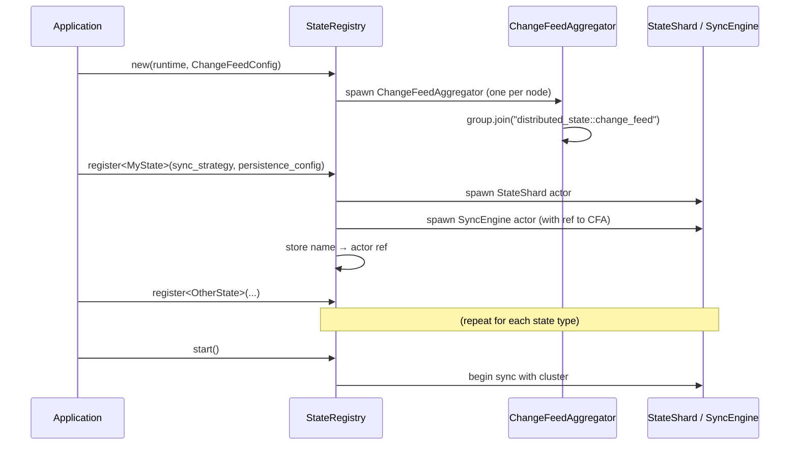
```mermaid
sequenceDiagram
    participant App as Application
    participant Reg as StateRegistry
    participant CFA as ChangeFeedAggregator
    participant Actors as StateShard / SyncEngine

    App->>Reg: new(runtime, ChangeFeedConfig)
    Reg->>CFA: spawn ChangeFeedAggregator (one per node)
    CFA->>CFA: group.join("distributed_state::change_feed")

    App->>Reg: register<MyState>(sync_strategy, persistence_config)
    Reg->>Actors: spawn StateShard actor
    Reg->>Actors: spawn SyncEngine actor (with ref to CFA)
    Reg->>Reg: store name → actor ref

    App->>Reg: register<OtherState>(...)
    Note over Reg,Actors: (repeat for each state type)

    App->>Reg: start()
    Reg->>Actors: begin sync with cluster
```

### 10.1 Registration API

```rust
pub struct StateConfig<S: DistributedState> {
    /// Synchronization strategy. Composed of a primary push mode and
    /// optional layers. Used when `sync_urgency()` returns
    /// `SyncUrgency::Default` (i.e., the fallback behavior).
    pub sync_strategy: SyncStrategy,
    /// Optional persistence backend. The generic parameter ties the
    /// persistence implementation to the concrete state type.
    pub persistence: Option<Box<dyn StatePersistence<State = S::State, StateDeltaChange = ()>>>,
    /// Default freshness for queries when caller doesn't specify.
    pub default_freshness: Duration,
    /// How to handle incoming sync messages with an unrecognized wire_version.
    /// Defaults to `VersionMismatchPolicy::KeepStale`.
    pub version_mismatch_policy: VersionMismatchPolicy,
    /// Timeout for PullView requests to a single peer. If a peer does not
    /// respond within this duration, the pull is considered failed.
    /// Default: 5 seconds.
    pub pull_timeout: Duration,
}

/// Composable sync strategy. Pick a primary push mode and layer on
/// optional behaviors.
pub struct SyncStrategy {
    /// How mutations are proactively pushed to peers.
    pub push_mode: PushMode,

    /// If set, a background timer broadcasts a full snapshot at this interval
    /// regardless of whether individual mutations were already pushed.
    /// Acts as a safety net to bound maximum staleness and recover from
    /// any missed deltas.
    pub periodic_full_sync: Option<Duration>,

    /// If true, the query path pulls fresh data from stale peers on demand
    /// (the "slow path" in §3.1). Defaults to true.
    pub pull_on_query: bool,
}

/// Primary push mode — how each mutation is propagated to peers.
pub enum PushMode {
    /// Push full state/delta immediately on every mutation.
    /// Lowest latency, highest bandwidth.
    ActivePush,

    /// Send lightweight change notifications via the ChangeFeedAggregator.
    /// Peers pull actual data lazily when needed. See §4.2.
    ActiveFeedLazyPull,

    /// No proactive push. Relies entirely on periodic_full_sync and/or
    /// pull_on_query for peers to get updates.
    None,
}

impl Default for SyncStrategy {
    fn default() -> Self {
        Self {
            push_mode: PushMode::ActivePush,
            periodic_full_sync: None,
            pull_on_query: true,
        }
    }
}

impl SyncStrategy {
    /// Active push with no extras — the simplest config for small state.
    pub fn active_push() -> Self {
        Self::default()
    }

    /// Change feed notifications + lazy pull on query.
    pub fn feed_lazy_pull() -> Self {
        Self {
            push_mode: PushMode::ActiveFeedLazyPull,
            periodic_full_sync: None,
            pull_on_query: true,
        }
    }

    /// Change feed + periodic full sync as a staleness safety net.
    pub fn feed_with_periodic_sync(interval: Duration) -> Self {
        Self {
            push_mode: PushMode::ActiveFeedLazyPull,
            periodic_full_sync: Some(interval),
            pull_on_query: true,
        }
    }

    /// Periodic-only — no per-mutation push, just background full sync.
    pub fn periodic_only(interval: Duration) -> Self {
        Self {
            push_mode: PushMode::None,
            periodic_full_sync: Some(interval),
            pull_on_query: true,
        }
    }
}
```

> **Note:** The change feed `batch_interval` is on `ChangeFeedConfig` (below),
> not on `SyncStrategy`, because the `ChangeFeedAggregator` is a **per-node**
> actor that batches across all state types.

```rust
/// Node-level configuration for the ChangeFeedAggregator.
/// Set once during StateRegistry initialization, applies to all state types.
pub struct ChangeFeedConfig {
    /// How often the aggregator flushes batched notifications to peers.
    /// Default: 1 second. Lower values reduce notification latency but
    /// increase network traffic.
    pub batch_interval: Duration,
}

impl Default for ChangeFeedConfig {
    fn default() -> Self {
        Self { batch_interval: Duration::from_secs(1) }
    }
}
```

---

## 11. Error Handling and Retry

### 11.1 Expected Inconsistencies

Because the system is eventually consistent, callers may act on stale data. The downstream processing may fail due to this staleness. The recommended pattern:

```rust
loop {
    let decision = state_shard
        .query(Duration::from_secs(1), |view_map| {
            // Make a decision based on the view
            compute_decision(view_map)
        })
        .await?;

    match execute_decision(decision).await {
        Ok(result) => return Ok(result),
        Err(e) if e.is_stale_state_error() => {
            // Retry with tighter freshness or after a backoff
            tokio::time::sleep(backoff).await;
            continue;
        }
        Err(e) => return Err(e),
    }
}
```

### 11.2 Error Types

```rust
/// Errors returned by StateRegistry operations.
pub enum RegistryError {
    /// The requested state type has not been registered.
    StateNotRegistered { name: String },
    /// The registered entry exists but does not match the expected concrete type.
    /// This indicates a programming error (two state types sharing the same name).
    TypeMismatch { name: String },
    /// A different state type is already registered under this name.
    /// Returned by `register()` when `S::name()` collides with an existing
    /// registration that has a different `TypeId`.
    DuplicateName { name: String, existing_type: TypeId, new_type: TypeId },
}

pub enum QueryError {
    /// One or more peer views could not be refreshed within the freshness window.
    StalePeer { node_id: NodeId, last_synced: i64 },
    /// The state is not registered or the type does not match.
    Registry(RegistryError),
    /// Internal communication error (actor unavailable, etc.).
    ActorError(ActorSendError),
}

pub enum MutationError {
    /// Persistence failed.
    PersistenceFailed(PersistError),
    /// Internal communication error (actor unavailable, etc.).
    ActorError(ActorSendError),
}

impl From<RegistryError> for QueryError {
    fn from(e: RegistryError) -> Self {
        QueryError::Registry(e)
    }
}
```

---

## 12. Wire Protocol

Messages exchanged between `SyncEngine` actors across nodes:

```rust
pub enum SyncMessage {
    /// Full snapshot of a public view (used for initial sync, gap recovery).
    FullSnapshot {
        state_name: String,
        source_node: NodeId,
        generation: Generation,
        wire_version: u32,
        data: Vec<u8>,
    },
    /// Incremental delta update. The delta advances the view from
    /// `generation.age - 1` to `generation.age` (always +1).
    DeltaUpdate {
        state_name: String,
        source_node: NodeId,
        generation: Generation,
        wire_version: u32,
        data: Vec<u8>,
    },
    /// Request a full snapshot (used when a gap is detected or on join).
    RequestSnapshot {
        state_name: String,
        requester: NodeId,
    },
}
```

Messages exchanged between `ChangeFeedAggregator` actors across nodes:

```rust
/// A single change notification (state-type-independent).
pub struct ChangeNotification {
    pub state_name: String,
    pub source_node: NodeId,
    pub generation: Generation,
}

/// Batched change feed — sent at a configurable interval by the aggregator.
/// Carries notifications for ALL state types that changed since the last flush.
/// No target node is specified because this message is broadcast to all nodes.
pub struct BatchedChangeFeed {
    pub source_node: NodeId,
    pub notifications: Vec<ChangeNotification>,
}
```

> **Design note:** `ChangeFeed` was previously a variant of `SyncMessage` sent
> per-state via the SyncEngine processing group. It is now a separate message
> type sent via the dedicated `distributed_state::change_feed` processing group.
> This separation enables cross-state batching — the key bandwidth optimization.
> A single `BatchedChangeFeed` message replaces what would have been N separate
> per-state `SyncMessage::ChangeFeed` messages.

---

## 13. Diagnostics and Observability

In a distributed system, stale state, sync failures, and network issues are
inevitable. The crate must provide first-class diagnostics so that operators and
consumers can quickly identify **what** is stale, **why** it is stale, and
**where** the problem originates.

### 13.1 Per-View Sync Metadata

Every `StateViewObject<V>` already carries timestamps and age. The system exposes
these as queryable diagnostic info without requiring the caller to inspect the
view directly:

```rust
/// Diagnostic snapshot for a single peer's view of a given state.
pub struct PeerSyncStatus {
    pub node_id: NodeId,
    pub state_name: String,
    /// Current age of the local replica.
    pub local_age: u64,
    /// Last known age on the owner node (from the most recent sync message).
    pub remote_age: Option<u64>,
    /// Number of age gaps detected (full snapshot recoveries triggered).
    pub gap_count: u64,
    /// Consecutive failed sync attempts to this peer.
    pub consecutive_failures: u32,
    /// Last successful sync time (unix ms). None if never synced.
    pub last_sync_time: Option<i64>,
    /// Last sync attempt time (unix ms), whether it succeeded or not.
    pub last_attempt_time: Option<i64>,
    /// Last error message from a failed sync attempt, if any.
    pub last_error: Option<String>,
    /// Round-trip latency of the most recent successful sync (ms).
    pub last_sync_latency_ms: Option<u64>,
}
```

### 13.2 State-Level Diagnostics API

Each `StateShard` exposes a diagnostic endpoint that returns the full sync picture:

```rust
impl<S: DistributedState> StateShard<S> {
    /// Returns sync status for every peer in the cluster view map.
    pub async fn sync_status(&self) -> Vec<PeerSyncStatus> { todo!() }

    /// Returns peers whose local view is older than `max_staleness`.
    pub async fn stale_peers(&self, max_staleness: Duration) -> Vec<PeerSyncStatus> { todo!() }

    /// Returns counters and histograms for this state type.
    pub async fn sync_metrics(&self) -> StateSyncMetrics { todo!() }
}

pub struct StateSyncMetrics {
    pub state_name: String,
    /// Total mutations applied to the local shard since startup.
    pub total_mutations: u64,
    /// Total deltas sent to peers.
    pub deltas_sent: u64,
    /// Total deltas received from peers.
    pub deltas_received: u64,
    /// Total full snapshots sent (gap recovery, node join).
    pub snapshots_sent: u64,
    /// Total full snapshots received.
    pub snapshots_received: u64,
    /// Deltas suppressed by SyncUrgency::Suppress.
    pub deltas_suppressed: u64,
    /// Deltas escalated to SyncUrgency::Immediate.
    pub deltas_immediate: u64,
    /// Total sync failures (network errors, deserialization errors, timeouts).
    pub sync_failures: u64,
    /// Total age gaps detected on inbound deltas.
    pub age_gaps_detected: u64,
    /// Total stale deltas discarded (incoming age <= local age).
    pub stale_deltas_discarded: u64,
}
```

### 13.3 Common Failure Scenarios and Diagnostics

The following table maps common distributed system failure modes to the
diagnostic signals the crate provides and the recommended operator response:

| Failure Scenario | Symptoms | Diagnostic Signals | Recommended Action |
|---|---|---|---|
| **Network partition** | Queries for partitioned peers fail freshness checks; `StalePeer` errors returned to callers. | `PeerSyncStatus.consecutive_failures` climbs; `last_sync_time` stops advancing while `last_attempt_time` keeps updating; `last_error` shows timeout or connection refused. | Check network connectivity to the peer. The system will auto-recover when the partition heals. Callers can use `stale_peers()` to identify which nodes are affected and degrade gracefully. |
| **Slow peer / overloaded node** | One peer's view lags behind others; occasional `StalePeer` on tight freshness queries. | `last_sync_latency_ms` is elevated for that peer; `local_age` trails `remote_age` by a growing gap; `age_gaps_detected` may increase. | Investigate load on the slow peer. Consider relaxing freshness for non-critical queries or switching to `PeriodicPush` with a longer interval for that state type. |
| **Repeated age gaps** | `age_gaps_detected` keeps increasing; `snapshots_received` grows proportionally. | `gap_count` in `PeerSyncStatus` is high for specific peers; deltas are arriving out of order. | Indicates the sync interval is too long relative to mutation rate, or the network is reordering packets. Reduce the periodic push interval or switch to `ActivePush`. |
| **Wire version mismatch (rolling upgrade)** | Some peers cannot deserialize deltas; `sync_failures` increases during deployment. | `last_error` contains deserialization error mentioning version mismatch; `wire_version` differs between peers. | Expected during rolling upgrades. Monitor until all nodes are on the same version. If failures persist after upgrade completes, check for version skew bugs in the state author's `serialize`/`deserialize` implementations. |
| **Delta suppression over-tuned** | Peers have very stale views; `stale_peers()` returns many entries even when the network is healthy. | `deltas_suppressed` is disproportionately high relative to `total_mutations`; `deltas_sent` is very low. | The `sync_urgency()` implementation is too aggressive with `Suppress`. Lower the suppression thresholds or add a maximum suppression duration. |
| **Node leaves unexpectedly (crash)** | Queries return views for a node that no longer exists; `NodeLeft` event arrives after a delay. | `PeerSyncStatus` entry is removed after `NodeLeft` is processed. During the gap, `consecutive_failures` climbs and `last_error` shows connection errors. | The system cleans up automatically on `NodeLeft`. If `NodeLeft` is delayed (e.g., heartbeat timeout), the stale entry is visible in `sync_status()` with mounting failures — operators can cross-reference with cluster membership logs. |
| **Local shard mutation blocked** | `MutationError::ActorError` returned; state stops advancing. | `total_mutations` stops incrementing; `deltas_sent` flatlines. `sync_status()` shows local age frozen. | The `StateShard` actor may have crashed or its mailbox is full. Check actor health and runtime logs. |

### 13.4 Structured Logging

All sync operations emit structured log entries using `tracing` spans and events.
Each log entry includes:

- `state_name` — which state type
- `peer_node_id` — which peer (for send/receive events)
- `local_age` / `remote_age` — version context
- `sync_urgency` — the urgency decision for outbound deltas
- `latency_ms` — round-trip time for sync operations
- `error` — error details on failure

Example log output:

```
WARN distributed_state::sync_engine{state="node_resource" peer=NodeId(3)}:
     sync failed, attempt 5, last_error="connection timed out",
     local_age=142, remote_age=158, gap=16

INFO distributed_state::sync_engine{state="node_resource" peer=NodeId(2)}:
     delta pushed, urgency=Immediate, age 200→201, latency_ms=3

DEBUG distributed_state::sync_engine{state="node_resource" peer=NodeId(1)}:
     delta suppressed, urgency=Suppress, age 201→202,
     suppressed_count=4, total_mutations=202
```

### 13.5 Health Check Endpoint

#### Why this crate owns health checks (not the actor runtime)

The actor runtime provides **infrastructure-level** health: is a node
reachable? Is an actor alive? But it has no visibility into the **sync layer**
that this crate introduces. The following problems are invisible to the runtime yet
critical to operators:

| Problem | Runtime sees | This crate sees |
|---|---|---|
| Network is up but deltas are suppressed too aggressively → all views stale | ✅ Node healthy, actor alive | ❌ `deltas_suppressed` high, views beyond freshness window |
| Actor is alive but SyncEngine is stuck retrying serde errors | ✅ Actor alive | ❌ `sync_failures` climbing, `last_error` = deserialization |
| Node is reachable but peer's view is 30s stale due to slow push interval | ✅ Node reachable | ❌ `synced_at` elapsed too long, `local_age` ≪ `remote_age` |
| Rolling upgrade causes half the cluster to reject deltas | ✅ All nodes up | ❌ `wire_version` mismatch across peers |

In short, the runtime answers *"can we talk to the node?"* while this crate answers
*"is the distributed state actually consistent enough to make decisions?"* — a
strictly higher-level concern. Delegating to the runtime would leave a blind spot in
exactly the scenarios operators need to troubleshoot most.

The `StateRegistry` provides an aggregate health check that summarizes the sync
health of all registered states in a single call:

```rust
impl StateRegistry {
    /// Returns the overall health of the distributed state system.
    pub async fn health_check(&self) -> SystemHealth { todo!() }
}

pub struct SystemHealth {
    /// Per-state health summaries.
    pub states: Vec<StateHealth>,
}

pub struct StateHealth {
    pub state_name: String,
    /// Number of peers with a healthy (fresh) view.
    pub healthy_peers: u32,
    /// Number of peers whose view is stale beyond the default freshness.
    pub stale_peers: u32,
    /// Number of peers with consecutive sync failures.
    pub failing_peers: u32,
    /// Overall status for this state.
    pub status: HealthStatus,
}

pub enum HealthStatus {
    /// All peers are synced within the default freshness window.
    Healthy,
    /// Some peers are stale or have recent sync failures, but the
    /// majority are healthy. The system is operational with degraded coverage.
    Degraded,
    /// The majority of peers are stale or unreachable. Queries will
    /// frequently fail freshness checks.
    Unhealthy,
}
```

This endpoint can be wired into application-level health probes (e.g., Kubernetes
readiness checks) so that infrastructure tooling reacts to distributed state
problems automatically.

---

## 14. Example — NodeResource State

This end-to-end example shows how to use the distributed state crate to track
per-node CPU, memory, and disk usage across a cluster, and query for the node
with the lowest memory consumption.

### 14.1 Define the State, View, and Delta Types

```rust
use serde::{Deserialize, Serialize};

/// Full state owned by each node. Contains both private bookkeeping fields
/// and the public resource metrics that are broadcast to the cluster.
#[derive(Clone, Debug, Default)]
pub struct NodeResourceState {
    // -- Public (broadcast to peers via View) --
    pub cpu_usage_pct: f64,
    pub memory_used_bytes: u64,
    pub memory_total_bytes: u64,
    pub disk_used_bytes: u64,
    pub disk_total_bytes: u64,

    // -- Private (local-only, never leaves this node) --
    /// Number of samples collected since last reset; used for local averaging.
    pub sample_count: u64,
    /// Cumulative CPU readings for local averaging.
    pub cpu_accumulator: f64,
}

/// Public view replicated to every node in the cluster.
/// Projected from `NodeResourceState` by `project_view()`.
#[derive(Clone, Debug, Serialize, Deserialize)]
pub struct NodeResourceView {
    pub cpu_usage_pct: f64,
    pub memory_used_bytes: u64,
    pub memory_total_bytes: u64,
    pub disk_used_bytes: u64,
    pub disk_total_bytes: u64,
}

/// View-level delta — a patch that advances a `NodeResourceView`.
/// For this small view struct a full replacement is practical.
#[derive(Clone, Debug, Serialize, Deserialize)]
pub struct NodeResourceViewDelta {
    pub cpu_usage_pct: f64,
    pub memory_used_bytes: u64,
    pub memory_total_bytes: u64,
    pub disk_used_bytes: u64,
    pub disk_total_bytes: u64,
}

/// State-level delta — returned by the mutation closure to describe
/// what changed. Projected to `NodeResourceViewDelta` by `project_delta()`.
#[derive(Clone, Debug)]
pub struct NodeResourceChange {
    pub cpu_usage_pct: f64,
    pub memory_used_bytes: u64,
    pub memory_total_bytes: u64,
    pub disk_used_bytes: u64,
    pub disk_total_bytes: u64,
}
```

### 14.2 Implement the `DeltaDistributedState` Trait

Because `NodeResourceState` has private fields (`sample_count`,
`cpu_accumulator`) that must not leave the owning node, we use the delta-aware
trait.

```rust
use distributed_state::{DeltaDistributedState, SyncUrgency, DeserializeError};

pub struct NodeResource;

impl DeltaDistributedState for NodeResource {
    type State = NodeResourceState;
    type View = NodeResourceView;
    type Delta = NodeResourceViewDelta;
    type StateDeltaChange = NodeResourceChange;

    const WIRE_VERSION: u32 = 1;
    const STORAGE_VERSION: u32 = 1;

    fn name() -> &'static str {
        "node_resource"
    }

    fn project_view(state: &NodeResourceState) -> NodeResourceView {
        NodeResourceView {
            cpu_usage_pct: state.cpu_usage_pct,
            memory_used_bytes: state.memory_used_bytes,
            memory_total_bytes: state.memory_total_bytes,
            disk_used_bytes: state.disk_used_bytes,
            disk_total_bytes: state.disk_total_bytes,
        }
    }

    fn project_delta(state_delta: &NodeResourceChange) -> NodeResourceViewDelta {
        // The state-level change maps 1:1 to the view-level delta here
        // because only public fields changed. Private fields (sample_count,
        // cpu_accumulator) are excluded by construction.
        NodeResourceViewDelta {
            cpu_usage_pct: state_delta.cpu_usage_pct,
            memory_used_bytes: state_delta.memory_used_bytes,
            memory_total_bytes: state_delta.memory_total_bytes,
            disk_used_bytes: state_delta.disk_used_bytes,
            disk_total_bytes: state_delta.disk_total_bytes,
        }
    }

    fn apply_delta(view: &mut NodeResourceView, delta: &NodeResourceViewDelta) {
        view.cpu_usage_pct = delta.cpu_usage_pct;
        view.memory_used_bytes = delta.memory_used_bytes;
        view.memory_total_bytes = delta.memory_total_bytes;
        view.disk_used_bytes = delta.disk_used_bytes;
        view.disk_total_bytes = delta.disk_total_bytes;
    }

    fn serialize_view(view: &NodeResourceView, _target_version: u32) -> Vec<u8> {
        bincode::serialize(view).expect("serialization should not fail")
    }

    fn deserialize_view(bytes: &[u8], _wire_version: u32) -> Result<NodeResourceView, DeserializeError> {
        bincode::deserialize(bytes).map_err(|e| DeserializeError::new(e.to_string()))
    }

    fn serialize_delta(delta: &NodeResourceViewDelta, _target_version: u32) -> Vec<u8> {
        bincode::serialize(delta).expect("serialization should not fail")
    }

    fn deserialize_delta(bytes: &[u8], _wire_version: u32) -> Result<NodeResourceViewDelta, DeserializeError> {
        bincode::deserialize(bytes).map_err(|e| DeserializeError::new(e.to_string()))
    }

    fn sync_urgency(old: &NodeResourceView, new: &NodeResourceView, _delta: &NodeResourceViewDelta) -> SyncUrgency {
        let mem_change = (new.memory_used_bytes as f64 - old.memory_used_bytes as f64).abs();
        let mem_change_pct = mem_change / old.memory_total_bytes as f64 * 100.0;

        let cpu_change = (new.cpu_usage_pct - old.cpu_usage_pct).abs();

        if mem_change_pct > 20.0 || cpu_change > 30.0 {
            // Large swing — broadcast immediately so peers can react
            SyncUrgency::Immediate
        } else if mem_change_pct < 1.0 && cpu_change < 2.0 {
            // Negligible change — suppress and let the next meaningful delta carry it
            SyncUrgency::Suppress
        } else {
            // Normal change — use the configured push mode
            SyncUrgency::Default
        }
    }
}
```

### 14.3 Register the State at Application Startup

```rust
use distributed_state::{StateRegistry, StateConfig, SyncStrategy, ChangeFeedConfig};
use std::time::Duration;

async fn setup(registry: &mut StateRegistry) -> Result<(), RegistryError> {
    // Use change feed + periodic full sync every 30s as a safety net.
    // Resource metrics tolerate a few seconds of staleness and we don't
    // want to flood the network on every sample.
    registry.register::<NodeResource>(StateConfig {
        sync_strategy: SyncStrategy::feed_with_periodic_sync(Duration::from_secs(30)),
        persistence: None,  // No need to persist resource metrics across restarts
        pull_timeout: Duration::from_secs(5),
        ..Default::default()
    })?;

    Ok(())
}
```

### 14.4 Background Task — Periodically Update Local Resource Metrics

```rust
use sysinfo::System;
use std::time::Duration;
use tokio::time;

/// Spawns a background task that samples CPU, memory, and disk every 2 seconds
/// and writes the readings into the local NodeResource shard.
async fn start_resource_monitor(registry: &StateRegistry) -> Result<(), RegistryError> {
    let shard = registry.lookup::<NodeResource>()?.clone();

    tokio::spawn(async move {
        let mut sys = System::new_all();
        let mut interval = time::interval(Duration::from_secs(2));

        loop {
            interval.tick().await;
            sys.refresh_all();

            let cpu_usage = sys.global_cpu_usage() as f64;
            let memory_used = sys.used_memory();
            let memory_total = sys.total_memory();
            let disk_used = sys.disks().iter().map(|d| d.total_space() - d.available_space()).sum::<u64>();
            let disk_total = sys.disks().iter().map(|d| d.total_space()).sum::<u64>();

            // mutate_with_delta() sends a message to the StateShard actor.
            // The closure mutates the state AND returns a StateDeltaChange
            // describing what changed. Safe to call from a background task.
            let _ = shard
                .mutate_with_delta(|state| {
                    state.cpu_usage_pct = cpu_usage;
                    state.memory_used_bytes = memory_used;
                    state.memory_total_bytes = memory_total;
                    state.disk_used_bytes = disk_used;
                    state.disk_total_bytes = disk_total;

                    // Private bookkeeping — not broadcast to peers
                    state.sample_count += 1;
                    state.cpu_accumulator += cpu_usage;

                    // Return the state-level change; the system will call
                    // project_delta() to produce a NodeResourceViewDelta.
                    NodeResourceChange {
                        cpu_usage_pct: cpu_usage,
                        memory_used_bytes: memory_used,
                        memory_total_bytes: memory_total,
                        disk_used_bytes: disk_used,
                        disk_total_bytes: disk_total,
                    }
                })
                .await;
        }
    });

    Ok(())
}
```

### 14.5 Consumer — Find the Node with the Lowest Memory Consumption

```rust
use distributed_state::NodeId;

/// Returns the NodeId of the cluster node currently using the least memory.
/// The query uses a freshness requirement of 5 seconds — the system will
/// refresh any stale peer views before returning.
async fn find_lowest_memory_node(registry: &StateRegistry) -> Result<NodeId, QueryError> {
    let shard = registry.lookup::<NodeResource>()?;

    shard
        .query(Duration::from_secs(5), |view_map| {
            // view_map: &HashMap<NodeId, StateViewObject<NodeResourceView>>
            // The map always contains at least the local node, so unwrap is safe.
            view_map
                .iter()
                .min_by_key(|(_, view_obj)| view_obj.value.memory_used_bytes)
                .map(|(node_id, _)| *node_id)
                .expect("cluster view map always contains the local node")
        })
        .await
}
```

#### Usage

```rust
async fn handle_request(registry: &StateRegistry) {
    match find_lowest_memory_node(registry).await {
        Ok(target_node) => {
            println!("Routing work to node {:?} (lowest memory usage)", target_node);
            // route_work_to(target_node, work_item).await;
        }
        Err(QueryError::StalePeer { node_id, .. }) => {
            println!("Warning: node {:?} view is stale, proceeding with best-effort", node_id);
            // Fallback: use local node or retry
        }
        Err(e) => {
            eprintln!("Failed to query cluster state: {:?}", e);
        }
    }
}
```

### 14.6 Putting It All Together

```mermaid
graph LR
    subgraph "Node A"
        MonA["Resource Monitor<br/>(background task)"]
        ShardA["StateShard&lt;NodeResource&gt;<br/>CPU: 45%, Mem: 2.1GB"]
        MonA -->|"mutate_with_delta()"| ShardA
    end

    subgraph "Node B"
        MonB["Resource Monitor<br/>(background task)"]
        ShardB["StateShard&lt;NodeResource&gt;<br/>CPU: 72%, Mem: 5.8GB"]
        MonB -->|"mutate_with_delta()"| ShardB
    end

    subgraph "Node C"
        MonC["Resource Monitor<br/>(background task)"]
        ShardC["StateShard&lt;NodeResource&gt;<br/>CPU: 30%, Mem: 1.4GB"]
        Consumer["Consumer"]
        MonC -->|"mutate_with_delta()"| ShardC
        Consumer -->|"query(freshness=5s)"| ShardC
    end

    ShardA <-->|"change feed +<br/>full sync (30s)"| ShardB
    ShardA <-->|"change feed +<br/>full sync (30s)"| ShardC
    ShardB <-->|"change feed +<br/>full sync (30s)"| ShardC

    ShardC -->|"Node A: 2.1GB, Node B: 5.8GB<br/>Node C: 1.4GB → pick C"| Consumer
```

Each node runs a background monitor that calls `mutate_with_delta()` on its
local shard every 2 seconds. The `ChangeFeedAggregator` batches change
notifications and broadcasts them to peers every second (configurable). A
periodic full sync every 30 seconds acts as a safety net. When the consumer on
Node C queries with a 5-second freshness window, it reads the full cluster view
locally and picks Node C (1.4 GB) without any cross-node round-trip.

---

## 15. Testability

A distributed state library is hard to test if core logic is coupled to the
actor runtime, real clocks, or network I/O. This section describes the design
principles and abstractions that keep the crate easy to **unit test** without
spinning up a full actor cluster.

### 15.1 Clock Abstraction

Multiple components depend on the current time: freshness checks
(`synced_at.elapsed()`), incarnation generation (`current_unix_time_ms()`),
and timer-driven work. Calling `Instant::now()` or `SystemTime::now()`
directly makes it impossible to test time-dependent logic without real delays.

```rust
/// Abstraction over system time, injected into actors.
pub trait Clock: Send + Sync + 'static {
    /// Monotonic instant (for freshness checks).
    fn now(&self) -> Instant;
    /// Wall-clock Unix milliseconds (for created_time, modified_time, incarnation).
    fn unix_ms(&self) -> i64;
}

/// Production implementation — delegates to std.
pub struct SystemClock;
impl Clock for SystemClock {
    fn now(&self) -> Instant { Instant::now() }
    fn unix_ms(&self) -> i64 {
        SystemTime::now()
            .duration_since(UNIX_EPOCH)
            .unwrap()
            .as_millis() as i64
    }
}

/// Test implementation — time only advances when the test says so.
pub struct TestClock {
    instant: Arc<Mutex<Instant>>,
    unix_ms: Arc<AtomicI64>,
}
impl TestClock {
    pub fn advance(&self, duration: Duration) { /* bump both instant and unix_ms */ }
}
```

`StateShard`, `SyncEngine`, and `ChangeFeedAggregator` accept a
`Arc<dyn Clock>` at construction. All time reads go through the clock,
so tests can:
- Freeze time to verify that freshness checks pass or fail at exact thresholds.
- Advance time by large amounts without `tokio::time::sleep`.
- Generate deterministic incarnations for reproducible test assertions.

### 15.2 Separating Core Logic from the Actor Shell

The actor runtime's message handler receives messages through the mailbox.
But the **business logic** inside each handler — age comparison, delta
application, view projection, staleness detection — does not depend on any
specific actor framework. The design separates these into a testable inner
struct:

```rust
/// Pure state machine — no actor framework dependency.
/// All handler logic lives here. Unit-testable with plain method calls.
pub(crate) struct ShardCore<S: DistributedState> {
    pub state: StateObject<S::State>,
    pub view_map: Arc<ArcSwap<HashMap<NodeId, StateViewObject<S::View>>>>,
    pub node_id: NodeId,
    pub config: StateConfig<S>,
    pub clock: Arc<dyn Clock>,
}

impl<S: DistributedState> ShardCore<S> {
    /// Apply a mutation. Returns the outbound message to send (if any).
    pub fn apply_mutation(&mut self, mutate: impl FnOnce(&mut S::State))
        -> (S::State, u64 /* new_age */) { ... }

    /// Decide whether to accept an incoming snapshot.
    pub fn should_accept(&self, peer: NodeId, incarnation: u64, age: u64)
        -> AcceptResult { ... }

    /// Check which peers are stale given current clock.
    pub fn stale_peers(&self, max_staleness: Duration)
        -> Vec<NodeId> { ... }
}

/// The actor is a thin shell that routes messages to ShardCore.
impl<S: DistributedState> Actor for StateShard<S> {
    async fn handle(&mut self, msg: StateShardMsg<S>) {
        match msg {
            StateShardMsg::Mutate { mutate, reply } => {
                let result = self.core.apply_mutation(mutate);
                // persist, update view_map, send to sync_engine ...
            }
            // ...
        }
    }
}
```

This means the core ordering logic, view map manipulation, and staleness
checks can be tested with **direct method calls** — no actor spawning, no
async runtime, no message serialization.

### 15.3 Key Pure Functions to Unit Test

The following logic is extracted as standalone functions or methods on
`ShardCore`, each testable in isolation:

| Function | Inputs | Output | What to test |
|---|---|---|---|
| `should_accept(local, incoming)` | `(incarnation, age)` pairs | `Accept / Discard / GapDetected` | All 5 rows of the §5.1 ordering table |
| `is_stale(entry, max_staleness, clock)` | View entry + duration | `bool` | Time-based and `pending_remote_age`-based staleness |
| `project_view` / `project_delta` | State or delta | View or view-delta | Trait impl correctness (app-level, not crate) |
| `apply_delta(view, delta)` | Existing view + delta | Mutated view | Incremental update correctness |
| `merge_change_notifications(pending, incoming)` | Two `(incarnation, age)` | Winner | Deduplication / latest-wins in aggregator |
| `compute_incarnation(persistence_result)` | Load result | `u64` | New vs preserved incarnation per §5.1 rules |

### 15.4 In-Memory Test Doubles

The crate provides (or users can trivially implement) test doubles for
all trait-based extension points:

```rust
/// In-memory persistence — no disk I/O. Ideal for unit tests.
pub struct InMemoryPersistence<S> {
    store: Arc<Mutex<Option<StateObject<S>>>>,
}
#[async_trait]
impl<S: Clone + Send + Sync + 'static> StatePersistence for InMemoryPersistence<S> {
    type State = S;
    type StateDeltaChange = ();
    async fn save(&self, state: &StateObject<S>, _delta: Option<&()>) -> Result<(), PersistError> {
        *self.store.lock().unwrap() = Some(state.clone());
        Ok(())
    }
    async fn load(&self) -> Result<Option<StateObject<S>>, PersistError> {
        Ok(self.store.lock().unwrap().clone())
    }
}

/// Failing persistence — simulates storage errors.
pub struct FailingPersistence;
#[async_trait]
impl StatePersistence for FailingPersistence {
    type State = ();
    type StateDeltaChange = ();
    async fn save(&self, _: &StateObject<()>, _: Option<&()>) -> Result<(), PersistError> {
        Err(PersistError::StorageUnavailable("test: simulated failure".into()))
    }
    async fn load(&self) -> Result<Option<StateObject<()>>, PersistError> {
        Err(PersistError::StorageUnavailable("test: simulated failure".into()))
    }
}
```

### 15.5 Integration Testing Without a Real Cluster

For tests that need multiple actors interacting (e.g., mutation → sync →
view update on peer), the crate provides an **in-process test harness**:

```rust
/// Spin up N logical nodes in a single process, no real network.
/// Each node has its own StateShard + SyncEngine actors running on the
/// same tokio runtime. SyncEngine actors use a shared in-process
/// transport instead of the real cluster's TCP transport.
pub struct TestCluster {
    nodes: Vec<TestNode>,
    clock: Arc<TestClock>,
}

impl TestCluster {
    pub fn new(node_count: usize) -> Self { ... }

    /// Mutate a state on a specific node.
    pub async fn mutate<S: DistributedState>(
        &self, node: usize, f: impl FnOnce(&mut S::State)
    ) -> Result<(), MutationError> { ... }

    /// Query a state on a specific node.
    pub async fn query<S, R>(
        &self, node: usize, max_staleness: Duration,
        project: impl FnOnce(&HashMap<NodeId, StateViewObject<S::View>>) -> R
    ) -> Result<R, QueryError> { ... }

    /// Simulate a node crash (drop its actors) and restart.
    pub async fn crash_and_restart(&mut self, node: usize) { ... }

    /// Advance the shared test clock.
    pub fn advance_time(&self, d: Duration) { self.clock.advance(d); }

    /// Wait until all pending sync messages are delivered.
    pub async fn settle(&self) { ... }
}
```

This allows integration tests like:

```rust
#[tokio::test]
async fn mutation_propagates_to_peers() {
    let cluster = TestCluster::new(3);
    cluster.mutate::<MyState>(0, |s| s.counter = 42).await.unwrap();
    cluster.settle().await;

    let value = cluster.query::<MyState, _>(1, Duration::from_secs(5), |map| {
        map.get(&NodeId(0)).unwrap().value.counter
    }).await.unwrap();
    assert_eq!(value, 42);
}

#[tokio::test]
async fn crash_restart_propagates_via_new_incarnation() {
    let cluster = TestCluster::new(2);
    cluster.mutate::<MyState>(0, |s| s.counter = 100).await.unwrap();
    cluster.settle().await;

    cluster.crash_and_restart(0).await;
    cluster.mutate::<MyState>(0, |s| s.counter = 1).await.unwrap();
    cluster.settle().await;

    // Peer accepts age=1 because incarnation is higher.
    let value = cluster.query::<MyState, _>(1, Duration::from_secs(5), |map| {
        map.get(&NodeId(0)).unwrap().value.counter
    }).await.unwrap();
    assert_eq!(value, 1);
}
```

### 15.6 Design Rules for Testability

| Rule | Rationale |
|---|---|
| Never call `Instant::now()` or `SystemTime::now()` directly | Use injected `Clock` so tests control time |
| Core logic in `ShardCore`, actor in thin shell | Unit test without async runtime or actor spawning |
| All I/O behind traits (`StatePersistence`, transport) | Swap in-memory or failing doubles in tests |
| Deterministic node IDs in tests (`NodeId(0)`, `NodeId(1)`, …) | Reproducible assertions, no random UUIDs |
| `TestCluster::settle()` drains all in-flight messages | Eliminates flaky timing-dependent assertions |
| No global mutable state (e.g., no `lazy_static` registries) | Tests run in parallel without interference |

---

## 16. Summary

The distributed state crate provides a structured way to shard, replicate, and query application state across a distributed actor cluster. By keeping read-only replicas on every node and offering configurable synchronization strategies, it enables **local-first, low-latency decision-making** while accepting bounded staleness as a deliberate trade-off. The **actor runtime abstraction** (§6.0) decouples the crate from any specific framework — ractor, kameo, actix, or custom implementations can be swapped via cargo features without changing business logic. The trait-based design keeps the system extensible for diverse state types.
