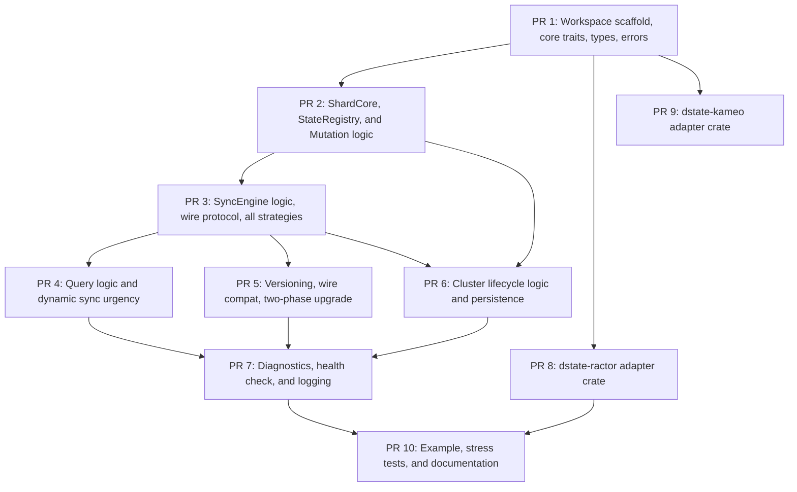

# Distributed State — Development Plan

This plan breaks the distributed state **multi-crate workspace**
implementation into reviewable PRs following **test-driven development
(TDD)**. Each PR completes a logical component end-to-end — types,
implementation, and tests — so it can be reviewed and validated
independently.

The workspace contains three crates (see Design §6.0.3):
- **`dstate`** — core crate with traits, types, pure logic, and test support
  (no actor framework dependency)
- **`dstate-ractor`** — ractor adapter crate
- **`dstate-kameo`** — kameo adapter crate

References:
- [Design Spec](./distributed-state-design.md)
- [Test Plan](./distributed-state-test-plan.md)

---

## Guiding Principles

1. **Tests first.** Every PR writes failing tests before implementation code.
2. **Complete components.** Each PR delivers a fully functional, testable
   component. No half-built abstractions waiting for a follow-up PR.
3. **Max ~2000 lines of production code per PR.** Test code does not count
   toward this limit.
4. **Compiles at every PR.** The workspace must compile (and all existing
   tests pass) after merging each PR.
5. **Incremental integration.** Start with in-process unit tests using
   `TestRuntime`, then add adapter-specific integration tests.
6. **Core before adapters.** All pure logic lives in the `dstate` core crate,
   tested with `TestRuntime`. Adapter crates are thin wrappers.

---

## PR Dependency Graph

---

## PR 1 — Workspace Scaffold, Core Traits, Types, and Errors

**Scope:** Create the workspace, the `dstate` core crate, and define all
foundational types and abstract traits. After this PR, downstream code can
import the traits, error types, envelope types, and runtime abstractions.

**Design ref:** §2 (State Model), §2.3 (Envelopes), §6.0 (Actor Runtime
Abstraction), §6.0.2 (Abstract Trait Definitions), §6.0.3 (Crate
Architecture), §11.2 (Error Types)

**What's built:**
- Workspace `Cargo.toml` defining members: `dstate`, `dstate-ractor`,
  `dstate-kameo`
- `dstate/Cargo.toml` with minimal dependencies (`arc-swap`, `tokio` time
  feature only, `bincode`, `serde`, `tracing`, `uuid`)
- Module structure: `traits/`, `types/`, `core/`, `messages/`,
  `test_support/`
- **Abstract traits** (`traits/runtime.rs`):
  - `ActorRuntime` (spawn, send_interval, send_after, groups, cluster_events)
  - `ActorRef<M>` (send, request)
  - `ProcessingGroup` (join, leave, broadcast, get_members)
  - `ClusterEvents` (subscribe)
  - `TimerHandle` (cancel)
- **State traits** (`traits/state.rs`):
  - `DistributedState` trait (simple): `name`, `serialize_state`,
    `deserialize_state`, `WIRE_VERSION`, `STORAGE_VERSION`
  - `DeltaDistributedState` trait (delta-aware): State, View, ViewDelta,
    StateDeltaChange types and projection/serialization methods
  - `SyncUrgency` enum
- **Persistence trait** (`traits/persistence.rs`):
  - `StatePersistence` async trait with `save()` / `load()`
- **Clock trait** (`traits/clock.rs`):
  - `Clock` trait with `SystemClock` and `TestClock`
- **Types** (`types/`):
  - `StateObject<S>`, `StateViewObject<V>` envelopes
  - `StateConfig<S>`, `SyncStrategy`, `PushMode`, `ChangeFeedConfig`
  - `RegistryError`, `QueryError`, `MutationError`, `ActorSendError`,
    `ActorRequestError`, `GroupError`, `ClusterError`, `DeserializeError`
  - `NodeId`, `VersionMismatchPolicy`
- **Test support** (`test_support/`):
  - `TestClock` — controllable time
  - `InMemoryPersistence`, `FailingPersistence` — test doubles
  - `TestRuntime` — mock `ActorRuntime` implementation for core crate tests
- `TestState` (simple) and `TestDeltaState` (delta-aware) reference
  implementations for subsequent test PRs

**Tests (red → green):**
- SM-01 through SM-03 (DistributedState trait)
- DSM-01 through DSM-10 (DeltaDistributedState trait)
- ENV-01 through ENV-07 (envelope types including incarnation)
- ERR-01, ERR-02 (error propagation)
- TEST-01 through TEST-04 (Clock abstraction)
- TEST-08 through TEST-10 (test doubles)
- RT-01 through RT-14 (ActorRuntime trait contracts via TestRuntime)
- MOCK-01 through MOCK-05 (TestRuntime self-tests)

**Estimated size:** ~1200 lines production code

---

## PR 2 — ShardCore, StateRegistry, and Mutation Logic

**Scope:** The pure state machine logic and runtime-generic registry. After
this PR, a single node can register state types, mutate its local shard
via `ShardCore`, and maintain a PublicViewMap — all tested without any
actor framework.

**Design ref:** §3 (Node-Local Data Layout), §6.1 (StateRegistry), §6.2
(StateShard), §7.2 (Mutation API), §15.2 (ShardCore)

**What's built:**
- `ShardCore<S>` (`core/shard_core.rs`) — pure state machine struct (no
  framework dependency) containing mutation logic, `should_accept()`,
  `stale_peers()`, view map manipulation
- Message enums (`messages/`): `StateShardMsg`, `SimpleShardMsg`,
  `DeltaShardMsg`, `SyncEngineMsg`, `ChangeFeedMsg`
- `StateRegistry<R: ActorRuntime>` (`registry.rs`) — generic over the
  runtime, provides `register()`, `lookup()`,
  `broadcast_node_joined()`, `broadcast_node_left()`
- `AnyStateShard` trait with blanket impl
- Actor shell message routing via `TestRuntime` (integration within core)
- Mutation flow: apply closure to clone, persist before publish,
  broadcast `OutboundSnapshot` / `OutboundDelta`
- `snapshot()` API for direct view map access
- Request coalescing for `RefreshAndQuery` (thundering herd prevention)
- Concurrency: actor mailbox for writes, ArcSwap for lock-free reads

**Tests (red → green):**
- PVM-01 through PVM-03 (PublicViewMap)
- SHARD-01 through SHARD-10 (StateShard / ShardCore)
- MUT-01 through MUT-06 (simple mutation + full-state sync)
- DMUT-01 through DMUT-06 (delta-aware mutation)
- REG-01 through REG-07 including REG-04a (StateRegistry with TestRuntime)
- TEST-05 through TEST-07 (ShardCore unit tests)

**Estimated size:** ~1600 lines production code

---

## PR 3 — SyncEngine Logic, Wire Protocol, and All Sync Strategies

**Scope:** The complete synchronization layer logic. After this PR, sync
strategies, wire protocol, and change feed logic are fully implemented and
tested using `TestRuntime`. No actor framework required.

**Design ref:** §4 (Synchronization Strategies), §4.2 (Change Feed), §5.1
(Age and Incarnation Ordering), §6.3 (SyncEngine), §6.5
(ChangeFeedAggregator), §6.6 (Timer-Driven Work), §12 (Wire Protocol)

**What's built:**
- `SyncMessage` enum (`FullSnapshot`, `DeltaUpdate`, `RequestSnapshot`) with
  `incarnation` field. Serialization via bincode/serde.
- `BatchedChangeFeed` / `ChangeNotification` with `incarnation`
- Sync engine logic (`core/sync_logic.rs`):
  - Urgency dispatch (`Immediate`, `Delayed`, `Suppress`, `Default`)
  - Delta accumulation buffer for suppressed mutations
  - Self-message filtering
- Change feed logic (`core/change_feed.rs`):
  - `NotifyChange` dedup by `(state_name, source_node)` using
    `(incarnation, age)` comparison
  - Batch and flush logic
- Actor shell wiring (via `TestRuntime`):
  - SyncEngine joins processing group via `ProcessingGroup::join()`
  - Uses `ProcessingGroup::broadcast()` for outbound
  - Uses `ProcessingGroup::get_members()` for point-to-point requests
  - ChangeFeedAggregator joins `distributed_state::change_feed` group
- `(incarnation, age)` ordering on inbound messages (5-row table from §5.1)
- Composable strategies via `SyncStrategy`:
  - **ActivePush**, **ActiveFeedLazyPull**, **periodic_full_sync**,
    **pull_on_query**
- Timer-driven work via `ActorRuntime::send_interval()` /
  `ActorRuntime::send_after()`

**Tests (red → green):**
- SYNC-01 through SYNC-22 (all strategies including composable and feed)
- CFA-01 through CFA-09 (ChangeFeedAggregator)
- SE-01 through SE-05 (SyncEngine logic)
- VER-01 through VER-05, INC-01 through INC-09 (age + incarnation ordering)
- WIRE-01 through WIRE-09 (wire protocol)

**Estimated size:** ~2000 lines production code

---

## PR 4 — Query Logic and Dynamic Sync Urgency

**Scope:** The consumer-facing query logic and per-delta urgency dispatch.
After this PR, callers can query the cluster view map with freshness
requirements and state authors can control sync timing per mutation.

**Design ref:** §7.1 (Query API), §4.6 (Dynamic Sync Urgency)

**What's built:**
- Query logic in `ShardCore`:
  - Fast path: lock-free snapshot load, check `synced_at.elapsed()` and
    `pending_remote_age`
  - Slow path: `RefreshAndQuery` with concurrent pulls via `join_all` and
    request coalescing
  - Error mapping for unreachable peers (`QueryError::StalePeer`)
- `snapshot()` — direct view map access without freshness check
- Dynamic urgency dispatch in sync logic:
  - `sync_urgency()` called after every mutation
  - `Immediate` → bypass timer, push now
  - `Delayed(d)` → schedule push within `d` via `send_after`
  - `Suppress` → accumulate into next non-suppressed delta
  - `Default` → delegate to configured strategy
- Delta accumulation buffer for suppressed mutations

**Tests (red → green):**
- QUERY-01 through QUERY-08 (query API including concurrent pulls, snapshot)
- SYNC-14 through SYNC-18 (dynamic urgency)
- SE-03 (`sync_urgency` called on every mutation)
- ERR-05, ERR-06 (retry pattern)

**Estimated size:** ~1000 lines production code

---

## PR 5 — Versioning, Wire Compat, and Two-Phase Upgrade

**Scope:** Full version handling: `wire_version` / `storage_version`
separation, `VersionMismatchPolicy` enforcement, and the two-phase upgrade
pattern validated by integration tests simulating mixed-version clusters.

**Design ref:** §5.2 (Rolling Upgrades and Serde Versioning)

**What's built:**
- `VersionMismatchPolicy` handling in sync engine inbound path
  (`core/versioning.rs`):
  - `KeepStale` — keep last good view, log warning
  - `DropAndWait` — remove peer view from PublicViewMap
  - `RequestReserialization` — request + response flow with
    `max_supported_version`
- Multi-version deserialization dispatch (match on `wire_version`)
- Storage version migration in persistence load path
- Test fixtures simulating mixed-version clusters (nodes at V1 and V2)
- Two-phase upgrade test harness validating all 3 phases

**Tests (red → green):**
- VER-06 through VER-11 (wire version compatibility)
- VER-12 through VER-15 (two-phase upgrade phases 1–3)
- VER-16 through VER-18 (storage version persist/load)

**Estimated size:** ~1000 lines production code

---

## PR 6 — Cluster Lifecycle Logic and Persistence

**Scope:** How the system reacts to cluster membership changes and how state
survives node restarts. Both share the node join/restart flow. All logic
implemented in the core crate using `TestRuntime`.

**Design ref:** §9 (Cluster Lifecycle Events), §6.4 (ClusterMembership
Listener), §8 (Persistence)

**What's built:**
- Cluster membership logic:
  - Subscribe to `ClusterEvents::NodeJoined` / `NodeLeft`
  - `NodeJoined` → trigger snapshot exchange for all registered state types
  - `NodeLeft` → remove from PublicViewMap, discard in-flight messages
- Crash restart flow: incarnation generation at startup
  - No persistence / load failure → `current_unix_time_ms()` as new
    incarnation
  - Successful load → preserve persisted incarnation
  - Ensures peers accept `age=0` after crash via `(incarnation, age)`
    ordering
- Partition behavior: stale views, freshness-based detection, recovery
- `StatePersistence` integration in ShardCore:
  - Persist-before-publish: mutation applied to clone, persisted, then
    committed
  - `load()` on startup with storage_version check and migration
  - Graceful fallback to empty state on failure
  - `persistence: None` bypass
- Node restart flow: load → project initial view → re-announce → rebuild

**Tests (red → green):**
- LIFE-01 through LIFE-13 (cluster lifecycle including crash restart)
- PERSIST-01 through PERSIST-20 (persistence trait, persist-before-publish,
  startup load, migration, rejoin)
- INC-04 through INC-06 (incarnation generation at startup)
- ERR-03 (`MutationError::PersistenceFailed` on save failure)
- ERR-04 (actor crash → `ActorSendError` / `ActorRequestError`)

**Estimated size:** ~1500 lines production code

---

## PR 7 — Diagnostics, Health Check, and Structured Logging

**Scope:** The complete observability layer. After this PR, operators can
inspect per-peer sync status, query aggregate metrics, check system health,
and read structured logs for troubleshooting.

**Design ref:** §13 (Diagnostics and Observability)

**What's built:**
- `PeerSyncStatus` struct (age, latency, failures, errors, gap count)
- `StateSyncMetrics` struct with atomic counters
- Counter increments wired into sync logic (send, receive, fail, gap,
  suppress, immediate)
- `ShardCore::sync_status()`, `stale_peers()`, `sync_metrics()` methods
- `SystemHealth`, `StateHealth`, `HealthStatus` structs/enums
- `health_status()` on `AnyStateShard` trait
- `StateRegistry::health_check()` — aggregate across all state types
- `tracing` instrumentation across sync logic and ShardCore:
  - Structured fields: `state_name`, `peer`, `age`, `urgency`,
    `latency_ms`, `error`
  - INFO on sync success, WARN on failure, DEBUG on suppression

**Tests (red → green):**
- DIAG-01 through DIAG-22 (all diagnostics, metrics, health, logging tests)

**Estimated size:** ~1500 lines production code

---

## PR 8 — dstate-ractor Adapter Crate

**Scope:** The ractor adapter crate that provides `RactorRuntime` and wires
the core crate's logic into ractor actors. Can start development after PR 1
merges (only needs trait definitions).

**Design ref:** §6.0.4 (Ractor Provider)

**What's built:**
- `dstate-ractor/Cargo.toml` with dependencies (`dstate`, `ractor`,
  `ractor_cluster`, `tokio`)
- `RactorRuntime` struct implementing `ActorRuntime`:
  - `spawn()` → `ractor::Actor::spawn()` with handler wrapper
  - `send_interval()` → `ractor::Actor::send_interval()`
  - `send_after()` → `ractor::Actor::send_after()`
- `RactorActorRef<M>` implementing `ActorRef<M>`:
  - `send()` → `ractor::ActorRef::cast()`
  - `request()` → `ractor::ActorRef::call()` with `RpcReplyPort`
- `RactorProcessingGroup` implementing `ProcessingGroup`:
  - `join()` → `ractor::pg::join()`
  - `leave()` → `ractor::pg::leave()`
  - `broadcast()` → `ractor::pg::broadcast()`
  - `get_members()` → `ractor::pg::get_members()`
- `RactorClusterEvents` implementing `ClusterEvents`:
  - `subscribe()` → `ractor_cluster` event subscription
- `RactorTimerHandle` implementing `TimerHandle`:
  - `cancel()` → drop `ractor::timer::SendAfterHandle`
- Actor wrappers:
  - `StateShardActor<S>` — ractor `Actor` impl wrapping `ShardCore`
  - `SyncEngineActor<S>` — ractor `Actor` impl
  - `ChangeFeedActor` — ractor `Actor` impl
- Re-export all public types from `dstate` core

**Tests (red → green):**
- RACTOR-01 through RACTOR-07 (ractor adapter tests)
- ADAPT-01 through ADAPT-08 (conformance tests with `RactorRuntime`)

**Estimated size:** ~1200 lines production code

---

## PR 9 — dstate-kameo Adapter Crate

**Scope:** The kameo adapter crate that provides `KameoRuntime` using kameo's
`#[derive(Actor)]`, `PubSub<M>` for processing groups, `ActorSwarm` for
cluster, and tokio tasks for timers. Can start development after PR 1 merges.

**Design ref:** §6.0.5 (Kameo Provider)

**What's built:**
- `dstate-kameo/Cargo.toml` with dependencies (`dstate`, `kameo`,
  `kameo_actors`, `tokio`)
- `KameoRuntime` struct implementing `ActorRuntime`:
  - `spawn()` → `A::spawn(initial_state)` with `#[derive(Actor)]`
  - `send_interval()` → spawn tokio task calling `tell()` on interval
  - `send_after()` → `tokio::spawn` with `tokio::time::sleep` + `tell()`
- `KameoActorRef<M>` implementing `ActorRef<M>`:
  - `send()` → `kameo::ActorRef::tell()`
  - `request()` → `kameo::ActorRef::ask()` with timeout
- `KameoProcessingGroup` implementing `ProcessingGroup`:
  - Internal `HashMap<String, ActorRef<PubSub<M>>>` (one PubSub per group)
  - `join()` → `pubsub_ref.tell(Subscribe::new(actor_ref.recipient()))`
  - `leave()` → `pubsub_ref.tell(Unsubscribe::new(actor_ref.recipient()))`
  - `broadcast()` → `pubsub_ref.tell(Publish::new(msg))`
  - `get_members()` → query internal subscriber list
- `KameoClusterEvents` implementing `ClusterEvents`:
  - `subscribe()` → `ActorSwarm` peer event subscription
- `KameoTimerHandle` implementing `TimerHandle`:
  - `cancel()` → `JoinHandle::abort()`
- Actor wrappers:
  - `StateShardActor<S>` — `#[derive(Actor)]` + `impl Message<StateShardMsg<S>>`
  - `SyncEngineActor<S>` — `#[derive(Actor)]` + `impl Message<SyncEngineMsg<S>>`
  - `ChangeFeedActor` — `#[derive(Actor)]` + `impl Message<ChangeFeedMsg>`
- Re-export all public types from `dstate` core

**Tests (red → green):**
- KAMEO-01 through KAMEO-11 (kameo adapter tests)
- ADAPT-01 through ADAPT-08 (conformance tests with `KameoRuntime`)

**Estimated size:** ~1200 lines production code

---

## PR 10 — Example, Stress Tests, and Documentation

**Scope:** The capstone PR — a complete working example, hardening tests, and
documentation. After this PR the workspace is ready for production use.

**Design ref:** §14 (Example), Test Plan §13 (Stress and Chaos), §14
(NodeResource), §16 (Multi-Crate Architecture Tests)

**What's built:**
- `examples/node_resource_ractor.rs`:
  - `NodeResourceState`, `NodeResourceView`, `NodeResourceDelta` structs
  - `DeltaDistributedState` impl with `sync_urgency` (threshold-based)
  - `start_resource_monitor()` background task using `RactorRuntime`
  - `find_lowest_memory_node()` query function
- `examples/node_resource_kameo.rs`:
  - Same example but using `KameoRuntime`
- `TestCluster` harness (Design §15.5):
  - In-process multi-node cluster with shared `TestClock` and `TestRuntime`
  - `mutate()`, `query()`, `snapshot()`, `crash_and_restart()`,
    `advance_time()`, `settle()` methods
  - In-memory transport (no real network)
  - Deterministic `NodeId(0)`, `NodeId(1)`, …
- Stress and chaos test suite:
  - Built on `TestCluster` harness
  - Fault injection utilities (delay, drop, partition)
  - TestClock for skew tests
- `README.md` for the workspace with quick start guide
- Rustdoc comments on all public types, traits, and methods
- `CHANGELOG.md` with initial version entry

**Tests (red → green):**
- EXAMPLE-01 through EXAMPLE-06 (NodeResource end-to-end)
- STRESS-01 through STRESS-03 (high throughput)
- CHAOS-01 through CHAOS-06 (fault injection)
- UPGRADE-01 through UPGRADE-04 (rolling upgrade simulation)
- TEST-11 through TEST-14 (TestCluster harness)

**Estimated size:** ~2000 lines production + test harness

---

## Summary

| PR | Crate | Component | Key Tests | Depends On | ~Lines |
|---|---|---|---|---|---|
| 1 | `dstate` | Workspace scaffold, traits, types, errors, Clock, TestRuntime | SM-\*, DSM-\*, ENV-\*, ERR-01–02, TEST-01–04, TEST-08–10, RT-\*, MOCK-\* | — | 1200 |
| 2 | `dstate` | ShardCore, StateRegistry\<R\>, mutation logic | PVM-\*, SHARD-\*, MUT-\*, DMUT-\*, REG-\*, TEST-05–07 | 1 | 1600 |
| 3 | `dstate` | SyncEngine logic + ChangeFeed + strategies + wire protocol | SYNC-01–22, CFA-\*, SE-\*, VER-01–05, INC-\*, WIRE-\* | 2 | 2000 |
| 4 | `dstate` | Query logic + dynamic sync urgency | QUERY-01–08, SYNC-14–18, ERR-05–06 | 3 | 1000 |
| 5 | `dstate` | Versioning + two-phase upgrade | VER-06–18 | 3 | 1000 |
| 6 | `dstate` | Cluster lifecycle logic + persistence + incarnation | LIFE-01–13, PERSIST-01–20, INC-04–06, ERR-03–04 | 2, 3 | 1500 |
| 7 | `dstate` | Diagnostics, health check, logging | DIAG-01–22 | 4, 5, 6 | 1500 |
| 8 | `dstate-ractor` | Ractor adapter: runtime, actors, groups, cluster | RACTOR-01–07, ADAPT-01–08 | 1 | 1200 |
| 9 | `dstate-kameo` | Kameo adapter: runtime, PubSub groups, ActorSwarm, timers | KAMEO-01–11, ADAPT-01–08 | 1 | 1200 |
| 10 | all | Examples, TestCluster, stress tests, docs | EXAMPLE-\*, STRESS-\*, CHAOS-\*, UPGRADE-\*, TEST-11–14 | 7, 8 | 2000 |

**Total: 10 PRs, ~14,200 lines of production code, 230+ test cases.**

PRs 4, 5, and 6 can be developed in parallel after PR 3 merges.
PRs 8 and 9 can be developed in parallel, starting after PR 1 merges.
