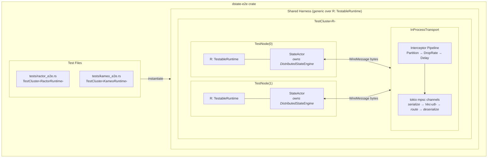
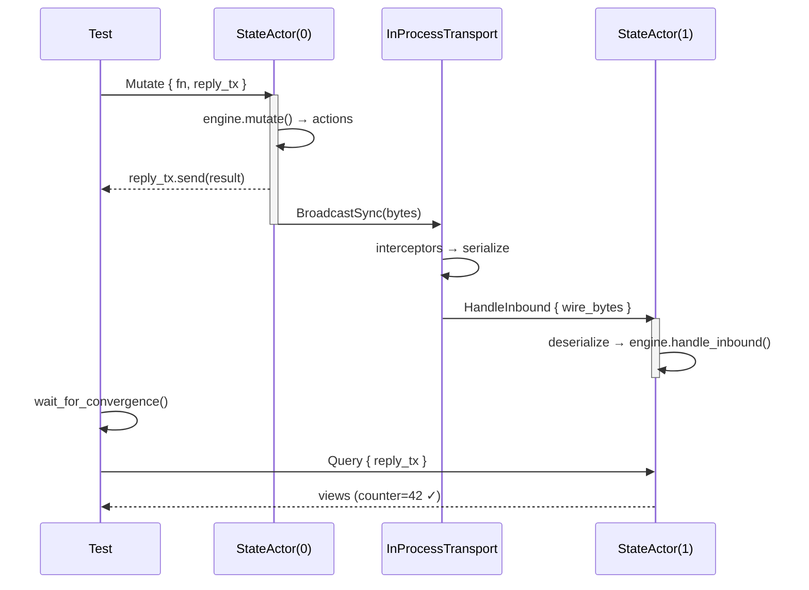

# dstate End-to-End Integration Test Plan

> **⚠️ Historical Document (v0.1):** This E2E test plan was written for the v0.1
> architecture with `dstate-ractor`, `dstate-kameo`, and the `dstate-e2e` shared
> test crate. As of v1.0, these adapter crates have been removed and the `dstate-e2e`
> crate has been deleted. Integration testing now uses `dstate-integration` with
> `MockCluster`. See [distributed-state-design.md §6.0](./distributed-state-design.md#60-actor-runtime--dactor-integration)
> for the current architecture.

## Problem

The adapter crates (`dstate-ractor`, `dstate-kameo`) currently test only
the `ActorRuntime` adapter layer (spawn, group, timers, cluster events)
but **do NOT test actual distributed state replication** through real actors.
The existing `dstate-integration` crate tests the engine in isolation with
a deterministic single-threaded `MockCluster`. There is no test that
exercises the **full stack**: real actors → async message passing →
byte-level transport → engine sync protocol → convergence verification.

Both adapters implement identical semantics (same message constraints, same
fire-and-forget send, same tokio-based timers, same callback-based cluster
events). A single test harness parameterized over `ActorRuntime` can test
both without code duplication.

## Approach

Build a **shared `dstate-e2e` crate** containing a runtime-generic test
harness. The harness creates multi-node in-process clusters using real
actors and `DistributedStateEngine` instances. Each node runs a "state
manager" actor that owns the engine and processes mutations, queries, and
inbound sync messages. Nodes communicate through an in-process transport
layer using tokio mpsc channels at the **byte level**. Tests interact with
the cluster through an async control API.

Test logic is written once as generic async functions, then instantiated
for each runtime in separate test files.

### Key Differences from dstate-integration

| Aspect | dstate-integration | dstate-e2e |
|--------|-------------------|------------|
| Actors | None (direct engine calls) | Real ractor/kameo actors |
| Scheduling | Deterministic tick() | Real tokio async scheduling |
| Transport | MockTransport (in-memory) | In-process tokio channels (bytes) |
| Timers | Manual clock advance | Real tokio timers (with time::pause) |
| Concurrency | Single-threaded | Multi-threaded (tokio runtime) |
| Runtimes | None | Both ractor and kameo |
| Purpose | Test engine logic | Test adapter integration end-to-end |

### Why Both Adapters Can Share a Harness

| Aspect | dstate-ractor | dstate-kameo | Compatible? |
|--------|--------------|-------------|-------------|
| Async runtime | Tokio | Tokio | ✓ |
| Message constraint | `Send + 'static` | `Send + 'static` | ✓ |
| Send semantics | `.cast()` (fire-and-forget) | `.tell().try_send()` (fire-and-forget) | ✓ |
| Timers | tokio tasks | tokio tasks | ✓ |
| Groups | Type-erased + downcast | Type-erased + downcast | ✓ |
| Cluster events | Callback-based | Callback-based | ✓ |
| Constructor | `::new()` | `::new()` | ✓ |

## Architecture



### Message Flow



## Component Design

### TestableRuntime Trait

Extension trait that bridges the gap between `ActorRuntime` (which has no
constructor or event-emit method) and what the test harness needs:

```rust
pub trait TestableRuntime: ActorRuntime + Clone {
    fn new_for_testing() -> Self;
    fn emit_cluster_event(&self, event: ClusterEvent);
}
```

Implemented for both `RactorRuntime` and `KameoRuntime` (trivial — both
already have `::new()` and `cluster_events_handle().emit()`).

### StateActor

An actor per node that owns the `DistributedStateEngine`. Spawned via
`R::spawn()`, so it uses the real actor framework's mailbox and scheduling.

```rust
enum NodeCommand {
    Mutate { mutate_fn, reply: oneshot::Sender<MutateResult> },
    Query { reply: oneshot::Sender<HashMap<NodeId, StateViewObject>> },
    HandleInbound { wire_bytes: Vec<u8> },
    PeriodicSync,
    OnNodeJoined { node_id: NodeId, reply: oneshot::Sender<()> },
    OnNodeLeft { node_id: NodeId },
    GetMetrics { reply: oneshot::Sender<SyncMetrics> },
}
```

- Request-reply via `tokio::sync::oneshot` channels for mutate/query/metrics
- Fire-and-forget for inbound messages, periodic sync, node events
- Routes outbound `EngineAction`s to the transport after processing

### InProcessTransport

Central byte-level message router (adapter-agnostic):

- Each node registers a `tokio::sync::mpsc::Sender<Vec<u8>>` on creation
- `send(from, to, bytes)` routes through interceptor pipeline then delivers
- `broadcast(from, bytes)` sends to all except the sender
- A background receiver task per node deserializes bytes and sends
  `HandleInbound` to that node's StateActor
- Interceptor pipeline: `Vec<Box<dyn Interceptor>>` applied in order

### TestCluster\<R: TestableRuntime\>

Generic orchestrator and async control API:

- `add_node(config)` → creates runtime + engine + StateActor + channel
- `remove_node(id)` → sends OnNodeLeft to all peers, drops node
- `mutate(node_id, fn)` → sends Mutate command, awaits oneshot reply
- `query(node_id)` → sends Query command, awaits reply
- `wait_for_convergence(expected, timeout)` → polls views until matching
- `inject_partition(a, b)` / `heal_partition()` → modifies interceptors

### Shared Test Functions

Test logic written once as generic async functions:

```rust
// In dstate-e2e/src/scenarios.rs
pub async fn test_basic_mutation<R: TestableRuntime>(config: StateConfig) {
    let mut cluster = TestCluster::<R>::new(2, config).await;
    cluster.mutate(NodeId(0), |s| s.counter = 42).await;
    cluster.wait_for_convergence(Duration::from_secs(5)).await;
    let views = cluster.query(NodeId(1)).await;
    assert_eq!(views[&NodeId(0)].value.counter, 42);
}

// In dstate-e2e/tests/ractor_e2e.rs
#[tokio::test]
async fn e2e_01_basic_mutation() {
    test_basic_mutation::<RactorRuntime>(active_push_config()).await;
}

// In dstate-e2e/tests/kameo_e2e.rs
#[tokio::test]
async fn e2e_01_basic_mutation() {
    test_basic_mutation::<KameoRuntime>(active_push_config()).await;
}
```

## Crate Structure

```
dstate-e2e/
├── Cargo.toml              # depends on dstate; dev-depends on dstate-ractor, dstate-kameo
├── src/
│   ├── lib.rs              # module declarations, TestableRuntime trait
│   ├── transport.rs        # InProcessTransport (byte-level, interceptors)
│   ├── cluster.rs          # TestCluster<R> (async control API)
│   ├── interceptor.rs      # DropAll, Partition, DropRate, Delay, CorruptBytes
│   └── scenarios.rs        # Shared generic test functions
└── tests/
    ├── ractor_e2e.rs       # Instantiates scenarios with RactorRuntime
    └── kameo_e2e.rs        # Instantiates scenarios with KameoRuntime
```

## PR Breakdown

### PR 1 — E2E Test Plan Document (this PR)

- Create `docs/e2e-test-plan.md` with architecture and test matrix
- No code changes

### PR 2 — Shared Harness Crate

- Create `dstate-e2e/` crate with workspace membership
- `src/lib.rs` — `TestableRuntime` trait + impls for both runtimes
- `src/transport.rs` — InProcessTransport with byte-level routing
- `src/cluster.rs` — `TestCluster<R>` orchestrator + async control API
- `src/interceptor.rs` — Fault injection interceptors
- Self-tests: transport routing, interceptor behavior, node lifecycle

### PR 3 — E2E Happy Path Tests

- `src/scenarios.rs` — shared generic test functions
- `tests/ractor_e2e.rs` — happy path tests with RactorRuntime
- `tests/kameo_e2e.rs` — happy path tests with KameoRuntime

### PR 4 — E2E Fault Injection Tests

- Additional scenarios in `src/scenarios.rs`
- Fault injection tests in both `ractor_e2e.rs` and `kameo_e2e.rs`

## Test Matrix

### Happy Path (PR 3)

| ID | Scenario | Nodes | Strategy | Validates |
|----|----------|-------|----------|-----------|
| E2E-01 | Basic mutation propagates | 2 | ActivePush | Mutate on A, B sees update via real actors |
| E2E-02 | Bidirectional sync | 2 | ActivePush | Both mutate, both converge |
| E2E-03 | Multi-node fan-out | 4 | ActivePush | 1 mutation reaches 3 peers |
| E2E-04 | Delta sync round-trip | 2 | ActivePush | Delta serialized → deserialized → applied |
| E2E-05 | Node join receives snapshot | 2→3 | ActivePush | New node gets existing state from peers |
| E2E-06 | Node leave cleans views | 3→2 | ActivePush | Departed node's view removed on peers |
| E2E-07 | Periodic sync convergence | 3 | PeriodicOnly(200ms) | Syncs after interval via send_interval |
| E2E-08 | Feed + lazy pull | 3 | FeedLazyPull | Change feed → pull on query |
| E2E-09 | Concurrent mutations | 3 | ActivePush | All nodes mutate simultaneously, all converge |
| E2E-10 | Query freshness check | 2 | ActivePush | Fresh query returns correct result |
| E2E-11 | Multiple mutations sequence | 2 | ActivePush | 10 rapid mutations, final value propagated |
| E2E-12 | Cluster events subscription | 3 | ActivePush | NodeJoined triggers snapshot push |

### Fault Injection (PR 4)

| ID | Scenario | Fault | Validates |
|----|----------|-------|-----------|
| E2E-F01 | Network partition | Partition({0,1}, {2}) | Isolated node doesn't see updates; healing restores |
| E2E-F02 | Total network failure | DropAll | Local state intact; convergence after restore |
| E2E-F03 | Packet loss (30%) | DropRate(0.3) | Retries via periodic sync → eventual consistency |
| E2E-F04 | Message corruption | CorruptBytes | Engine handles deserialization errors gracefully |
| E2E-F05 | Node crash + restart | Remove + re-add | Restarted node receives fresh snapshots |
| E2E-F06 | Message delay (500ms) | Delay(500ms) | Late messages processed correctly |
| E2E-F07 | Rapid mutations under loss | DropRate(0.1) + 50 mutations | Convergence despite intermittent loss |

Each test runs **twice** — once with `RactorRuntime`, once with `KameoRuntime` —
giving **38 total test executions** (19 scenarios × 2 runtimes).

## Notes

- Uses `tokio::time::pause()` so timer tests don't need real-time waits
- `wait_for_convergence` polls at 10ms intervals with configurable timeout
- Each test creates an isolated TestCluster — no shared state between tests
- `dstate-e2e` is `publish = false` (test-only crate)
- InProcessTransport uses `bincode::serialize(WireMessage)` for byte-level
  encoding, matching real production usage patterns
- StateActor uses the actor framework's mailbox ordering guarantee: all
  commands to a single node are processed sequentially
