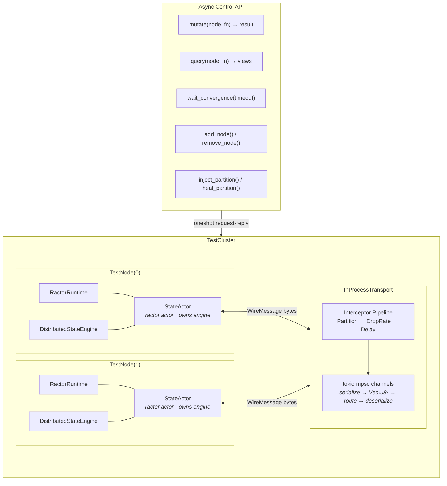
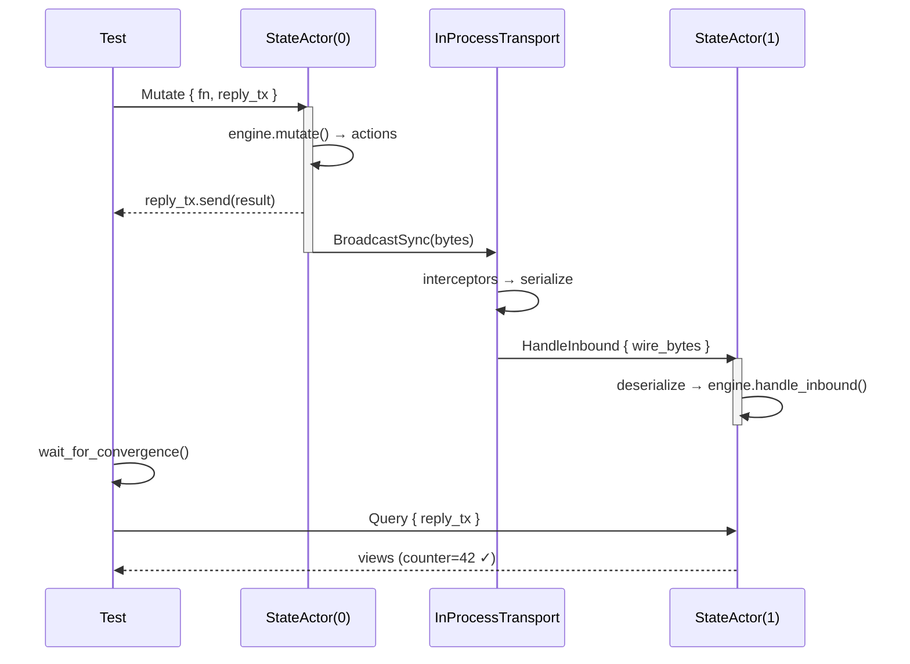

# dstate-ractor End-to-End Integration Test Plan

## Problem

The `dstate-ractor` crate currently tests only the `ActorRuntime` adapter
layer (spawn, group, timers, cluster events) but **does NOT test actual
distributed state replication** through real ractor actors. The existing
`dstate-integration` crate tests the engine in isolation with a deterministic
single-threaded `MockCluster`. There is no test that exercises the **full
stack**: real ractor actors → async message passing → byte-level transport →
engine sync protocol → convergence verification.

## Approach

Build a **host application harness** that creates a multi-node in-process
cluster using real ractor actors and `DistributedStateEngine` instances.
Each node runs a "state manager" ractor actor that owns the engine and
processes mutations, queries, and inbound sync messages. Nodes communicate
through an in-process transport layer using tokio mpsc channels at the
**byte level** (enforcing serialization/deserialization). Tests interact
with the cluster through an async control API.

### Key Differences from dstate-integration

| Aspect | dstate-integration | dstate-ractor E2E |
|--------|-------------------|-------------------|
| Actors | None (direct engine calls) | Real ractor actors |
| Scheduling | Deterministic tick() | Real tokio async scheduling |
| Transport | MockTransport (in-memory) | In-process tokio channels (bytes) |
| Timers | Manual clock advance | Real tokio timers (with time::pause) |
| Concurrency | Single-threaded | Multi-threaded (tokio runtime) |
| Purpose | Test engine logic | Test ractor integration end-to-end |

## Architecture



### Message Flow



## Component Design

### StateActor

A ractor actor per node that owns the `DistributedStateEngine`. All engine
access is serialized through the actor's mailbox, eliminating data races.

```rust
enum NodeCommand {
    Mutate { mutate_fn, reply: oneshot::Sender<MutateResult> },
    Query { reply: oneshot::Sender<HashMap<NodeId, StateViewObject>> },
    HandleInbound { wire_bytes: Vec<u8> },
    PeriodicSync,
    OnNodeJoined { node_id: NodeId, reply: oneshot::Sender<()> },
    OnNodeLeft { node_id: NodeId },
    GetMetrics { reply: oneshot::Sender<SyncMetrics> },
}
```

- Request-reply via `tokio::sync::oneshot` channels for mutate/query/metrics
- Fire-and-forget for inbound messages, periodic sync, node events
- Routes outbound `EngineAction`s to the transport after processing

### InProcessTransport

Central byte-level message router using tokio mpsc channels:

- Each node registers a `tokio::sync::mpsc::Sender<Vec<u8>>` on creation
- `send(from, to, bytes)` routes through interceptor pipeline then delivers
- `broadcast(from, bytes)` sends to all except the sender
- A background receiver task per node deserializes bytes and sends
  `HandleInbound` to that node's StateActor
- Interceptor pipeline: `Vec<Box<dyn Interceptor>>` applied in order

### TestCluster

Orchestrator and async control API for tests:

- `add_node(config)` → creates RactorRuntime + Engine + StateActor + channel
- `remove_node(id)` → sends OnNodeLeft to all peers, drops node
- `mutate(node_id, fn)` → sends Mutate command, awaits oneshot reply
- `query(node_id)` → sends Query command, awaits reply
- `wait_for_convergence(expected, timeout)` → polls views until matching
- `inject_partition(a, b)` / `heal_partition()` → modifies interceptors

### Why Real Ractor Actors Matter

- Tests exercise the sync→async spawn bridge (OS thread creation)
- Tests verify ractor's mailbox delivers messages correctly under load
- Tests confirm timer-based periodic sync works with real tokio timers
- Tests validate that `RactorClusterEvents::emit()` correctly triggers
  `on_node_joined/left` through the callback chain

## PR Breakdown

### PR 1 — E2E Test Plan Document (this PR)

- Create `docs/ractor-e2e-test-plan.md` with architecture and test matrix
- No code changes

### PR 2 — Host Application Harness

- `dstate-ractor/tests/harness/mod.rs` — module declarations
- `dstate-ractor/tests/harness/transport.rs` — InProcessTransport with
  byte-level routing, interceptor pipeline, tokio mpsc channels
- `dstate-ractor/tests/harness/node.rs` — TestNode (StateActor, Engine,
  RactorRuntime wiring, command handling, action routing)
- `dstate-ractor/tests/harness/cluster.rs` — TestCluster orchestrator
  with async control API (mutate, query, wait_for_convergence)
- `dstate-ractor/tests/harness/interceptor.rs` — Fault injection
  interceptors (DropAll, Partition, DropRate, Delay, CorruptBytes)
- Self-tests: transport routing, interceptor behavior, node lifecycle

### PR 3 — E2E Happy Path Tests

- `dstate-ractor/tests/e2e_happy_path.rs` — integration tests using harness

### PR 4 — E2E Fault Injection Tests

- `dstate-ractor/tests/e2e_fault_injection.rs` — fault injection tests

## Test Matrix

### Happy Path (PR 3)

| ID | Scenario | Nodes | Strategy | Validates |
|----|----------|-------|----------|-----------|
| E2E-01 | Basic mutation propagates | 2 | ActivePush | Mutate on A, B sees update via ractor actors |
| E2E-02 | Bidirectional sync | 2 | ActivePush | Both mutate, both converge |
| E2E-03 | Multi-node fan-out | 4 | ActivePush | 1 mutation reaches 3 peers |
| E2E-04 | Delta sync round-trip | 2 | ActivePush | Delta serialized → deserialized → applied |
| E2E-05 | Node join receives snapshot | 2→3 | ActivePush | New node gets existing state from peers |
| E2E-06 | Node leave cleans views | 3→2 | ActivePush | Departed node's view removed on peers |
| E2E-07 | Periodic sync convergence | 3 | PeriodicOnly(200ms) | State syncs after interval via send_interval |
| E2E-08 | Feed + lazy pull | 3 | FeedLazyPull | Change feed notification → pull on query |
| E2E-09 | Concurrent mutations | 3 | ActivePush | All nodes mutate simultaneously, all converge |
| E2E-10 | Query freshness check | 2 | ActivePush | Fresh query returns correct result |
| E2E-11 | Multiple mutations sequence | 2 | ActivePush | 10 rapid mutations, final value propagated |
| E2E-12 | Cluster events subscription | 3 | ActivePush | NodeJoined triggers snapshot push |

### Fault Injection (PR 4)

| ID | Scenario | Fault | Validates |
|----|----------|-------|-----------|
| E2E-F01 | Network partition | Partition({0,1}, {2}) | Isolated node doesn't see updates; healing restores |
| E2E-F02 | Total network failure | DropAll | Local state intact; convergence after restore |
| E2E-F03 | Packet loss (30%) | DropRate(0.3) | Retries via periodic sync → eventual consistency |
| E2E-F04 | Message corruption | CorruptBytes | Engine handles deserialization errors gracefully |
| E2E-F05 | Node crash + restart | Remove + re-add | Restarted node receives fresh snapshots |
| E2E-F06 | Message delay (500ms) | Delay(500ms) | Late messages processed correctly |
| E2E-F07 | Rapid mutations under loss | DropRate(0.1) + 50 mutations | Convergence despite intermittent loss |

## Notes

- Uses `tokio::time::pause()` so timer tests don't need real-time waits
  (use `tokio::time::advance()` for periodic sync tests)
- `wait_for_convergence` polls at 10ms intervals with configurable timeout
- Each test creates an isolated TestCluster — no shared state between tests
- The harness is placed in `dstate-ractor/tests/harness/` (not a separate
  crate) since it's specific to dstate-ractor and only used for testing
- InProcessTransport uses `bincode::serialize(WireMessage)` for byte-level
  encoding, matching real production usage patterns
- `StateActor` uses ractor's message ordering guarantee: all commands to a
  single node are processed sequentially, preventing data races on the engine
